# laba/Вариант 1

## <p align="center"><b>МОДУЛЬ 1</b></p>

Задание:

Необходимо разработать и настроить инфраструктуру информационно-коммуникационной системы согласно предложенной топологии.

Задание включает базовую настройку устройств:

- присвоение имен устройствам;
- расчет IP-адресации;
- настройку коммутации и маршрутизации.

В ходе проектирования и настройки сетевой инфраструктуры следует вести отчет о своих действиях, включая таблицы и схемы, предусмотренные в задании.

По каждому пункту задания, требующего отчёт, необходимо составить текстовый документ. Название документа должно содержать индекс пункта и краткое описание.

Текстовый документ должен содержать текстовую информацию и может включать снимки экрана. Скриншоты необходимо кадрировать так, чтобы относящаяся к выполнению задания информация была читаемой.

Итоговый отчет по окончании работы следует сохранить на диске рабочего места и задать имя файла:

**ФамилияУчастникаЗадание1**

без учёта расширения.

SSH Для подключения к стендам, выполняется с HQ-CLI. !!! ВНИМАНИЕ если не умееете не трогайте

isp - ssh root@172.16.10.1
hq-srv - ssh sshuser@192.168.100.2 -p 2027
br-srv - ssh sshuser@192.168.200.2 -p 2027
hq-rtr - ssh root@192.168.100.1
br-rtr - ssh root@192.168.200.1

Порты смотретите по заданию они изменяются


# laba/Вариант 1

## <p align="center"><b>МОДУЛЬ 1</b></p>

Задание 1. Настройка сетевой инфраструктуры :
Необходимо разработать и настроить инфраструктуру информационно коммуникационной системы согласно предложенной топологии (см.  Рисунок 
1). 
Задание включает базовую настройку устройств: 
- присвоение имен устройствам; 
- расчет IP-адресации; 
- настройку коммутации и маршрутизации;

В ходе проектирования и настройки сетевой инфраструктуры следует вести отчет о своих действиях, включая таблицы и схемы, предусмотренные в задании.

По каждому пункту задания, требующего отчёт, составить текстовый документ, название которого должно содержать индекс пункта и краткое  описание.

Текстовый документ должен содержать текстовую информацию и может включать снимки экрана, кадрированные таким образом, чтобы относящаяся к выполнению задания информация на снимках была читаемой. 

Итоговый отчет по окончании работы следует сохранить на диске рабочего места и задать имя файла - ФамилияУчастникаЗадание1 без учёта расширения.

<p align="center">
  
</p>

<p align="center">
  
</p>

<p align="center"><b>Чтобы зайти на стенд для 1 модуля.</b></p>
 
<p align="center"><b>User name: m1</b></p>
<p align="center"><b>Password: module1</b></p>

**ISP преднастроена, но включать ее надо**
 
### <p align="center"><b>Настройка имен устройств</b></p>

По заданию необходимо настроить имена устройств согласно топологии, используя полные доменные имена.

Для изменения имени устройства используем команду:

```bash
hostnamectl set-hostname <имя_устройства>.au-team.irpo; exec bash
```

Настраиваем имена на всех устройствах.

<p align="center"><b>ISP</b></p>

```bash
hostnamectl set-hostname isp.au-team.irpo; exec bash
```

<p align="center">
  
</p>

<p align="center"><b>HQ-RTR</b></p>

```bash
hostnamectl set-hostname hq-rtr.au-team.irpo; exec bash
```

<p align="center">
  
</p>

<p align="center"><b>BR-RTR</b></p>

```bash
hostnamectl set-hostname br-rtr.au-team.irpo; exec bash
```

<p align="center">
  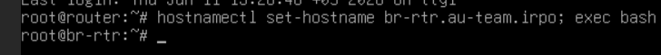
</p>

<p align="center"><b>HQ-SRV</b></p>

```bash
hostnamectl set-hostname hq-srv.au-team.irpo; exec bash
```

<p align="center">
  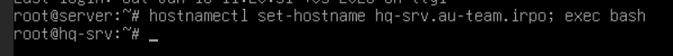
</p>

<p align="center"><b>BR-SRV</b></p>

```bash
hostnamectl set-hostname br-srv.au-team.irpo; exec bash
```

<p align="center">
  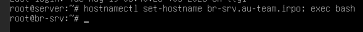
</p>

<p align="center"><b>HQ-CLI</b></p>

На клиентской машине сначала переходим в root:

```bash
su -
```

После этого меняем имя устройства:

```bash
hostnamectl set-hostname hq-cli.au-team.irpo; exec bash
```

<p align="center">
  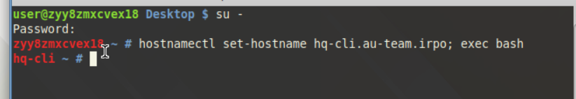
</p>

<p align="center"><b>BR-FW</b></p>

```bash
hostnamectl set-hostname br-fw.au-team.irpo; exec bash
```

<p align="center">
  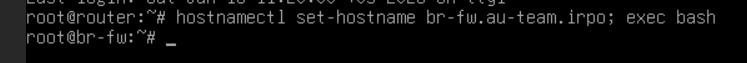
</p>

> **Примечание:**
> После выполнения команды имя устройства изменяется сразу благодаря `exec bash`.

> **Примечание:**
> Для устройств `HQ-RTR`, `BR-RTR`, `BR-FW`, `HQ-SRV`, `HQ-CLI` и `BR-SRV` используем домен `au-team.irpo` в соответствии с таблицей имен из задания.

### <p align="center"><b>Настройка IP-адресации</b></p>

Согласно заданию необходимо настроить IPv4-адресацию на устройствах.

Для варианта 1 будем использовать следующую таблицу адресации:

<p align="center">
  
</p>

> **Примечание:**
> Для `HQ-CLI` адрес `192.168.20.2/28` указан в таблице как планируемый. Фактически адрес будет выдан позже по DHCP.

---

<p align="center"><b>HQ-RTR</b></p>

На данном этапе настраиваем только интерфейс в сторону ISP.

Интерфейс в сторону HQ оставляем без адресации, так как VLAN 100, 200 и 999 будут настроены позднее в отдельном пункте задания.

Открываем конфигурацию сети:

```bash
nano /etc/network/interfaces
```

Настраиваем:

```text
auto ens18
iface ens18 inet static
    address 172.16.1.2/28
    gateway 172.16.1.1

auto ens19
iface ens19 inet manual
```

<p align="center">
  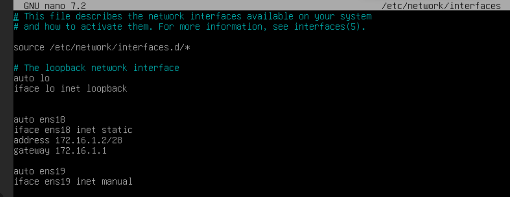
</p>

---

<p align="center"><b>BR-RTR</b></p>

Открываем конфигурацию сети:

```bash
nano /etc/network/interfaces
```

Настраиваем интерфейс в сторону ISP и интерфейс в сторону `BR-FW`:

```text
auto ens18
iface ens18 inet static
    address 172.16.2.2/28
    gateway 172.16.2.1

auto ens19
iface ens19 inet static
    address 192.168.30.1/30
```

<p align="center">
  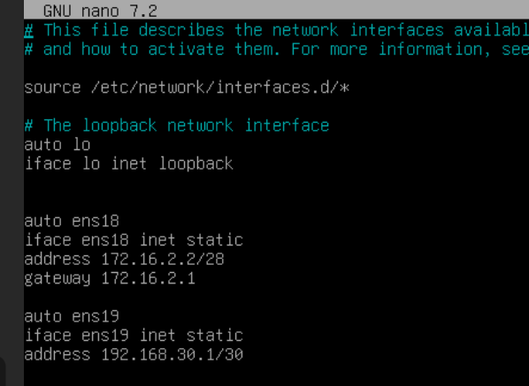
</p>

---

<p align="center"><b>HQ-SRV</b></p>

Открываем конфигурацию сети:

```bash
nano /etc/network/interfaces
```

Настраиваем адрес сервера:

```text
auto ens18
iface ens18 inet static
    address 192.168.100.2/27
    gateway 192.168.100.1
```

<p align="center">
  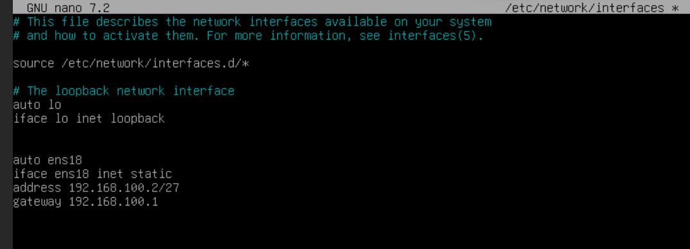
</p>

---

<p align="center"><b>BR-SRV</b></p>

Открываем конфигурацию сети:

```bash
nano /etc/network/interfaces
```

Настраиваем адрес сервера:

```text
auto ens18
iface ens18 inet static
    address 192.168.200.2/28
    gateway 192.168.200.1
```

<p align="center">
  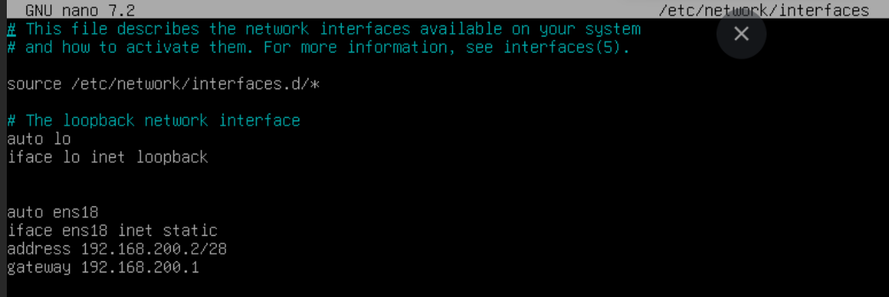
</p>

---

<p align="center"><b>BR-FW</b></p>

Открываем конфигурацию сети:

```bash
nano /etc/network/interfaces
```

Настраиваем интерфейс в сторону `BR-RTR` и интерфейс в сторону `BR-SRV`:

```text
auto ens18
iface ens18 inet static
    address 192.168.30.2/30
    gateway 192.168.30.1

auto ens19
iface ens19 inet static
    address 192.168.200.1/28
```

<p align="center">
  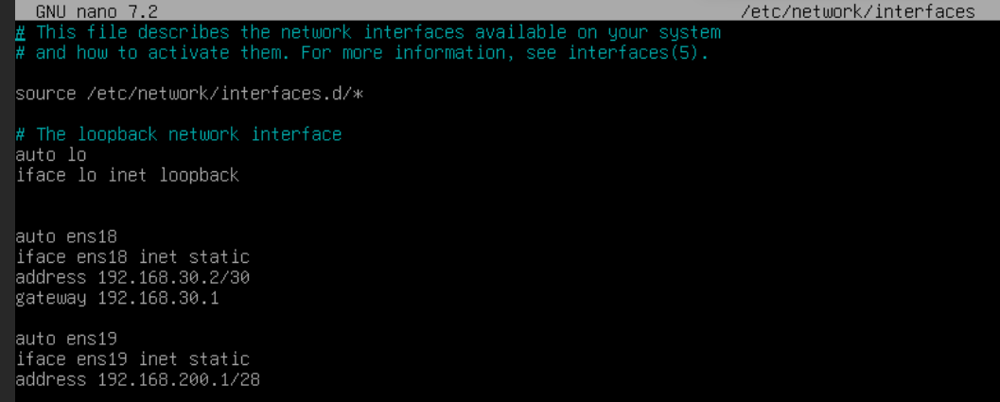
</p>

---

<p align="center"><b>HQ-CLI</b></p>

На данном этапе вручную статический адрес на `HQ-CLI` не настраиваем.

Позднее по заданию на `HQ-RTR` будет настроен DHCP-сервер, который выдаст клиенту адрес из сети:

```text
192.168.20.0/28
```

Планируемый адрес клиента:

```text
192.168.20.2/28
```

Шлюз по умолчанию:

```text
192.168.20.1
```

---

После изменения конфигурации сети на устройствах перезапускаем службу:

```bash
systemctl restart networking
```

Проверить назначенные адреса можно командой:

```bash
ip -br a
```

Проверить таблицу маршрутизации:

```bash
ip r
```

> **Примечание:**
> Адреса для VLAN 100, VLAN 200 и VLAN 999 на `HQ-RTR` будут добавлены позднее при настройке коммутации.

### <p align="center"><b>2. Настройка доступа к сети Интернет на ISP</b></p>

По заданию необходимо настроить маршрутизатор `ISP`:

- интерфейс в сторону магистрального провайдера должен получать адрес по DHCP;
- интерфейс в сторону `HQ-RTR` должен находиться в сети `172.16.1.0/28`;
- интерфейс в сторону `BR-RTR` должен находиться в сети `172.16.2.0/28`;
- необходимо разрешить маршрутизацию пакетов;
- настроить динамическую трансляцию адресов для выхода `HQ-RTR` и `BR-RTR` в Интернет.

<p align="center"><b>ISP</b></p>

Открываем файл конфигурации сетевых интерфейсов:

```bash
nano /etc/network/interfaces
```

Настраиваем интерфейсы следующим образом:

```text
auto ens18
iface ens18 inet dhcp

auto ens19
iface ens19 inet static
    address 172.16.1.1/28

auto ens20
iface ens20 inet static
    address 172.16.2.1/28
```

<p align="center">
  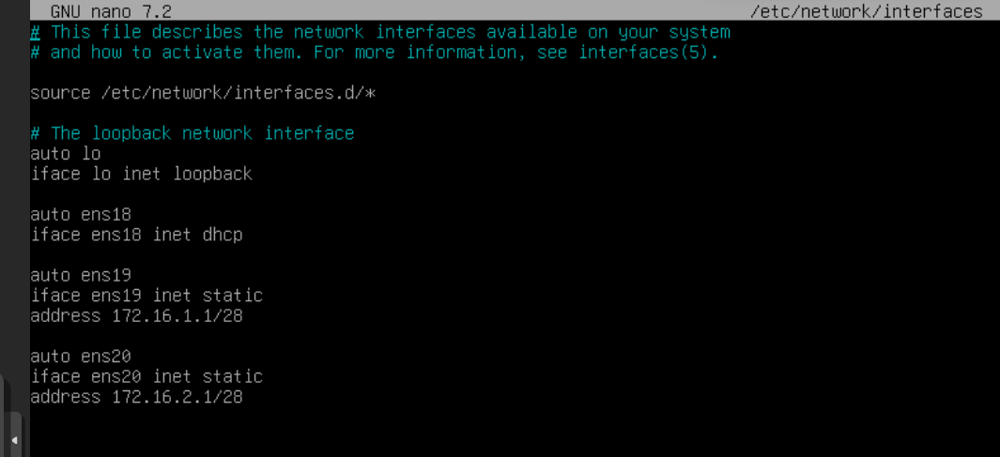
</p>

Где:

- `ens18` — интерфейс в сторону магистрального провайдера;
- `ens19` — интерфейс в сторону `HQ-RTR`;
- `ens20` — интерфейс в сторону `BR-RTR`.

После изменения конфигурации перезапускаем сеть:

```bash
systemctl restart networking
```

### <p align="center"><b>Включаем пересылку пакетов на ISP</b></p>

Чтобы `ISP` мог пересылать пакеты между своими интерфейсами, включаем IPv4 forwarding.

Открываем файл:

```bash
nano /etc/sysctl.conf
```

Раскомментируем или добавим строку:

```text
net.ipv4.ip_forward=1
```

<p align="center">
  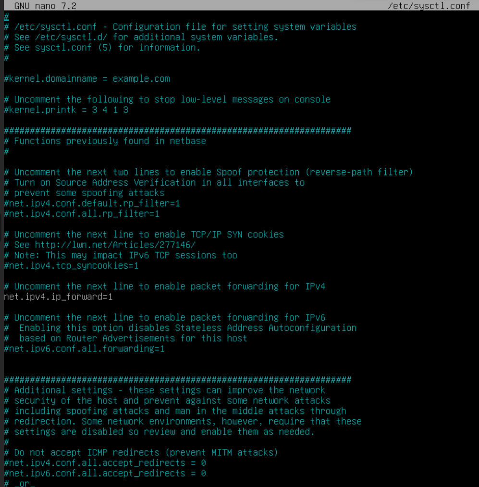
</p>

Применяем изменения:

```bash
sysctl -p
```

### <p align="center"><b>Настройка NAT на ISP</b></p>

Для выхода маршрутизаторов `HQ-RTR` и `BR-RTR` в Интернет настроим динамическую трансляцию адресов с помощью `nftables`.

Открываем файл:

```bash
nano /etc/nftables.conf
```

Настраиваем:

```nft
#!/usr/sbin/nft -f

flush ruleset

table inet filter {
    chain forward {
        type filter hook forward priority filter;
        policy accept;
    }
}

table inet nat {
    chain POSTROUTING {
        type nat hook postrouting priority srcnat;

        oifname "ens18" ip saddr { 172.16.1.0/28, 172.16.2.0/28 } masquerade
    }
}
```

<p align="center">
  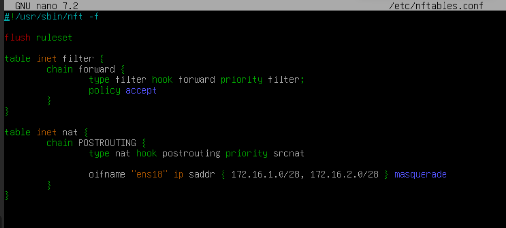
</p>

Проверяем конфигурацию:

```bash
nft -c -f /etc/nftables.conf
```

Если ошибок нет, применяем:

```bash
nft -f /etc/nftables.conf
```

Добавляем службу в автозагрузку:

```bash
systemctl enable nftables
```

Перезапускаем:

```bash
systemctl restart nftables
```

Проверяем правила:

```bash
nft list ruleset
```

После этого `HQ-RTR` и `BR-RTR` должны иметь возможность выходить в Интернет через `ISP`.

### <p align="center"><b>4. Настройка коммутации в сегменте HQ</b></p>

По заданию необходимо:

- трафик `HQ-SRV` поместить в VLAN 100;
- трафик `HQ-CLI` поместить в VLAN 200;
- предусмотреть VLAN 999 для управления;
- маршрутизацию всех VLAN на `HQ-RTR` реализовать через один физический интерфейс.

<p align="center"><b>HQ-RTR</b></p>

Для связи с сегментом HQ используем один физический интерфейс `ens19`.

Открываем конфигурацию:

```bash
nano /etc/network/interfaces
```

Настраиваем VLAN-подинтерфейсы:

```text
auto ens19
iface ens19 inet manual

auto ens19.100
iface ens19.100 inet static
    address 192.168.100.1/27
    vlan-raw-device ens19

auto ens19.200
iface ens19.200 inet static
    address 192.168.20.1/28
    vlan-raw-device ens19

auto ens19.999
iface ens19.999 inet static
    address 192.168.99.1/29
    vlan-raw-device ens19
```

<p align="center">
  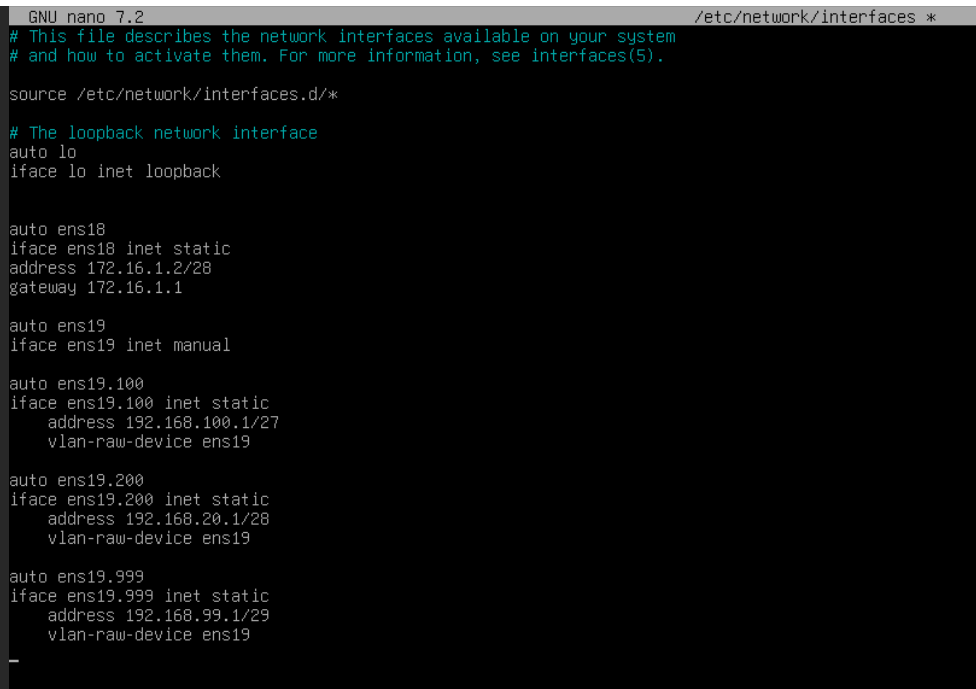
</p>

После изменения конфигурации перезапускаем сеть:

```bash
systemctl restart networking
```

Проверяем созданные VLAN-интерфейсы:

```bash
ip -br a
```

<p align="center">
  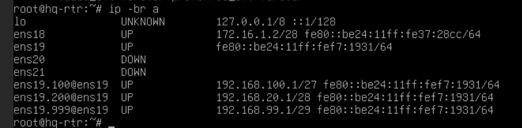
</p>

В результате должны быть доступны:

```text
ens19.100
ens19.200
ens19.999
```

> **Примечание:**
> Все VLAN маршрутизируются через один физический интерфейс `ens19`, как и требуется по заданию.

### <p align="center"><b>Настройка VLAN на виртуальном коммутаторе</b></p>

На виртуальном коммутаторе Proxmox распределяем устройства по VLAN.

Для `HQ-SRV` указываем VLAN 100:

<p align="center">
  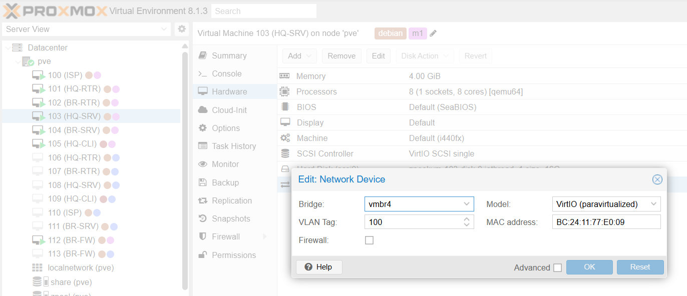
</p>

Для `HQ-CLI` указываем VLAN 200:

<p align="center">
  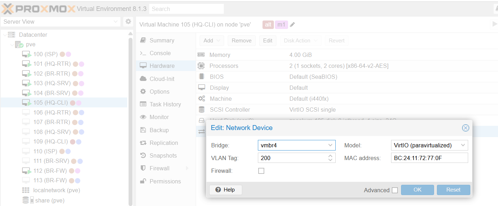
</p>

Интерфейс `HQ-RTR`, подключённый к `vmbr4`, оставляем без VLAN Tag, так как через него должен проходить трафик VLAN 100, 200 и 999.

> **Примечание:**
> На `HQ-RTR` разделение трафика выполняется подинтерфейсами `ens19.100`, `ens19.200` и `ens19.999`.

### <p align="center"><b>6. Настройка GRE-туннеля между HQ и BR</b></p>

По заданию между маршрутизаторами `HQ-RTR` и `BR-RTR` необходимо настроить GRE-туннель.

Для туннеля используем сеть:

```text
10.10.10.0/30
```

Адреса:

```text
HQ-RTR -> 10.10.10.1/30
BR-RTR -> 10.10.10.2/30
```

<p align="center"><b>HQ-RTR</b></p>

Открываем файл сетевой конфигурации:

```bash
nano /etc/network/interfaces
```

Добавляем GRE-интерфейс:

```text
auto gre1
iface gre1 inet static
    address 10.10.10.1/30
    pre-up ip tunnel add gre1 mode gre local 172.16.1.2 remote 172.16.2.2 ttl 255
    post-down ip tunnel del gre1
```

<p align="center">
  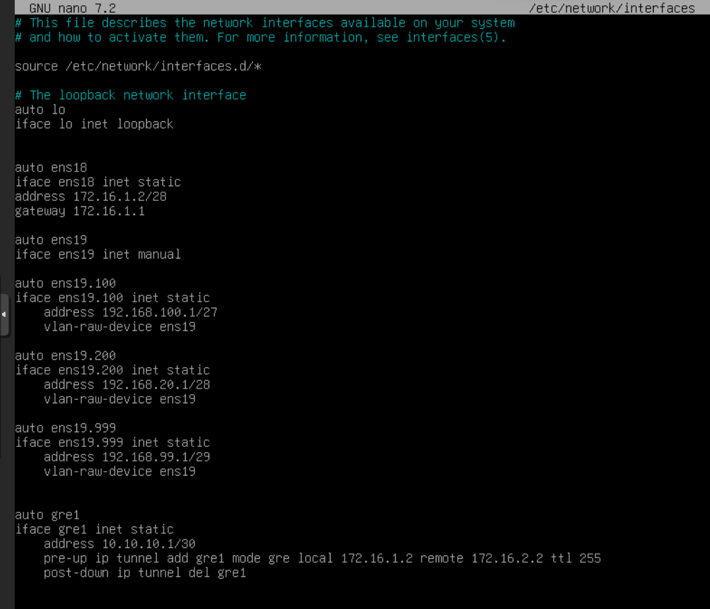
</p>

<p align="center"><b>BR-RTR</b></p>

Открываем:

```bash
nano /etc/network/interfaces
```

Добавляем:

```text
auto gre1
iface gre1 inet static
    address 10.10.10.2/30
    pre-up ip tunnel add gre1 mode gre local 172.16.2.2 remote 172.16.1.2 ttl 255
    post-down ip tunnel del gre1
```

<p align="center">
  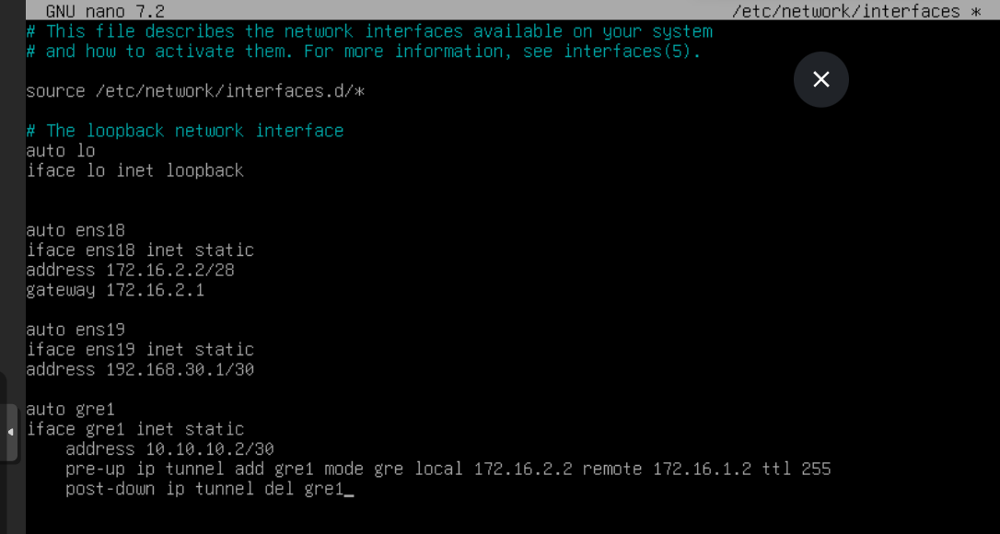
</p>

После настройки перезапускаем сеть:

```bash
systemctl restart networking
```

Проверяем GRE-туннель с `HQ-RTR`:

```bash
ping 10.10.10.2
```

<p align="center">
  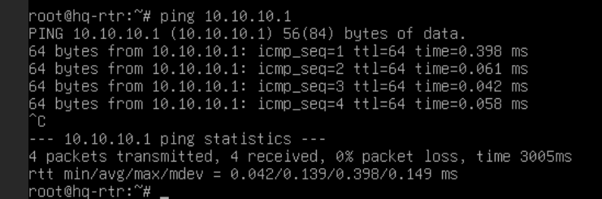
</p>

При успешной настройке адрес `10.10.10.2` должен отвечать без потерь.

### <p align="center"><b>8. Настройка динамической трансляции адресов</b></p>

По заданию необходимо настроить динамическую трансляцию адресов на маршрутизаторах `HQ-RTR` и `BR-RTR`, чтобы устройства обоих офисов имели доступ к сети Интернет.

### <p align="center"><b>Включение пересылки IPv4</b></p>

Для маршрутизации трафика на `HQ-RTR`, `BR-RTR` и `BR-FW` необходимо разрешить пересылку IPv4-пакетов.

Открываем файл:

```bash
nano /etc/sysctl.conf
```

Добавляем или раскомментируем строку:

```text
net.ipv4.ip_forward=1
```

Применяем настройки:

```bash
sysctl -p
```

Проверяем:

```bash
sysctl net.ipv4.ip_forward
```

Ожидаемый результат:

```text
net.ipv4.ip_forward = 1
```

> **Примечание:**
> `BR-FW` является промежуточным маршрутизатором между `BR-RTR` и сетью `BR-SRV`, поэтому IPv4 forwarding на нём также должен быть включён.

---

<p align="center"><b>HQ-RTR</b></p>

Для выхода локальных сетей офиса HQ в Интернет настраиваем динамическую трансляцию адресов.

Открываем:

```bash
nano /etc/nftables.conf
```

Настраиваем:

```nft
#!/usr/sbin/nft -f

flush ruleset

table inet filter {
    chain input {
        type filter hook input priority filter;
    }

    chain forward {
        type filter hook forward priority filter;
    }

    chain output {
        type filter hook output priority filter;
    }
}

table inet nat {
    chain POSTROUTING {
        type nat hook postrouting priority srcnat;

        oifname "ens18" ip saddr { 192.168.100.0/27, 192.168.20.0/28, 192.168.99.0/29 } masquerade
    }
}
```

<p align="center">
  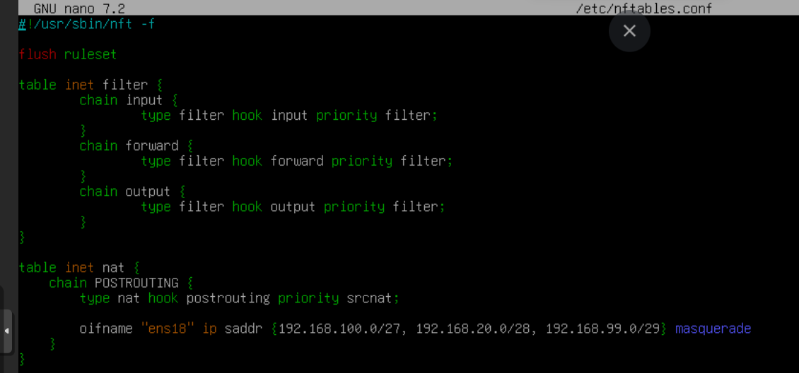
</p>

---

<p align="center"><b>BR-RTR</b></p>

Для выхода сетей офиса BR в Интернет выполняем аналогичную настройку.

Открываем:

```bash
nano /etc/nftables.conf
```

Настраиваем:

```nft
#!/usr/sbin/nft -f

flush ruleset

table inet filter {
    chain input {
        type filter hook input priority filter;
    }

    chain forward {
        type filter hook forward priority filter;
    }

    chain output {
        type filter hook output priority filter;
    }
}

table inet nat {
    chain POSTROUTING {
        type nat hook postrouting priority srcnat;

        oifname "ens18" ip saddr { 192.168.30.0/30, 192.168.200.0/28 } masquerade
    }
}
```

<p align="center">
  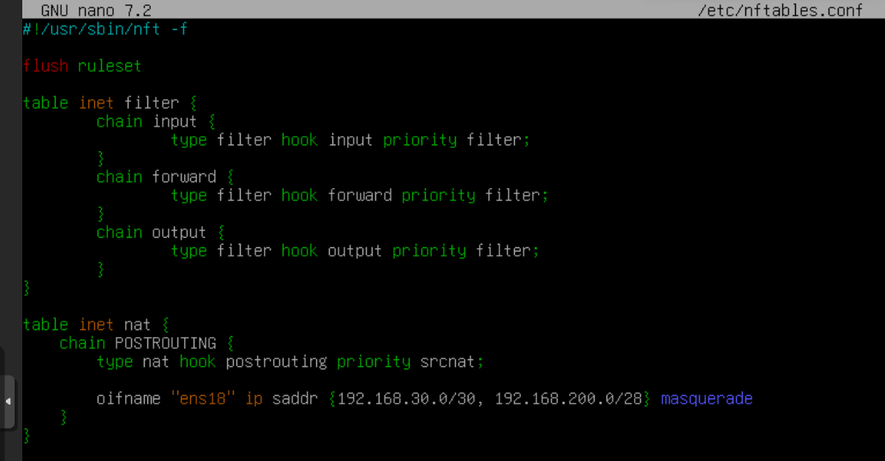
</p>

---

### <p align="center"><b>BR-FW</b></p>

На `BR-FW` NAT не настраиваем.

`BR-FW` только маршрутизирует трафик между сетью `BR-SRV` и `BR-RTR`.

На интерфейсе в сторону `BR-RTR` ранее уже был настроен шлюз:

```text
gateway 192.168.30.1
```

Поэтому на `BR-FW` автоматически создаётся маршрут по умолчанию:

```text
default via 192.168.30.1
```

Проверить его можно командой:

```bash
ip r
```

> **Примечание:**
> Динамическая трансляция адресов выполняется на `BR-RTR`, а `BR-FW` выступает промежуточным маршрутизатором между `192.168.200.0/28` и `BR-RTR`.

---

После настройки `nftables` на `HQ-RTR` и `BR-RTR` проверяем конфигурацию:

```bash
nft -c -f /etc/nftables.conf
```

Если ошибок нет, применяем:

```bash
nft -f /etc/nftables.conf
```

Добавляем службу в автозагрузку:

```bash
systemctl enable nftables
```

Перезапускаем:

```bash
systemctl restart nftables
```

Проверяем правила:

```bash
nft list ruleset
```

### <p align="center"><b>Проверка доступа в Интернет</b></p>

Проверяем доступ в Интернет с `BR-FW`:

```bash
ping 77.88.8.8
```

<p align="center">
  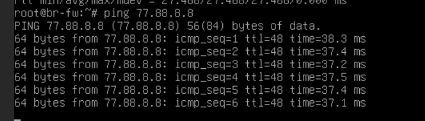
</p>

Ответы от `77.88.8.8` подтверждают, что `BR-FW` имеет доступ в Интернет через `BR-RTR`.

> **Примечание:**
> Полный доступ `BR-SRV` к сети Интернет будет проверен после настройки OSPF, когда `BR-RTR` получит маршрут к сети `192.168.200.0/28` через `BR-FW`.

### <p align="center"><b>7. Настройка динамической маршрутизации OSPF</b></p>

По заданию необходимо настроить динамическую маршрутизацию между `HQ-RTR`, `BR-RTR` и `BR-FW` с использованием протокола OSPF.

На `HQ-RTR` и `BR-RTR` обмен маршрутами между офисами выполняется через GRE-туннель.

На `BR-FW` OSPF используется только на интерфейсе в сторону `BR-RTR`.

Для защиты OSPF-соседства между `HQ-RTR` и `BR-RTR` используется MD5-аутентификация с паролем:

```text
P@ssw0rd
```

### <p align="center"><b>Установка и включение OSPF</b></p>

На `HQ-RTR`, `BR-RTR` и `BR-FW` устанавливаем FRR:

```bash
apt update
apt install -y frr
```

Открываем файл:

```bash
nano /etc/frr/daemons
```

Включаем демон OSPF:

```text
ospfd=yes
```

<p align="center">
  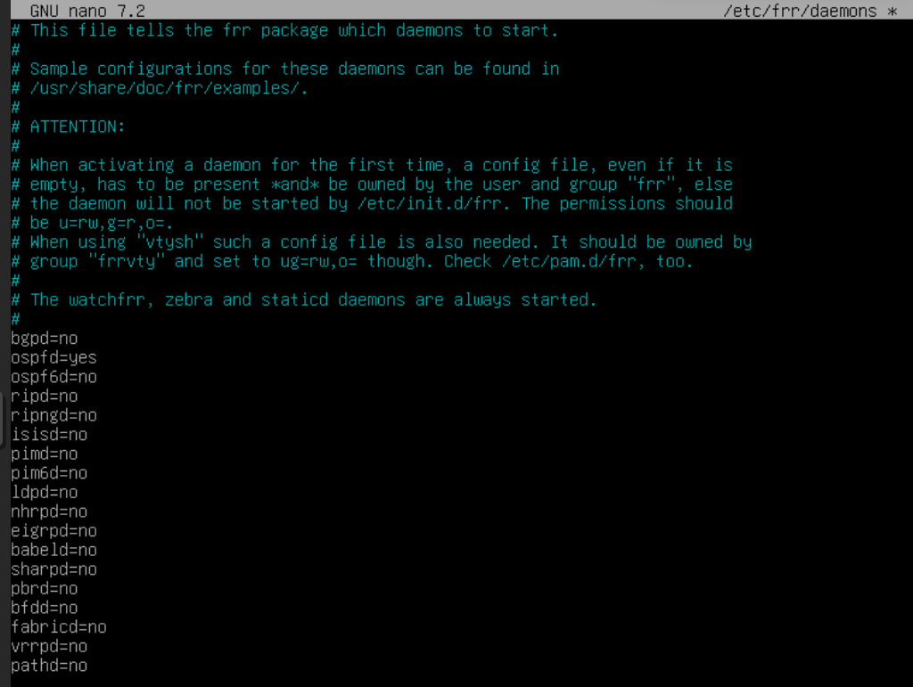
</p>

Перезапускаем FRR:

```bash
systemctl restart frr
systemctl enable frr
```

---

<p align="center"><b>HQ-RTR</b></p>

Заходим в консоль FRR:

```bash
vtysh
```

Настраиваем OSPF:

```text
configure terminal

router ospf
 passive-interface default
 network 10.10.10.0/30 area 0
 network 192.168.100.0/27 area 0
 network 192.168.20.0/28 area 0
 network 192.168.99.0/29 area 0
exit

interface gre1
 no ip ospf passive
 ip ospf authentication message-digest
 ip ospf message-digest-key 1 md5 P@ssw0rd
exit

end
write memory
```

<p align="center">
  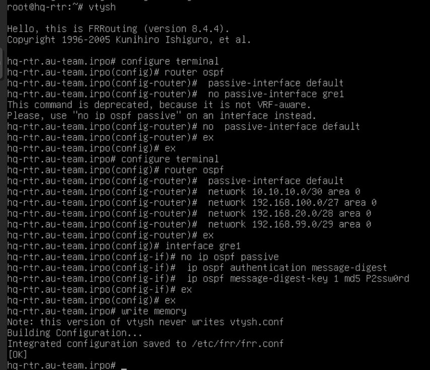
</p>

Таким образом, локальные сети HQ анонсируются в OSPF, но OSPF-соседство формируется только через `gre1`.

---

<p align="center"><b>BR-RTR</b></p>

Заходим в FRR:

```bash
vtysh
```

Настраиваем:

```text
configure terminal

router ospf
 passive-interface default
 network 10.10.10.0/30 area 0
 network 192.168.30.0/30 area 0
exit

interface gre1
 ip ospf authentication message-digest
 ip ospf message-digest-key 1 md5 P@ssw0rd
 no ip ospf passive
exit

interface ens19
 no ip ospf passive
exit

end
write memory
```

<p align="center">
  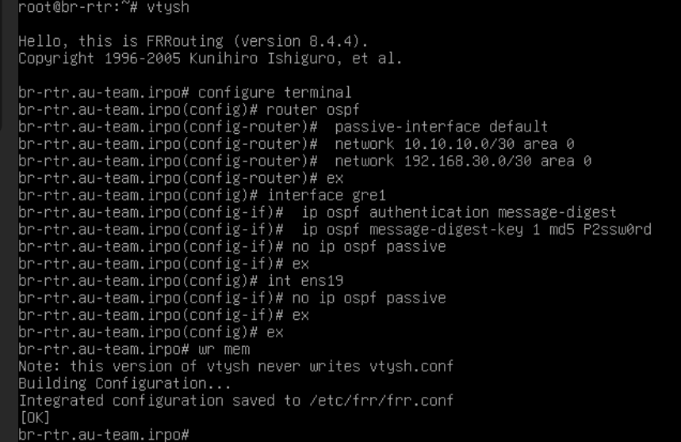
</p>

На `BR-RTR` OSPF-соседство формируется через `gre1` с `HQ-RTR` и через `ens19` с `BR-FW`.

---

<p align="center"><b>BR-FW</b></p>

Заходим в FRR:

```bash
vtysh
```

Настраиваем:

```text
configure terminal

router ospf
 passive-interface default
 network 192.168.30.0/30 area 0
 network 192.168.200.0/28 area 0
exit

interface ens18
 no ip ospf passive
exit

end
write memory
```

<p align="center">
  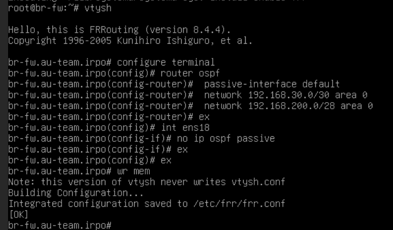
</p>

На `BR-FW` OSPF-соседство формируется только через `ens18` в сторону `BR-RTR`. Сеть `192.168.200.0/28` при этом анонсируется в OSPF.

### <p align="center"><b>Проверка OSPF-соседства</b></p>

На `BR-RTR` проверяем соседей:

```bash
vtysh -c "show ip ospf neighbor"
```

<p align="center">
  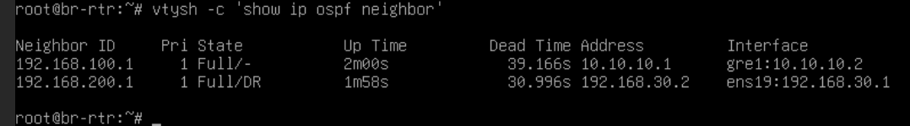
</p>

В таблице должны присутствовать два соседа: `HQ-RTR` через `gre1` и `BR-FW` через `ens19`. Состояние соседства должно быть `Full`.

### <p align="center"><b>Проверка полученных маршрутов</b></p>

На `BR-RTR` выполняем:

```bash
vtysh -c "show ip route ospf"
```

<p align="center">
  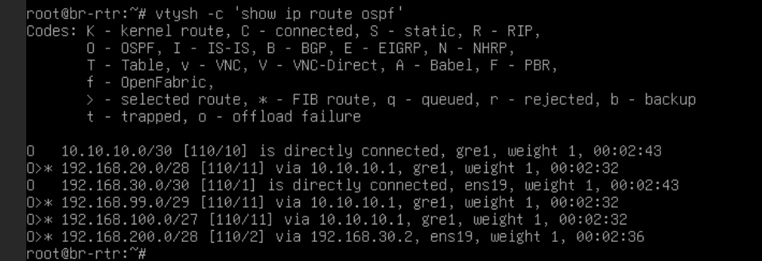
</p>

На `HQ-RTR` выполняем:

```bash
vtysh -c "show ip route ospf"
```

<p align="center">
  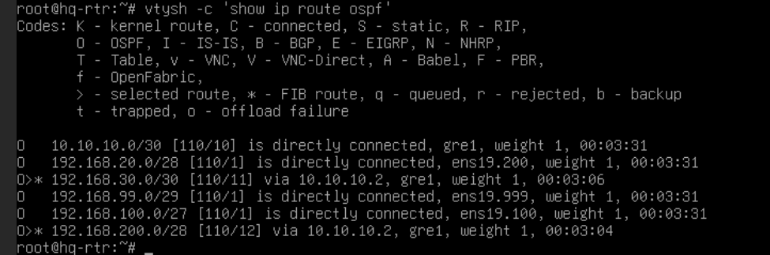
</p>

На `HQ-RTR` должны быть получены маршруты `192.168.30.0/30` и `192.168.200.0/28` через `BR-RTR`.

### <p align="center"><b>Проверка связности между офисами</b></p>

Проверяем доступ от `HQ-RTR` до `BR-SRV`:

```bash
ping 192.168.200.2
```

<p align="center">
  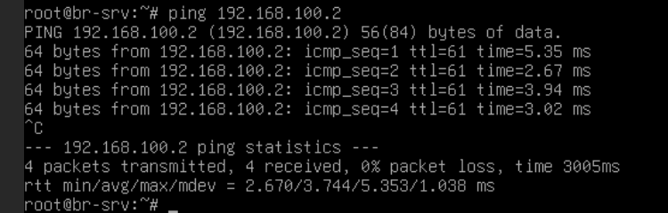
</p>

Проверяем доступ от `BR-SRV` до `HQ-SRV`:

```bash
ping 192.168.100.2
```

<p align="center">
  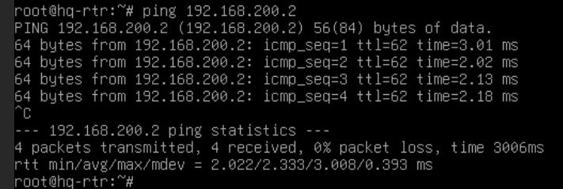
</p>

Успешный обмен ICMP-пакетами в обе стороны подтверждает корректную работу GRE-туннеля, OSPF и маршрутизации между офисами.

> **Примечание:**
> OSPF-соседство между `HQ-RTR` и `BR-RTR` защищено MD5-аутентификацией с паролем `P@ssw0rd`.

### <p align="center"><b>3. Создание локальных учетных записей</b></p>

По заданию необходимо создать локальные учетные записи на серверах `HQ-SRV` и `BR-SRV`, а также на маршрутизаторах `HQ-RTR` и `BR-RTR`.

На серверах создаётся пользователь `sshuser` с UID `2027`.

На маршрутизаторах создаётся пользователь `net_admin`.

Для всех пользователей используется пароль:

```text
P@ssw0rd
```

Также пользователи должны иметь возможность выполнять команды через `sudo` без ввода пароля.

---

### <p align="center"><b>Установка sudo</b></p>

На `HQ-SRV`, `BR-SRV`, `HQ-RTR` и `BR-RTR` устанавливаем пакет `sudo`:

```bash
apt update
apt install -y sudo
```

---

<p align="center"><b>HQ-SRV</b></p>

Создаём пользователя `sshuser` с UID `2027`:

```bash
useradd -m -u 2027 -s /bin/bash sshuser
```

Задаём пароль:

```bash
passwd sshuser
```

Пароль:

```text
P@ssw0rd
```

Добавляем пользователя в группу `sudo`:

```bash
usermod -aG sudo sshuser
```

<p align="center">
  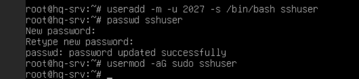
</p>

Создаём правило для запуска `sudo` без ввода пароля:

```bash
nano /etc/sudoers.d/sshuser
```

Добавляем:

```text
sshuser ALL=(ALL:ALL) NOPASSWD: ALL
```

Устанавливаем правильные права:

```bash
chmod 440 /etc/sudoers.d/sshuser
```

Проверяем пользователя:

```bash
id sshuser
```

Проверяем права `sudo`:

```bash
sudo -l -U sshuser
```

---

<p align="center"><b>BR-SRV</b></p>

Создаём пользователя:

```bash
useradd -m -u 2027 -s /bin/bash sshuser
passwd sshuser
usermod -aG sudo sshuser
```

Пароль:

```text
P@ssw0rd
```

Создаём файл:

```bash
nano /etc/sudoers.d/sshuser
```

Добавляем:

```text
sshuser ALL=(ALL:ALL) NOPASSWD: ALL
```

Устанавливаем права:

```bash
chmod 440 /etc/sudoers.d/sshuser
```

Проверяем:

```bash
id sshuser
sudo -l -U sshuser
```

<p align="center">
  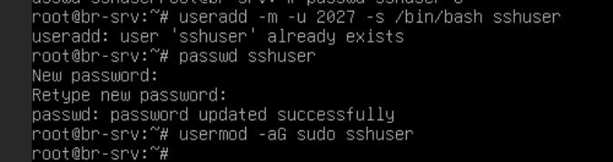
</p>

---

<p align="center"><b>HQ-RTR</b></p>

Создаём пользователя `net_admin`:

```bash
useradd -m -s /bin/bash net_admin
```

Задаём пароль:

```bash
passwd net_admin
```

Пароль:

```text
P@ssw0rd
```

Добавляем пользователя в группу `sudo`:

```bash
usermod -aG sudo net_admin
```

<p align="center">
  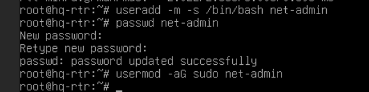
</p>

Создаём правило:

```bash
nano /etc/sudoers.d/net_admin
```

Добавляем:

```text
net_admin ALL=(ALL:ALL) NOPASSWD: ALL
```

Устанавливаем права:

```bash
chmod 440 /etc/sudoers.d/net_admin
```

Проверяем:

```bash
id net_admin
sudo -l -U net_admin
```

---

<p align="center"><b>BR-RTR</b></p>

Создаём пользователя:

```bash
useradd -m -s /bin/bash net_admin
passwd net_admin
usermod -aG sudo net_admin
```

Пароль:

```text
P@ssw0rd
```

Создаём файл:

```bash
nano /etc/sudoers.d/net_admin
```

Добавляем:

```text
net_admin ALL=(ALL:ALL) NOPASSWD: ALL
```

Устанавливаем права:

```bash
chmod 440 /etc/sudoers.d/net_admin
```

Проверяем:

```bash
id net_admin
sudo -l -U net_admin
```

<p align="center">
  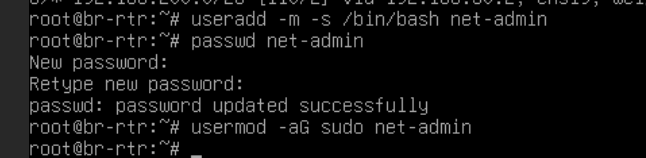
</p>

> **Примечание:**
> Пользователь `sshuser` на `HQ-SRV` и `BR-SRV` имеет UID `2027` и может выполнять команды через `sudo` без ввода пароля.
>
> Пользователь `net_admin` на `HQ-RTR` и `BR-RTR` также имеет возможность выполнять команды через `sudo` без ввода пароля.

### <p align="center"><b>5. Настройка безопасного удаленного доступа SSH</b></p>

По заданию необходимо настроить безопасный удаленный доступ на серверах `HQ-SRV` и `BR-SRV`.

Требования:

- использовать порт `2027`;
- разрешить подключение только пользователю `sshuser`;
- ограничить количество попыток входа до двух;
- настроить баннер `Authorized access only`.

### <p align="center"><b>Установка SSH-сервера</b></p>

По умолчанию SSH-сервер может быть не установлен, поэтому на `HQ-SRV` и `BR-SRV` устанавливаем пакет:

```bash
apt update
apt install -y openssh-server
```

После установки включаем службу:

```bash
systemctl enable ssh
systemctl start ssh
```

---

<p align="center"><b>HQ-SRV</b></p>

Открываем конфигурационный файл SSH:

```bash
nano /etc/ssh/sshd_config
```

**В самый конец файла** добавляем:

```text
Port 2027
AllowUsers sshuser
MaxAuthTries 2
Banner /etc/issue.net
```

<p align="center">
  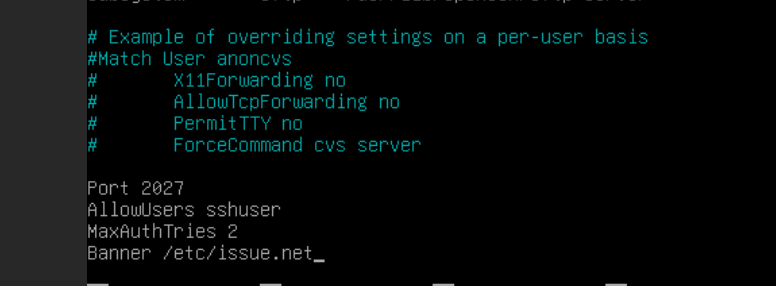
</p>

---

<p align="center"><b>BR-SRV</b></p>

Открываем:

```bash
nano /etc/ssh/sshd_config
```

**В самый конец файла** добавляем:

```text
Port 2027
AllowUsers sshuser
MaxAuthTries 2
Banner /etc/issue.net
```

<p align="center">
  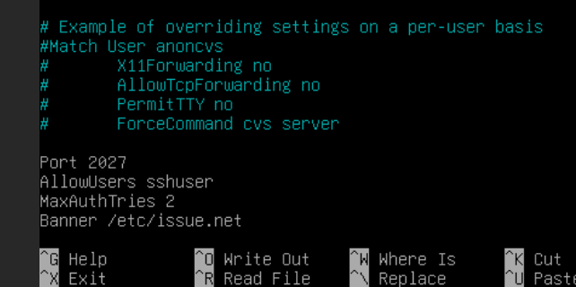
</p>

### <p align="center"><b>Настройка SSH-баннера</b></p>

На обоих серверах создаём файл баннера:

```bash
nano /etc/issue.net
```

Добавляем строку:

```text
Authorized access only
```

<p align="center">
  
</p>

Проверяем корректность конфигурации SSH:

```bash
sshd -t
```

Если команда не выводит ошибок, перезапускаем SSH:

```bash
systemctl restart ssh
```

Проверяем, что SSH слушает порт `2027`:

```bash
ss -tulpn | grep 2027
```

### <p align="center"><b>Проверка подключения к HQ-SRV</b></p>

Подключаемся к `HQ-SRV` по SSH:

```bash
ssh sshuser@192.168.100.2 -p 2027
```

При подключении должен появиться баннер:

```text
Authorized access only
```

<p align="center">
  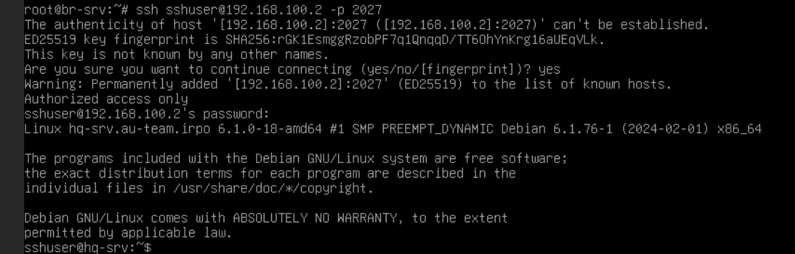
</p>

### <p align="center"><b>Проверка подключения к BR-SRV</b></p>

Подключаемся к `BR-SRV` по SSH:

```bash
ssh sshuser@192.168.200.2 -p 2027
```

При подключении также должен появиться баннер:

```text
Authorized access only
```

<p align="center">
  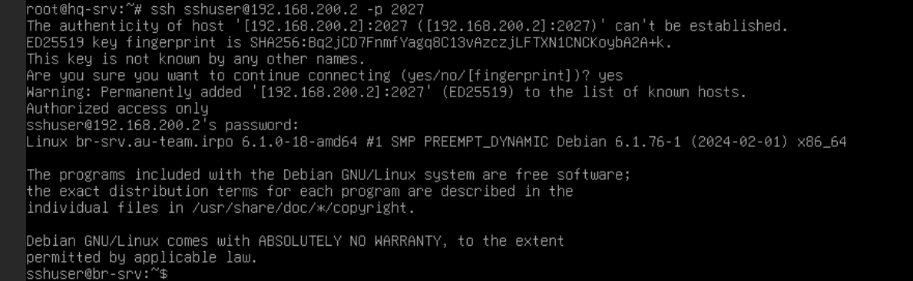
</p>

> **Примечание:**
> Благодаря параметру `AllowUsers sshuser` подключение по SSH разрешено только пользователю `sshuser`.
>
> Параметр `MaxAuthTries 2` ограничивает количество попыток аутентификации до двух.

### <p align="center"><b>9. Настройка DHCP для HQ-CLI</b></p>

По заданию необходимо настроить протокол динамической конфигурации хостов для сети в сторону `HQ-CLI`.

В качестве DHCP-сервера используется `HQ-RTR`, клиентом является `HQ-CLI`.

Для сети VLAN 200 используется подсеть:

```text
192.168.20.0/28
```

Адрес маршрутизатора:

```text
192.168.20.1
```

DNS-сервер:

```text
192.168.100.2
```

DNS-суффикс:

```text
au-team.irpo
```

### <p align="center"><b>Установка DHCP-сервера</b></p>

На `HQ-RTR` устанавливаем DHCP-сервер:

```bash
apt update
apt install -y isc-dhcp-server
```

> **ВНИМАНИЕ:**
> Сразу после установки `isc-dhcp-server` служба может завершиться с ошибкой.
> Это нормально, так как интерфейс и DHCP-подсеть ещё не настроены.
> После заполнения `/etc/default/isc-dhcp-server` и `/etc/dhcp/dhcpd.conf` служба должна успешно запуститься.

### <p align="center"><b>Выбор интерфейса DHCP-сервера</b></p>

Открываем файл:

```bash
nano /etc/default/isc-dhcp-server
```

Для IPv4 указываем интерфейс VLAN 200:

```text
INTERFACESv4="ens19.200"
```

<p align="center">
  
</p>

### <p align="center"><b>Настройка DHCP-пула</b></p>

Открываем основной конфигурационный файл:

```bash
nano /etc/dhcp/dhcpd.conf
```

В конец файла добавляем:

```text
authoritative;

subnet 192.168.20.0 netmask 255.255.255.240 {
    range 192.168.20.2 192.168.20.14;
    option routers 192.168.20.1;
    option domain-name-servers 192.168.100.2;
    option domain-name "au-team.irpo";
}
```

<p align="center">
  
</p>

Адрес `192.168.20.1` принадлежит маршрутизатору `HQ-RTR` и в диапазон выдачи не входит.

Диапазон DHCP:

```text
192.168.20.2 - 192.168.20.14
```

Шлюз по умолчанию:

```text
192.168.20.1
```

DNS-сервер:

```text
192.168.100.2
```

DNS-суффикс:

```text
au-team.irpo
```

### <p align="center"><b>Проверка и запуск DHCP-сервера</b></p>

Проверяем конфигурацию:

```bash
dhcpd -t -cf /etc/dhcp/dhcpd.conf
```

Если ошибок нет, перезапускаем службу:

```bash
systemctl restart isc-dhcp-server
```

Добавляем службу в автозагрузку:

```bash
systemctl enable isc-dhcp-server
```

Проверяем статус:

```bash
systemctl status isc-dhcp-server
```

<p align="center">
  
</p>

Служба должна находиться в состоянии:

```text
active (running)
```

### <p align="center"><b>Настройка HQ-CLI</b></p>

На `HQ-CLI` сетевой интерфейс должен получать IPv4-адрес автоматически по DHCP.

После получения адреса проверяем:

```bash
ip a
```

<p align="center">
  
</p>

На `HQ-CLI` должен быть получен адрес из сети:

```text
192.168.20.0/28
```

В нашем случае клиент получил:

```text
192.168.20.2/28
```

Проверить маршрут по умолчанию можно командой:

```bash
ip r
```

Ожидаемый шлюз:

```text
default via 192.168.20.1
```

Проверить DNS-настройки можно командой:

```bash
cat /etc/resolv.conf
```

DNS-сервером должен быть указан:

```text
192.168.100.2
```

> **Примечание:**
> `HQ-RTR` выступает DHCP-сервером для VLAN 200, а `HQ-CLI` получает сетевые параметры автоматически.

### <p align="center"><b>10. Настройка DNS на HQ-SRV</b></p>

По заданию необходимо настроить инфраструктуру разрешения доменных имён для офисов HQ и BR.

Основным DNS-сервером является `HQ-SRV`.

DNS-сервер должен обеспечивать:

- прямое разрешение имён в IP-адреса;
- обратное разрешение IP-адресов в имена для `HQ-SRV` и `BR-SRV`;
- пересылку внешних DNS-запросов на общедоступный DNS-сервер.

В качестве DNS-сервера используем `dnsmasq`.

### <p align="center"><b>Установка dnsmasq</b></p>

На `HQ-SRV` устанавливаем пакет:

```bash
apt update
apt install -y dnsmasq
```

### <p align="center"><b>Настройка локальной DNS-зоны</b></p>

Создаём отдельный конфигурационный файл:

```bash
nano /etc/dnsmasq.d/au-team.conf
```

Добавляем:

```text
domain=au-team.irpo
local=/au-team.irpo/

server=77.88.8.7

listen-address=127.0.0.1
listen-address=192.168.100.2
bind-interfaces

address=/hq-rtr.au-team.irpo/192.168.100.1
address=/br-rtr.au-team.irpo/192.168.30.1
address=/br-fw.au-team.irpo/192.168.200.1
address=/hq-srv.au-team.irpo/192.168.100.2
address=/hq-cli.au-team.irpo/192.168.20.2
address=/br-srv.au-team.irpo/192.168.200.2
address=/docker.au-team.irpo/172.16.1.1
address=/web.au-team.irpo/172.16.2.1
```

<p align="center">
  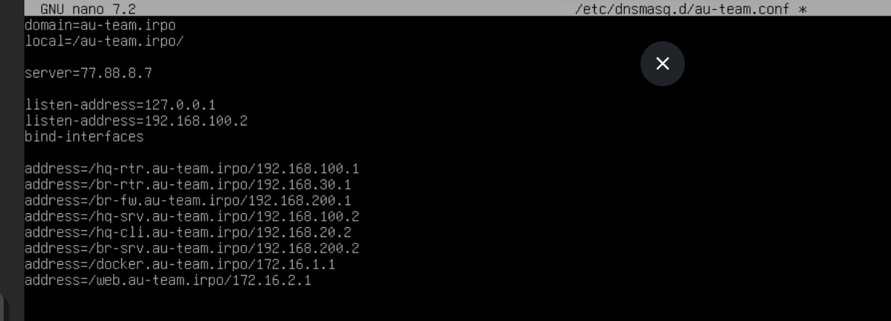
</p>

В конфигурации:

- локальный домен — `au-team.irpo`;
- внешний DNS-сервер для пересылки — `77.88.8.7`;
- `dnsmasq` принимает запросы на адресе `192.168.100.2`;
- добавлены все необходимые A-записи согласно таблице задания.

### <p align="center"><b>Настройка обратного разрешения имён</b></p>

Для `HQ-SRV` и `BR-SRV` по заданию необходимо обеспечить PTR-разрешение.

Открываем:

```bash
nano /etc/hosts
```

Добавляем:

```text
192.168.100.2 hq-srv.au-team.irpo hq-srv
192.168.200.2 br-srv.au-team.irpo br-srv
```

<p align="center">
  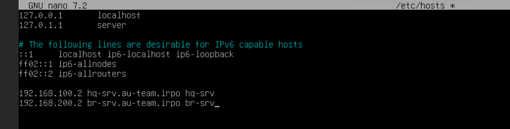
</p>

`dnsmasq` использует записи из `/etc/hosts`, поэтому для данных адресов будут доступны обратные DNS-запросы.

### <p align="center"><b>Проверка конфигурации DNS</b></p>

Проверяем синтаксис:

```bash
dnsmasq --test
```

При корректной конфигурации получаем:

```text
dnsmasq: syntax check OK.
```

Перезапускаем службу:

```bash
systemctl restart dnsmasq
```

Добавляем в автозагрузку:

```bash
systemctl enable dnsmasq
```

Проверяем статус:

```bash
systemctl status dnsmasq
```

<p align="center">
  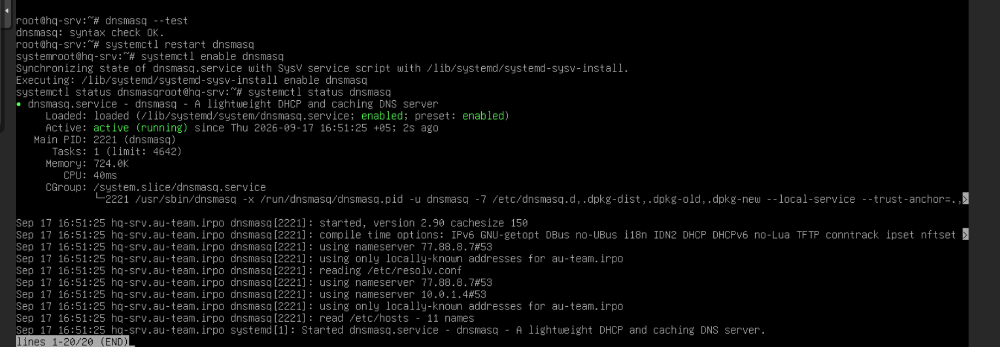
</p>

Служба должна находиться в состоянии:

```text
active (running)
```

### <p align="center"><b>Проверка прямого разрешения имён</b></p>

Проверяем локальные DNS-записи через `HQ-SRV`:

```bash
nslookup hq-srv.au-team.irpo 192.168.100.2
nslookup br-srv.au-team.irpo 192.168.100.2
nslookup br-rtr.au-team.irpo 192.168.100.2
nslookup docker.au-team.irpo 192.168.100.2
nslookup web.au-team.irpo 192.168.100.2
```

<p align="center">
  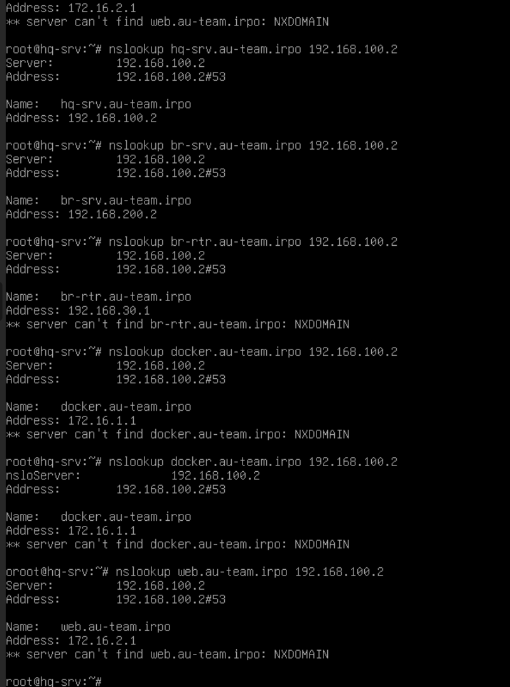
</p>

DNS-сервер должен возвращать соответствующие IPv4-адреса устройств.

> **Примечание:**
> При использовании `nslookup` после корректного IPv4-ответа может дополнительно отображаться `NXDOMAIN`.
> Это связано с дополнительными запросами, например AAAA-запросами.
> Если строка `Address:` содержит правильный IPv4-адрес, A-запись работает корректно.

### <p align="center"><b>Проверка обратного разрешения имён</b></p>

Проверяем PTR-запись для `HQ-SRV`:

```bash
nslookup 192.168.100.2 192.168.100.2
```

Проверяем PTR-запись для `BR-SRV`:

```bash
nslookup 192.168.200.2 192.168.100.2
```

<p align="center">
  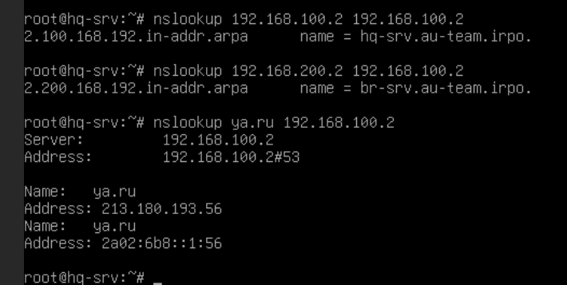
</p>

В результате должны разрешаться имена:

```text
hq-srv.au-team.irpo
br-srv.au-team.irpo
```

### <p align="center"><b>Проверка DNS-пересылки</b></p>

Проверяем разрешение внешнего доменного имени:

```bash
nslookup ya.ru 192.168.100.2
```

Если возвращается внешний IP-адрес, пересылка DNS-запросов через `77.88.8.7` работает корректно.

> **Примечание:**
> `HQ-CLI` получает адрес DNS-сервера `192.168.100.2` по DHCP, поэтому после настройки `dnsmasq` клиент может использовать `HQ-SRV` как основной DNS-сервер.
