# laba/Вариант 1

## <p align="center"><b>МОДУЛЬ 1</b></p>

Задание:

Необходимо разработать и настроить инфраструктуру информационно-коммуникационной системы согласно предложенной топологии.

Задание включает базовую настройку устройств:

- присвоение имен устройствам;
- расчет IP-адресации;
- настройку коммутации и маршрутизации.

В ходе проектирования и настройки сетевой инфраструктуры следует вести отчет о своих действиях, включая таблицы и схемы, предусмотренные в задании.

По каждому пункту задания, требующего отчёт, необходимо составить текстовый документ. Название документа должно содержать индекс пункта и краткое описание.

Текстовый документ должен содержать текстовую информацию и может включать снимки экрана. Скриншоты необходимо кадрировать так, чтобы относящаяся к выполнению задания информация была читаемой.

Итоговый отчет по окончании работы следует сохранить на диске рабочего места и задать имя файла:

**ФамилияУчастникаЗадание1**

без учёта расширения.

SSH Для подключения к стендам, выполняется с HQ-CLI. !!! ВНИМАНИЕ если не умееете не трогайте

isp - ssh root@172.16.10.1
hq-srv - ssh sshuser@192.168.100.2 -p 2027
br-srv - ssh sshuser@192.168.200.2 -p 2027
hq-rtr - ssh root@192.168.100.1
br-rtr - ssh root@192.168.200.1

Порты смотретите по заданию они изменяются


# laba/Вариант 1

## <p align="center"><b>МОДУЛЬ 1</b></p>

Задание 1. Настройка сетевой инфраструктуры :
Необходимо разработать и настроить инфраструктуру информационно коммуникационной системы согласно предложенной топологии (см.  Рисунок 
1). 
Задание включает базовую настройку устройств: 
- присвоение имен устройствам; 
- расчет IP-адресации; 
- настройку коммутации и маршрутизации;

В ходе проектирования и настройки сетевой инфраструктуры следует вести отчет о своих действиях, включая таблицы и схемы, предусмотренные в задании.

По каждому пункту задания, требующего отчёт, составить текстовый документ, название которого должно содержать индекс пункта и краткое  описание.

Текстовый документ должен содержать текстовую информацию и может включать снимки экрана, кадрированные таким образом, чтобы относящаяся к выполнению задания информация на снимках была читаемой. 

Итоговый отчет по окончании работы следует сохранить на диске рабочего места и задать имя файла - ФамилияУчастникаЗадание1 без учёта расширения.

<p align="center">
  
</p>

<p align="center">
  
</p>

<p align="center"><b>Чтобы зайти на стенд для 1 модуля.</b></p>
 
<p align="center"><b>User name: m1</b></p>
<p align="center"><b>Password: module1</b></p>

**ISP преднастроена, но включать ее надо**
 
### <p align="center"><b>Настройка имен устройств</b></p>

По заданию необходимо настроить имена устройств согласно топологии, используя полные доменные имена.

Для изменения имени устройства используем команду:

```bash
hostnamectl set-hostname <имя_устройства>.au-team.irpo; exec bash
```

Настраиваем имена на всех устройствах.

<p align="center"><b>ISP</b></p>

```bash
hostnamectl set-hostname isp.au-team.irpo; exec bash
```

<p align="center">
  
</p>

<p align="center"><b>HQ-RTR</b></p>

```bash
hostnamectl set-hostname hq-rtr.au-team.irpo; exec bash
```

<p align="center">
  
</p>

<p align="center"><b>BR-RTR</b></p>

```bash
hostnamectl set-hostname br-rtr.au-team.irpo; exec bash
```

<p align="center">
  
</p>

<p align="center"><b>HQ-SRV</b></p>

```bash
hostnamectl set-hostname hq-srv.au-team.irpo; exec bash
```

<p align="center">
  
</p>

<p align="center"><b>BR-SRV</b></p>

```bash
hostnamectl set-hostname br-srv.au-team.irpo; exec bash
```

<p align="center">
  
</p>

<p align="center"><b>HQ-CLI</b></p>

На клиентской машине сначала переходим в root:

```bash
su -
```

После этого меняем имя устройства:

```bash
hostnamectl set-hostname hq-cli.au-team.irpo; exec bash
```

<p align="center">
  
</p>

<p align="center"><b>BR-FW</b></p>

```bash
hostnamectl set-hostname br-fw.au-team.irpo; exec bash
```

<p align="center">
  
</p>

> **Примечание:**
> После выполнения команды имя устройства изменяется сразу благодаря `exec bash`.

> **Примечание:**
> Для устройств `HQ-RTR`, `BR-RTR`, `BR-FW`, `HQ-SRV`, `HQ-CLI` и `BR-SRV` используем домен `au-team.irpo` в соответствии с таблицей имен из задания.

### <p align="center"><b>Настройка IP-адресации</b></p>

Согласно заданию необходимо настроить IPv4-адресацию на устройствах.

Для варианта 1 будем использовать следующую таблицу адресации:

<p align="center">
  
</p>

> **Примечание:**
> Для `HQ-CLI` адрес `192.168.20.2/28` указан в таблице как планируемый. Фактически адрес будет выдан позже по DHCP.

---

<p align="center"><b>HQ-RTR</b></p>

На данном этапе настраиваем только интерфейс в сторону ISP.

Интерфейс в сторону HQ оставляем без адресации, так как VLAN 100, 200 и 999 будут настроены позднее в отдельном пункте задания.

Открываем конфигурацию сети:

```bash
nano /etc/network/interfaces
```

Настраиваем:

```text
auto ens18
iface ens18 inet static
    address 172.16.1.2/28
    gateway 172.16.1.1

auto ens19
iface ens19 inet manual
```

<p align="center">
  
</p>

---

<p align="center"><b>BR-RTR</b></p>

Открываем конфигурацию сети:

```bash
nano /etc/network/interfaces
```

Настраиваем интерфейс в сторону ISP и интерфейс в сторону `BR-FW`:

```text
auto ens18
iface ens18 inet static
    address 172.16.2.2/28
    gateway 172.16.2.1

auto ens19
iface ens19 inet static
    address 192.168.30.1/30
```

<p align="center">
  
</p>

---

<p align="center"><b>HQ-SRV</b></p>

Открываем конфигурацию сети:

```bash
nano /etc/network/interfaces
```

Настраиваем адрес сервера:

```text
auto ens18
iface ens18 inet static
    address 192.168.100.2/27
    gateway 192.168.100.1
```

<p align="center">
  
</p>

---

<p align="center"><b>BR-SRV</b></p>

Открываем конфигурацию сети:

```bash
nano /etc/network/interfaces
```

Настраиваем адрес сервера:

```text
auto ens18
iface ens18 inet static
    address 192.168.200.2/28
    gateway 192.168.200.1
```

<p align="center">
  
</p>

---

<p align="center"><b>BR-FW</b></p>

Открываем конфигурацию сети:

```bash
nano /etc/network/interfaces
```

Настраиваем интерфейс в сторону `BR-RTR` и интерфейс в сторону `BR-SRV`:

```text
auto ens18
iface ens18 inet static
    address 192.168.30.2/30
    gateway 192.168.30.1

auto ens19
iface ens19 inet static
    address 192.168.200.1/28
```

<p align="center">
  
</p>

---

<p align="center"><b>HQ-CLI</b></p>

На данном этапе вручную статический адрес на `HQ-CLI` не настраиваем.

Позднее по заданию на `HQ-RTR` будет настроен DHCP-сервер, который выдаст клиенту адрес из сети:

```text
192.168.20.0/28
```

Планируемый адрес клиента:

```text
192.168.20.2/28
```

Шлюз по умолчанию:

```text
192.168.20.1
```

---

После изменения конфигурации сети на устройствах перезапускаем службу:

```bash
systemctl restart networking
```

Проверить назначенные адреса можно командой:

```bash
ip -br a
```

Проверить таблицу маршрутизации:

```bash
ip r
```

> **Примечание:**
> Адреса для VLAN 100, VLAN 200 и VLAN 999 на `HQ-RTR` будут добавлены позднее при настройке коммутации.

### <p align="center"><b>2. Настройка доступа к сети Интернет на ISP</b></p>

По заданию необходимо настроить маршрутизатор `ISP`:

- интерфейс в сторону магистрального провайдера должен получать адрес по DHCP;
- интерфейс в сторону `HQ-RTR` должен находиться в сети `172.16.1.0/28`;
- интерфейс в сторону `BR-RTR` должен находиться в сети `172.16.2.0/28`;
- необходимо разрешить маршрутизацию пакетов;
- настроить динамическую трансляцию адресов для выхода `HQ-RTR` и `BR-RTR` в Интернет.

<p align="center"><b>ISP</b></p>

Открываем файл конфигурации сетевых интерфейсов:

```bash
nano /etc/network/interfaces
```

Настраиваем интерфейсы следующим образом:

```text
auto ens18
iface ens18 inet dhcp

auto ens19
iface ens19 inet static
    address 172.16.1.1/28

auto ens20
iface ens20 inet static
    address 172.16.2.1/28
```

<p align="center">
  
</p>

Где:

- `ens18` — интерфейс в сторону магистрального провайдера;
- `ens19` — интерфейс в сторону `HQ-RTR`;
- `ens20` — интерфейс в сторону `BR-RTR`.

После изменения конфигурации перезапускаем сеть:

```bash
systemctl restart networking
```

### <p align="center"><b>Включаем пересылку пакетов на ISP</b></p>

Чтобы `ISP` мог пересылать пакеты между своими интерфейсами, включаем IPv4 forwarding.

Открываем файл:

```bash
nano /etc/sysctl.conf
```

Раскомментируем или добавим строку:

```text
net.ipv4.ip_forward=1
```

<p align="center">
  
</p>

Применяем изменения:

```bash
sysctl -p
```

### <p align="center"><b>Настройка NAT на ISP</b></p>

Для выхода маршрутизаторов `HQ-RTR` и `BR-RTR` в Интернет настроим динамическую трансляцию адресов с помощью `nftables`.

Открываем файл:

```bash
nano /etc/nftables.conf
```

Настраиваем:

```nft
#!/usr/sbin/nft -f

flush ruleset

table inet filter {
    chain forward {
        type filter hook forward priority filter;
        policy accept;
    }
}

table inet nat {
    chain POSTROUTING {
        type nat hook postrouting priority srcnat;

        oifname "ens18" ip saddr { 172.16.1.0/28, 172.16.2.0/28 } masquerade
    }
}
```

<p align="center">
  
</p>

Проверяем конфигурацию:

```bash
nft -c -f /etc/nftables.conf
```

Если ошибок нет, применяем:

```bash
nft -f /etc/nftables.conf
```

Добавляем службу в автозагрузку:

```bash
systemctl enable nftables
```

Перезапускаем:

```bash
systemctl restart nftables
```

Проверяем правила:

```bash
nft list ruleset
```

После этого `HQ-RTR` и `BR-RTR` должны иметь возможность выходить в Интернет через `ISP`.

### <p align="center"><b>4. Настройка коммутации в сегменте HQ</b></p>

По заданию необходимо:

- трафик `HQ-SRV` поместить в VLAN 100;
- трафик `HQ-CLI` поместить в VLAN 200;
- предусмотреть VLAN 999 для управления;
- маршрутизацию всех VLAN на `HQ-RTR` реализовать через один физический интерфейс.

<p align="center"><b>HQ-RTR</b></p>

Для связи с сегментом HQ используем один физический интерфейс `ens19`.

Открываем конфигурацию:

```bash
nano /etc/network/interfaces
```

Настраиваем VLAN-подинтерфейсы:

```text
auto ens19
iface ens19 inet manual

auto ens19.100
iface ens19.100 inet static
    address 192.168.100.1/27
    vlan-raw-device ens19

auto ens19.200
iface ens19.200 inet static
    address 192.168.20.1/28
    vlan-raw-device ens19

auto ens19.999
iface ens19.999 inet static
    address 192.168.99.1/29
    vlan-raw-device ens19
```

<p align="center">
  
</p>

После изменения конфигурации перезапускаем сеть:

```bash
systemctl restart networking
```

Проверяем созданные VLAN-интерфейсы:

```bash
ip -br a
```

<p align="center">
  
</p>

В результате должны быть доступны:

```text
ens19.100
ens19.200
ens19.999
```

> **Примечание:**
> Все VLAN маршрутизируются через один физический интерфейс `ens19`, как и требуется по заданию.

### <p align="center"><b>Настройка VLAN на виртуальном коммутаторе</b></p>

На виртуальном коммутаторе Proxmox распределяем устройства по VLAN.

Для `HQ-SRV` указываем VLAN 100:

<p align="center">
  
</p>

Для `HQ-CLI` указываем VLAN 200:

<p align="center">
  
</p>

Интерфейс `HQ-RTR`, подключённый к `vmbr4`, оставляем без VLAN Tag, так как через него должен проходить трафик VLAN 100, 200 и 999.

> **Примечание:**
> На `HQ-RTR` разделение трафика выполняется подинтерфейсами `ens19.100`, `ens19.200` и `ens19.999`.

### <p align="center"><b>6. Настройка GRE-туннеля между HQ и BR</b></p>

По заданию между маршрутизаторами `HQ-RTR` и `BR-RTR` необходимо настроить GRE-туннель.

Для туннеля используем сеть:

```text
10.10.10.0/30
```

Адреса:

```text
HQ-RTR -> 10.10.10.1/30
BR-RTR -> 10.10.10.2/30
```

<p align="center"><b>HQ-RTR</b></p>

Открываем файл сетевой конфигурации:

```bash
nano /etc/network/interfaces
```

Добавляем GRE-интерфейс:

```text
auto gre1
iface gre1 inet static
    address 10.10.10.1/30
    pre-up ip tunnel add gre1 mode gre local 172.16.1.2 remote 172.16.2.2 ttl 255
    post-down ip tunnel del gre1
```

<p align="center">
  
</p>

<p align="center"><b>BR-RTR</b></p>

Открываем:

```bash
nano /etc/network/interfaces
```

Добавляем:

```text
auto gre1
iface gre1 inet static
    address 10.10.10.2/30
    pre-up ip tunnel add gre1 mode gre local 172.16.2.2 remote 172.16.1.2 ttl 255
    post-down ip tunnel del gre1
```

<p align="center">
  
</p>

После настройки перезапускаем сеть:

```bash
systemctl restart networking
```

Проверяем GRE-туннель с `HQ-RTR`:

```bash
ping 10.10.10.2
```

<p align="center">
  
</p>

При успешной настройке адрес `10.10.10.2` должен отвечать без потерь.

### <p align="center"><b>8. Настройка динамической трансляции адресов</b></p>

По заданию необходимо настроить динамическую трансляцию адресов на маршрутизаторах `HQ-RTR` и `BR-RTR`, чтобы устройства обоих офисов имели доступ к сети Интернет.

### <p align="center"><b>Включение пересылки IPv4</b></p>

Для маршрутизации трафика на `HQ-RTR`, `BR-RTR` и `BR-FW` необходимо разрешить пересылку IPv4-пакетов.

Открываем файл:

```bash
nano /etc/sysctl.conf
```

Добавляем или раскомментируем строку:

```text
net.ipv4.ip_forward=1
```

Применяем настройки:

```bash
sysctl -p
```

Проверяем:

```bash
sysctl net.ipv4.ip_forward
```

Ожидаемый результат:

```text
net.ipv4.ip_forward = 1
```

> **Примечание:**
> `BR-FW` является промежуточным маршрутизатором между `BR-RTR` и сетью `BR-SRV`, поэтому IPv4 forwarding на нём также должен быть включён.

---

<p align="center"><b>HQ-RTR</b></p>

Для выхода локальных сетей офиса HQ в Интернет настраиваем динамическую трансляцию адресов.

Открываем:

```bash
nano /etc/nftables.conf
```

Настраиваем:

```nft
#!/usr/sbin/nft -f

flush ruleset

table inet filter {
    chain input {
        type filter hook input priority filter;
    }

    chain forward {
        type filter hook forward priority filter;
    }

    chain output {
        type filter hook output priority filter;
    }
}

table inet nat {
    chain POSTROUTING {
        type nat hook postrouting priority srcnat;

        oifname "ens18" ip saddr { 192.168.100.0/27, 192.168.20.0/28, 192.168.99.0/29 } masquerade
    }
}
```

<p align="center">
  
</p>

---

<p align="center"><b>BR-RTR</b></p>

Для выхода сетей офиса BR в Интернет выполняем аналогичную настройку.

Открываем:

```bash
nano /etc/nftables.conf
```

Настраиваем:

```nft
#!/usr/sbin/nft -f

flush ruleset

table inet filter {
    chain input {
        type filter hook input priority filter;
    }

    chain forward {
        type filter hook forward priority filter;
    }

    chain output {
        type filter hook output priority filter;
    }
}

table inet nat {
    chain POSTROUTING {
        type nat hook postrouting priority srcnat;

        oifname "ens18" ip saddr { 192.168.30.0/30, 192.168.200.0/28 } masquerade
    }
}
```

<p align="center">
  
</p>

---

### <p align="center"><b>BR-FW</b></p>

На `BR-FW` NAT не настраиваем.

`BR-FW` только маршрутизирует трафик между сетью `BR-SRV` и `BR-RTR`.

На интерфейсе в сторону `BR-RTR` ранее уже был настроен шлюз:

```text
gateway 192.168.30.1
```

Поэтому на `BR-FW` автоматически создаётся маршрут по умолчанию:

```text
default via 192.168.30.1
```

Проверить его можно командой:

```bash
ip r
```

> **Примечание:**
> Динамическая трансляция адресов выполняется на `BR-RTR`, а `BR-FW` выступает промежуточным маршрутизатором между `192.168.200.0/28` и `BR-RTR`.

---

После настройки `nftables` на `HQ-RTR` и `BR-RTR` проверяем конфигурацию:

```bash
nft -c -f /etc/nftables.conf
```

Если ошибок нет, применяем:

```bash
nft -f /etc/nftables.conf
```

Добавляем службу в автозагрузку:

```bash
systemctl enable nftables
```

Перезапускаем:

```bash
systemctl restart nftables
```

Проверяем правила:

```bash
nft list ruleset
```

### <p align="center"><b>Проверка доступа в Интернет</b></p>

Проверяем доступ в Интернет с `BR-FW`:

```bash
ping 77.88.8.8
```

<p align="center">
  
</p>

Ответы от `77.88.8.8` подтверждают, что `BR-FW` имеет доступ в Интернет через `BR-RTR`.

> **Примечание:**
> Полный доступ `BR-SRV` к сети Интернет будет проверен после настройки OSPF, когда `BR-RTR` получит маршрут к сети `192.168.200.0/28` через `BR-FW`.

### <p align="center"><b>7. Настройка динамической маршрутизации OSPF</b></p>

По заданию необходимо настроить динамическую маршрутизацию между `HQ-RTR`, `BR-RTR` и `BR-FW` с использованием протокола OSPF.

На `HQ-RTR` и `BR-RTR` обмен маршрутами между офисами выполняется через GRE-туннель.

На `BR-FW` OSPF используется только на интерфейсе в сторону `BR-RTR`.

Для защиты OSPF-соседства между `HQ-RTR` и `BR-RTR` используется MD5-аутентификация с паролем:

```text
P@ssw0rd
```

### <p align="center"><b>Установка и включение OSPF</b></p>

На `HQ-RTR`, `BR-RTR` и `BR-FW` устанавливаем FRR:

```bash
apt update
apt install -y frr
```

Открываем файл:

```bash
nano /etc/frr/daemons
```

Включаем демон OSPF:

```text
ospfd=yes
```

<p align="center">
  
</p>

Перезапускаем FRR:

```bash
systemctl restart frr
systemctl enable frr
```

---

<p align="center"><b>HQ-RTR</b></p>

Заходим в консоль FRR:

```bash
vtysh
```

Настраиваем OSPF:

```text
configure terminal

router ospf
 passive-interface default
 network 10.10.10.0/30 area 0
 network 192.168.100.0/27 area 0
 network 192.168.20.0/28 area 0
 network 192.168.99.0/29 area 0
exit

interface gre1
 no ip ospf passive
 ip ospf authentication message-digest
 ip ospf message-digest-key 1 md5 P@ssw0rd
exit

end
write memory
```

<p align="center">
  
</p>

Таким образом, локальные сети HQ анонсируются в OSPF, но OSPF-соседство формируется только через `gre1`.

---

<p align="center"><b>BR-RTR</b></p>

Заходим в FRR:

```bash
vtysh
```

Настраиваем:

```text
configure terminal

router ospf
 passive-interface default
 network 10.10.10.0/30 area 0
 network 192.168.30.0/30 area 0
exit

interface gre1
 ip ospf authentication message-digest
 ip ospf message-digest-key 1 md5 P@ssw0rd
 no ip ospf passive
exit

interface ens19
 no ip ospf passive
exit

end
write memory
```

<p align="center">
  
</p>

На `BR-RTR` OSPF-соседство формируется через `gre1` с `HQ-RTR` и через `ens19` с `BR-FW`.

---

<p align="center"><b>BR-FW</b></p>

Заходим в FRR:

```bash
vtysh
```

Настраиваем:

```text
configure terminal

router ospf
 passive-interface default
 network 192.168.30.0/30 area 0
 network 192.168.200.0/28 area 0
exit

interface ens18
 no ip ospf passive
exit

end
write memory
```

<p align="center">
  
</p>

На `BR-FW` OSPF-соседство формируется только через `ens18` в сторону `BR-RTR`. Сеть `192.168.200.0/28` при этом анонсируется в OSPF.

### <p align="center"><b>Проверка OSPF-соседства</b></p>

На `BR-RTR` проверяем соседей:

```bash
vtysh -c "show ip ospf neighbor"
```

<p align="center">
  
</p>

В таблице должны присутствовать два соседа: `HQ-RTR` через `gre1` и `BR-FW` через `ens19`. Состояние соседства должно быть `Full`.

### <p align="center"><b>Проверка полученных маршрутов</b></p>

На `BR-RTR` выполняем:

```bash
vtysh -c "show ip route ospf"
```

<p align="center">
  
</p>

На `HQ-RTR` выполняем:

```bash
vtysh -c "show ip route ospf"
```

<p align="center">
  
</p>

На `HQ-RTR` должны быть получены маршруты `192.168.30.0/30` и `192.168.200.0/28` через `BR-RTR`.

### <p align="center"><b>Проверка связности между офисами</b></p>

Проверяем доступ от `HQ-RTR` до `BR-SRV`:

```bash
ping 192.168.200.2
```

<p align="center">
  
</p>

Проверяем доступ от `BR-SRV` до `HQ-SRV`:

```bash
ping 192.168.100.2
```

<p align="center">
  
</p>

Успешный обмен ICMP-пакетами в обе стороны подтверждает корректную работу GRE-туннеля, OSPF и маршрутизации между офисами.

> **Примечание:**
> OSPF-соседство между `HQ-RTR` и `BR-RTR` защищено MD5-аутентификацией с паролем `P@ssw0rd`.

### <p align="center"><b>3. Создание локальных учетных записей</b></p>

По заданию необходимо создать локальные учетные записи на серверах `HQ-SRV` и `BR-SRV`, а также на маршрутизаторах `HQ-RTR` и `BR-RTR`.

На серверах создаётся пользователь `sshuser` с UID `2027`.

На маршрутизаторах создаётся пользователь `net_admin`.

Для всех пользователей используется пароль:

```text
P@ssw0rd
```

Также пользователи должны иметь возможность выполнять команды через `sudo` без ввода пароля.

---

### <p align="center"><b>Установка sudo</b></p>

На `HQ-SRV`, `BR-SRV`, `HQ-RTR` и `BR-RTR` устанавливаем пакет `sudo`:

```bash
apt update
apt install -y sudo
```

---

<p align="center"><b>HQ-SRV</b></p>

Создаём пользователя `sshuser` с UID `2027`:

```bash
useradd -m -u 2027 -s /bin/bash sshuser
```

Задаём пароль:

```bash
passwd sshuser
```

Пароль:

```text
P@ssw0rd
```

Добавляем пользователя в группу `sudo`:

```bash
usermod -aG sudo sshuser
```

<p align="center">
  
</p>

Создаём правило для запуска `sudo` без ввода пароля:

```bash
nano /etc/sudoers.d/sshuser
```

Добавляем:

```text
sshuser ALL=(ALL:ALL) NOPASSWD: ALL
```

Устанавливаем правильные права:

```bash
chmod 440 /etc/sudoers.d/sshuser
```

Проверяем пользователя:

```bash
id sshuser
```

Проверяем права `sudo`:

```bash
sudo -l -U sshuser
```

---

<p align="center"><b>BR-SRV</b></p>

Создаём пользователя:

```bash
useradd -m -u 2027 -s /bin/bash sshuser
passwd sshuser
usermod -aG sudo sshuser
```

Пароль:

```text
P@ssw0rd
```

Создаём файл:

```bash
nano /etc/sudoers.d/sshuser
```

Добавляем:

```text
sshuser ALL=(ALL:ALL) NOPASSWD: ALL
```

Устанавливаем права:

```bash
chmod 440 /etc/sudoers.d/sshuser
```

Проверяем:

```bash
id sshuser
sudo -l -U sshuser
```

<p align="center">
  
</p>

---

<p align="center"><b>HQ-RTR</b></p>

Создаём пользователя `net_admin`:

```bash
useradd -m -s /bin/bash net_admin
```

Задаём пароль:

```bash
passwd net_admin
```

Пароль:

```text
P@ssw0rd
```

Добавляем пользователя в группу `sudo`:

```bash
usermod -aG sudo net_admin
```

<p align="center">
  
</p>

Создаём правило:

```bash
nano /etc/sudoers.d/net_admin
```

Добавляем:

```text
net_admin ALL=(ALL:ALL) NOPASSWD: ALL
```

Устанавливаем права:

```bash
chmod 440 /etc/sudoers.d/net_admin
```

Проверяем:

```bash
id net_admin
sudo -l -U net_admin
```

---

<p align="center"><b>BR-RTR</b></p>

Создаём пользователя:

```bash
useradd -m -s /bin/bash net_admin
passwd net_admin
usermod -aG sudo net_admin
```

Пароль:

```text
P@ssw0rd
```

Создаём файл:

```bash
nano /etc/sudoers.d/net_admin
```

Добавляем:

```text
net_admin ALL=(ALL:ALL) NOPASSWD: ALL
```

Устанавливаем права:

```bash
chmod 440 /etc/sudoers.d/net_admin
```

Проверяем:

```bash
id net_admin
sudo -l -U net_admin
```

<p align="center">
  
</p>

> **Примечание:**
> Пользователь `sshuser` на `HQ-SRV` и `BR-SRV` имеет UID `2027` и может выполнять команды через `sudo` без ввода пароля.
>
> Пользователь `net_admin` на `HQ-RTR` и `BR-RTR` также имеет возможность выполнять команды через `sudo` без ввода пароля.

### <p align="center"><b>5. Настройка безопасного удаленного доступа SSH</b></p>

По заданию необходимо настроить безопасный удаленный доступ на серверах `HQ-SRV` и `BR-SRV`.

Требования:

- использовать порт `2027`;
- разрешить подключение только пользователю `sshuser`;
- ограничить количество попыток входа до двух;
- настроить баннер `Authorized access only`.

### <p align="center"><b>Установка SSH-сервера</b></p>

По умолчанию SSH-сервер может быть не установлен, поэтому на `HQ-SRV` и `BR-SRV` устанавливаем пакет:

```bash
apt update
apt install -y openssh-server
```

После установки включаем службу:

```bash
systemctl enable ssh
systemctl start ssh
```

---

<p align="center"><b>HQ-SRV</b></p>

Открываем конфигурационный файл SSH:

```bash
nano /etc/ssh/sshd_config
```

**В самый конец файла** добавляем:

```text
Port 2027
AllowUsers sshuser
MaxAuthTries 2
Banner /etc/issue.net
```

<p align="center">
  
</p>

---

<p align="center"><b>BR-SRV</b></p>

Открываем:

```bash
nano /etc/ssh/sshd_config
```

**В самый конец файла** добавляем:

```text
Port 2027
AllowUsers sshuser
MaxAuthTries 2
Banner /etc/issue.net
```

<p align="center">
  
</p>

### <p align="center"><b>Настройка SSH-баннера</b></p>

На обоих серверах создаём файл баннера:

```bash
nano /etc/issue.net
```

Добавляем строку:

```text
Authorized access only
```

<p align="center">
  
</p>

Проверяем корректность конфигурации SSH:

```bash
sshd -t
```

Если команда не выводит ошибок, перезапускаем SSH:

```bash
systemctl restart ssh
```

Проверяем, что SSH слушает порт `2027`:

```bash
ss -tulpn | grep 2027
```

### <p align="center"><b>Проверка подключения к HQ-SRV</b></p>

Подключаемся к `HQ-SRV` по SSH:

```bash
ssh sshuser@192.168.100.2 -p 2027
```

При подключении должен появиться баннер:

```text
Authorized access only
```

<p align="center">
  
</p>

### <p align="center"><b>Проверка подключения к BR-SRV</b></p>

Подключаемся к `BR-SRV` по SSH:

```bash
ssh sshuser@192.168.200.2 -p 2027
```

При подключении также должен появиться баннер:

```text
Authorized access only
```

<p align="center">
  
</p>

> **Примечание:**
> Благодаря параметру `AllowUsers sshuser` подключение по SSH разрешено только пользователю `sshuser`.
>
> Параметр `MaxAuthTries 2` ограничивает количество попыток аутентификации до двух.

### <p align="center"><b>9. Настройка DHCP для HQ-CLI</b></p>

По заданию необходимо настроить протокол динамической конфигурации хостов для сети в сторону `HQ-CLI`.

В качестве DHCP-сервера используется `HQ-RTR`, клиентом является `HQ-CLI`.

Для сети VLAN 200 используется подсеть:

```text
192.168.20.0/28
```

Адрес маршрутизатора:

```text
192.168.20.1
```

DNS-сервер:

```text
192.168.100.2
```

DNS-суффикс:

```text
au-team.irpo
```

### <p align="center"><b>Установка DHCP-сервера</b></p>

На `HQ-RTR` устанавливаем DHCP-сервер:

```bash
apt update
apt install -y isc-dhcp-server
```

> **ВНИМАНИЕ:**
> Сразу после установки `isc-dhcp-server` служба может завершиться с ошибкой.
> Это нормально, так как интерфейс и DHCP-подсеть ещё не настроены.
> После заполнения `/etc/default/isc-dhcp-server` и `/etc/dhcp/dhcpd.conf` служба должна успешно запуститься.

### <p align="center"><b>Выбор интерфейса DHCP-сервера</b></p>

Открываем файл:

```bash
nano /etc/default/isc-dhcp-server
```

Для IPv4 указываем интерфейс VLAN 200:

```text
INTERFACESv4="ens19.200"
```

<p align="center">
  
</p>

### <p align="center"><b>Настройка DHCP-пула</b></p>

Открываем основной конфигурационный файл:

```bash
nano /etc/dhcp/dhcpd.conf
```

В конец файла добавляем:

```text
authoritative;

subnet 192.168.20.0 netmask 255.255.255.240 {
    range 192.168.20.2 192.168.20.14;
    option routers 192.168.20.1;
    option domain-name-servers 192.168.100.2;
    option domain-name "au-team.irpo";
}
```

<p align="center">
  
</p>

Адрес `192.168.20.1` принадлежит маршрутизатору `HQ-RTR` и в диапазон выдачи не входит.

Диапазон DHCP:

```text
192.168.20.2 - 192.168.20.14
```

Шлюз по умолчанию:

```text
192.168.20.1
```

DNS-сервер:

```text
192.168.100.2
```

DNS-суффикс:

```text
au-team.irpo
```

### <p align="center"><b>Проверка и запуск DHCP-сервера</b></p>

Проверяем конфигурацию:

```bash
dhcpd -t -cf /etc/dhcp/dhcpd.conf
```

Если ошибок нет, перезапускаем службу:

```bash
systemctl restart isc-dhcp-server
```

Добавляем службу в автозагрузку:

```bash
systemctl enable isc-dhcp-server
```

Проверяем статус:

```bash
systemctl status isc-dhcp-server
```

<p align="center">
  
</p>

Служба должна находиться в состоянии:

```text
active (running)
```

### <p align="center"><b>Настройка HQ-CLI</b></p>

На `HQ-CLI` сетевой интерфейс должен получать IPv4-адрес автоматически по DHCP.

После получения адреса проверяем:

```bash
ip a
```

<p align="center">
  
</p>

На `HQ-CLI` должен быть получен адрес из сети:

```text
192.168.20.0/28
```

В нашем случае клиент получил:

```text
192.168.20.2/28
```

Проверить маршрут по умолчанию можно командой:

```bash
ip r
```

Ожидаемый шлюз:

```text
default via 192.168.20.1
```

Проверить DNS-настройки можно командой:

```bash
cat /etc/resolv.conf
```

DNS-сервером должен быть указан:

```text
192.168.100.2
```

> **Примечание:**
> `HQ-RTR` выступает DHCP-сервером для VLAN 200, а `HQ-CLI` получает сетевые параметры автоматически.

### <p align="center"><b>10. Настройка DNS на HQ-SRV</b></p>

По заданию необходимо настроить инфраструктуру разрешения доменных имён для офисов HQ и BR.

Основным DNS-сервером является `HQ-SRV`.

DNS-сервер должен обеспечивать:

- прямое разрешение имён в IP-адреса;
- обратное разрешение IP-адресов в имена для `HQ-SRV` и `BR-SRV`;
- пересылку внешних DNS-запросов на общедоступный DNS-сервер.

В качестве DNS-сервера используем `dnsmasq`.

### <p align="center"><b>Установка dnsmasq</b></p>

На `HQ-SRV` устанавливаем пакет:

```bash
apt update
apt install -y dnsmasq
```

### <p align="center"><b>Настройка локальной DNS-зоны</b></p>

Создаём отдельный конфигурационный файл:

```bash
nano /etc/dnsmasq.d/au-team.conf
```

Добавляем:

```text
domain=au-team.irpo
local=/au-team.irpo/

server=77.88.8.7

listen-address=127.0.0.1
listen-address=192.168.100.2
bind-interfaces

address=/hq-rtr.au-team.irpo/192.168.100.1
address=/br-rtr.au-team.irpo/192.168.30.1
address=/br-fw.au-team.irpo/192.168.200.1
address=/hq-srv.au-team.irpo/192.168.100.2
address=/hq-cli.au-team.irpo/192.168.20.2
address=/br-srv.au-team.irpo/192.168.200.2
address=/docker.au-team.irpo/172.16.1.1
address=/web.au-team.irpo/172.16.2.1
```

<p align="center">
  
</p>

В конфигурации:

- локальный домен — `au-team.irpo`;
- внешний DNS-сервер для пересылки — `77.88.8.7`;
- `dnsmasq` принимает запросы на адресе `192.168.100.2`;
- добавлены все необходимые A-записи согласно таблице задания.

### <p align="center"><b>Настройка обратного разрешения имён</b></p>

Для `HQ-SRV` и `BR-SRV` по заданию необходимо обеспечить PTR-разрешение.

Открываем:

```bash
nano /etc/hosts
```

Добавляем:

```text
192.168.100.2 hq-srv.au-team.irpo hq-srv
192.168.200.2 br-srv.au-team.irpo br-srv
```

<p align="center">
  
</p>

`dnsmasq` использует записи из `/etc/hosts`, поэтому для данных адресов будут доступны обратные DNS-запросы.

### <p align="center"><b>Проверка конфигурации DNS</b></p>

Проверяем синтаксис:

```bash
dnsmasq --test
```

При корректной конфигурации получаем:

```text
dnsmasq: syntax check OK.
```

Перезапускаем службу:

```bash
systemctl restart dnsmasq
```

Добавляем в автозагрузку:

```bash
systemctl enable dnsmasq
```

Проверяем статус:

```bash
systemctl status dnsmasq
```

<p align="center">
  
</p>

Служба должна находиться в состоянии:

```text
active (running)
```

### <p align="center"><b>Проверка прямого разрешения имён</b></p>

Проверяем локальные DNS-записи через `HQ-SRV`:

```bash
nslookup hq-srv.au-team.irpo 192.168.100.2
nslookup br-srv.au-team.irpo 192.168.100.2
nslookup br-rtr.au-team.irpo 192.168.100.2
nslookup docker.au-team.irpo 192.168.100.2
nslookup web.au-team.irpo 192.168.100.2
```

<p align="center">
  
</p>

DNS-сервер должен возвращать соответствующие IPv4-адреса устройств.

> **Примечание:**
> При использовании `nslookup` после корректного IPv4-ответа может дополнительно отображаться `NXDOMAIN`.
> Это связано с дополнительными запросами, например AAAA-запросами.
> Если строка `Address:` содержит правильный IPv4-адрес, A-запись работает корректно.

### <p align="center"><b>Проверка обратного разрешения имён</b></p>

Проверяем PTR-запись для `HQ-SRV`:

```bash
nslookup 192.168.100.2 192.168.100.2
```

Проверяем PTR-запись для `BR-SRV`:

```bash
nslookup 192.168.200.2 192.168.100.2
```

<p align="center">
  
</p>

В результате должны разрешаться имена:

```text
hq-srv.au-team.irpo
br-srv.au-team.irpo
```

### <p align="center"><b>Проверка DNS-пересылки</b></p>

Проверяем разрешение внешнего доменного имени:

```bash
nslookup ya.ru 192.168.100.2
```

Если возвращается внешний IP-адрес, пересылка DNS-запросов через `77.88.8.7` работает корректно.

> **Примечание:**
> `HQ-CLI` получает адрес DNS-сервера `192.168.100.2` по DHCP, поэтому после настройки `dnsmasq` клиент может использовать `HQ-SRV` как основной DNS-сервер.

### <p align="center"><b>11. Настройка часового пояса</b></p>

По заданию необходимо настроить часовой пояс на всех устройствах, за исключением виртуального коммутатора.

Для места проведения экзамена используется часовой пояс:

```text
Asia/Yekaterinburg
```

На каждом устройстве выполняем:

```bash
timedatectl set-timezone Asia/Yekaterinburg
```

---

<p align="center"><b>ISP</b></p>

```bash
timedatectl set-timezone Asia/Yekaterinburg
```

<p align="center">
  
</p>

---

<p align="center"><b>HQ-RTR</b></p>

```bash
timedatectl set-timezone Asia/Yekaterinburg
```

<p align="center">
  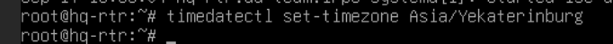
</p>

---

<p align="center"><b>BR-RTR</b></p>

```bash
timedatectl set-timezone Asia/Yekaterinburg
```

<p align="center">
  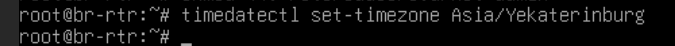
</p>

---

<p align="center"><b>HQ-SRV</b></p>

```bash
timedatectl set-timezone Asia/Yekaterinburg
```

<p align="center">
  
</p>

---

<p align="center"><b>HQ-CLI</b></p>

```bash
timedatectl set-timezone Asia/Yekaterinburg
```

<p align="center">
  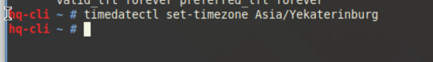
</p>

---

<p align="center"><b>BR-SRV</b></p>

```bash
timedatectl set-timezone Asia/Yekaterinburg
```

<p align="center">
  
</p>

---

<p align="center"><b>BR-FW</b></p>

```bash
timedatectl set-timezone Asia/Yekaterinburg
```

<p align="center">
  
</p>

Проверить установленный часовой пояс можно командой:

```bash
timedatectl show -p Timezone
```

Ожидаемый результат:

```text
Timezone=Asia/Yekaterinburg
```

> **Примечание:**
> Виртуальный коммутатор не настраиваем, так как по заданию часовой пояс требуется установить только на остальных устройствах.

## <p align="center"><b>МОДУЛЬ 2</b></p>

### <p align="center"><b>Подключение к устройствам по SSH с HQ-CLI</b></p>

Для удобства дальнейшей настройки устройств подключаемся к ним по SSH с машины `HQ-CLI`.

> **ВНИМАНИЕ!**
> На серверах `HQ-SRV` и `BR-SRV` используется SSH-порт `2027`.
> На маршрутизаторах и `ISP` подключение выполняется по стандартному SSH-порту `22`.

<p align="center"><b>HQ-SRV</b></p>

```bash
ssh sshuser@192.168.100.2 -p 2027
```

<p align="center">
  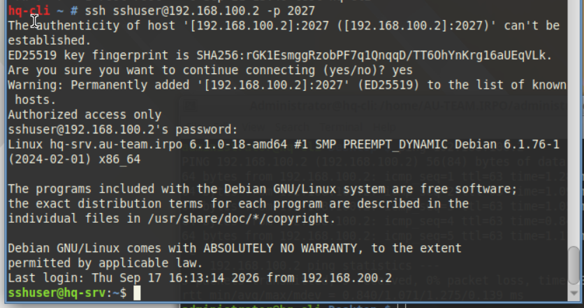
</p>

<p align="center"><b>BR-SRV</b></p>

```bash
ssh sshuser@192.168.200.2 -p 2027
```

<p align="center">
  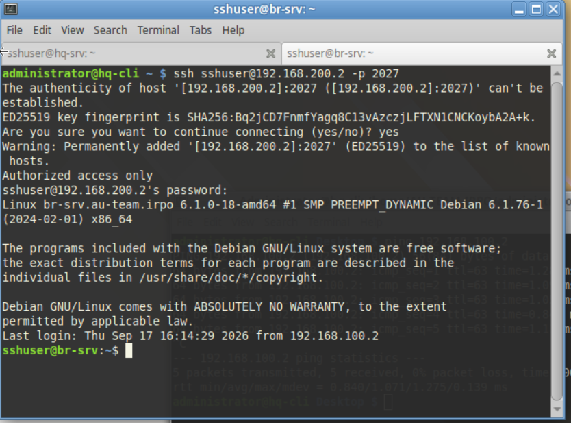
</p>

<p align="center"><b>HQ-RTR</b></p>

```bash
ssh net_admin@192.168.100.1
```

<p align="center">
  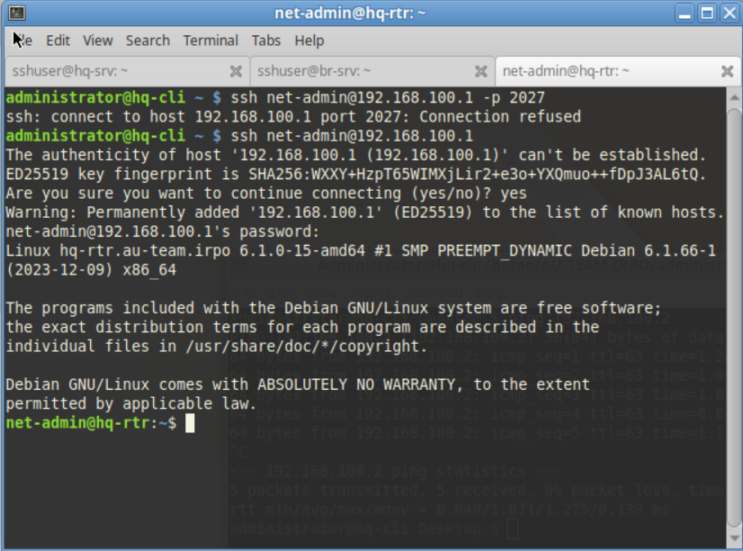
</p>

<p align="center"><b>BR-RTR</b></p>

```bash
ssh net_admin@192.168.30.1
```

<p align="center">
  
</p>

<p align="center"><b>BR-FW</b></p>

```bash
ssh root@192.168.200.1
```

<p align="center">
  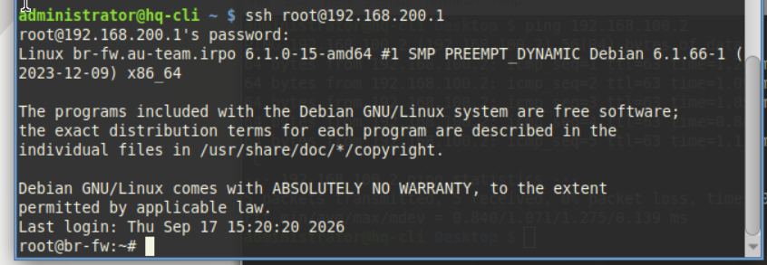
</p>

<p align="center"><b>ISP</b></p>

```bash
ssh root@172.16.1.1
```

<p align="center">
  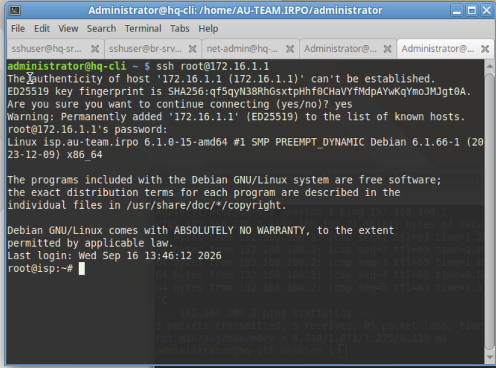
</p>

Пароль для пользователей `sshuser` и `net_admin`:

```text
P@ssw0rd
```

> **Примечание:**
> Все дальнейшие команды для серверов, маршрутизаторов и межсетевого экрана можно выполнять через SSH с `HQ-CLI`, не переключаясь постоянно между консолями виртуальных машин.

## <p align="center"><b>Задание 2. Организация сетевого администрирования</b></p>

### <p align="center"><b>1. Настройка контроллера домена Samba DC на BR-SRV</b></p>

По заданию контроллер домена `Samba DC` на сервере `BR-SRV` уже установлен и функционирует.

Необходимо:

- ввести `HQ-CLI` в домен;
- создать 5 пользователей `hquser1`–`hquser5`;
- настроить минимальную длину пароля 8 символов;
- настроить блокировку после 5 неудачных попыток входа;
- создать группу `hq` и добавить в неё созданных пользователей;
- обеспечить возможность аутентификации пользователей группы `hq` на `HQ-CLI`;
- разрешить пользователям группы `hq` повышение привилегий только для команд `cat`, `grep` и `id`.

---

### <p align="center"><b>Настройка парольной политики</b></p>

На `BR-SRV` задаём минимальную длину пароля:

```bash
samba-tool domain passwordsettings set --min-pwd-length=8
```

Настраиваем блокировку после 5 неудачных попыток:

```bash
samba-tool domain passwordsettings set --account-lockout-threshold=5
```

Устанавливаем длительность блокировки 5 минут:

```bash
samba-tool domain passwordsettings set --account-lockout-duration=5
```

Устанавливаем сброс счётчика неудачных попыток через 5 минут:

```bash
samba-tool domain passwordsettings set --reset-account-lockout-after=5
```

Проверяем настройки:

```bash
samba-tool domain passwordsettings show
```

<p align="center">
  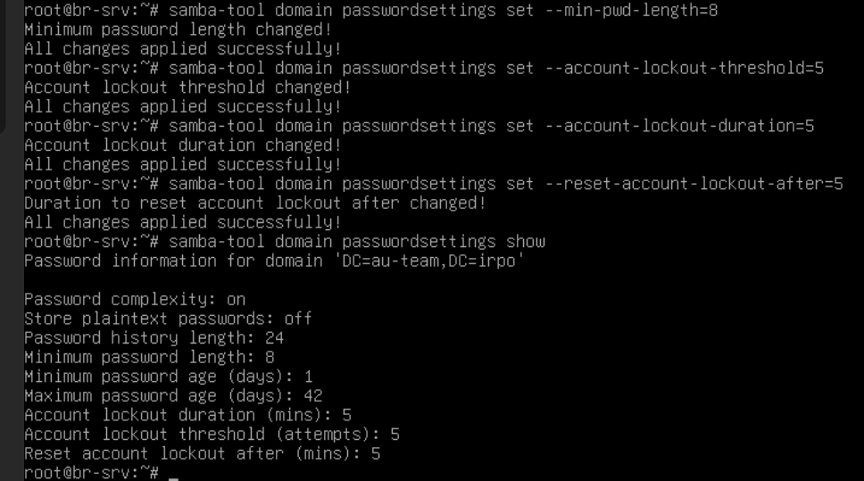
</p>

В результате:

```text
Minimum password length: 8
Account lockout threshold (attempts): 5
Account lockout duration (mins): 5
Reset Account lockout after (mins): 5
```

---

### <p align="center"><b>Создание пользователей и группы hq</b></p>

Создаём группу:

```bash
samba-tool group add hq
```

Создаём пользователей:

```bash
samba-tool user create hquser1 'P@ssw0rd1'
samba-tool user create hquser2 'P@ssw0rd2'
samba-tool user create hquser3 'P@ssw0rd3'
samba-tool user create hquser4 'P@ssw0rd4'
samba-tool user create hquser5 'P@ssw0rd5'
```

<p align="center">
  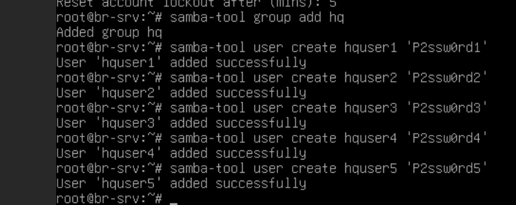
</p>

Добавляем пользователей в группу `hq`:

```bash
samba-tool group addmembers hq hquser1
samba-tool group addmembers hq hquser2
samba-tool group addmembers hq hquser3
samba-tool group addmembers hq hquser4
samba-tool group addmembers hq hquser5
```

Проверяем состав группы:

```bash
samba-tool group listmembers hq
```

<p align="center">
  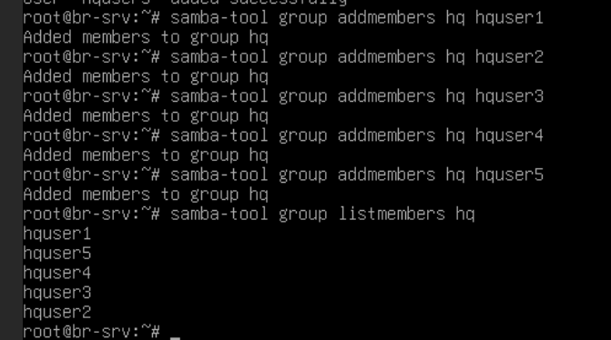
</p>

---

### <p align="center"><b>Ввод HQ-CLI в домен</b></p>

`HQ-CLI` работает под управлением `ALT Workstation 10.2`.

Перед установкой доменных пакетов удаляем пакет, который может мешать установке:

```bash
apt-get remove -y alterator-datetime
```

Устанавливаем необходимые компоненты:

```bash
apt-get update
apt-get install -y task-auth-ad-sssd
```

Вводим `HQ-CLI` в домен:

```bash
system-auth write ad au-team.irpo hq-cli AU-TEAM 'Administrator' 'P@ssw0rd'
```

<p align="center">
  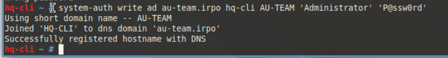
</p>

После успешного присоединения проверяем состояние:

```bash
system-auth status
```

<p align="center">
  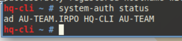
</p>

На `BR-SRV` проверяем создание учётной записи компьютера:

```bash
samba-tool computer list
```

<p align="center">
  
</p>

В списке должна присутствовать машина:

```text
HQ-CLI$
```

---

### <p align="center"><b>Проверка доменного пользователя</b></p>

На `HQ-CLI` проверяем пользователя:

```bash
id 'hquser1@au-team.irpo'
```

<p align="center">
  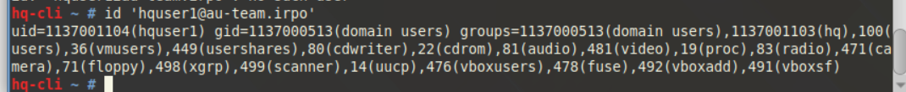
</p>

В выводе должна присутствовать группа:

```text
hq
```

После первого полноценного входа в графическую оболочку домашний каталог пользователя создаётся автоматически.

Проверяем вход:

```bash
whoami
pwd
id
```

<p align="center">
  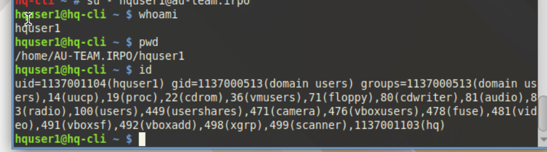
</p>

---

### <p align="center"><b>Настройка ограниченного sudo для группы hq</b></p>

На ALT Workstation пользователи группы `hq` должны иметь возможность выполнять с повышенными привилегиями только:

```text
cat
grep
id
```

Создаём файл:

```bash
nano /etc/sudoers.d/hq
```

Добавляем:

```sudoers
%hq ALL=(ALL) /usr/bin/cat, /bin/grep, /usr/bin/id
```

<p align="center">
  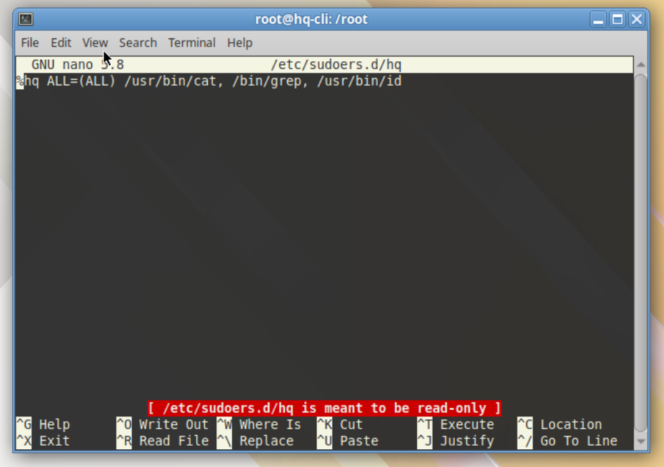
</p>

Для ALT Workstation устанавливаем требуемые права:

```bash
chmod 400 /etc/sudoers.d/hq
chmod 400 /etc/sudoers.d/99-sudopw
```

Также разрешаем пользователям запуск бинарного файла `sudo`:

```bash
chmod o+x /usr/bin/sudo
```

Проверяем конфигурацию:

```bash
visudo -c
```

<p align="center">
  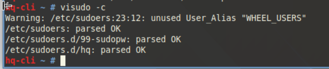
</p>

---

### <p align="center"><b>Проверка разрешённых и запрещённых команд</b></p>

Под доменным пользователем `hquser1` проверяем разрешённые команды:

```bash
sudo /usr/bin/id
sudo /usr/bin/cat /etc/hostname
sudo /bin/grep root /etc/passwd
```

Проверяем запрещённую команду:

```bash
sudo /usr/bin/apt-get update
```

<p align="center">
  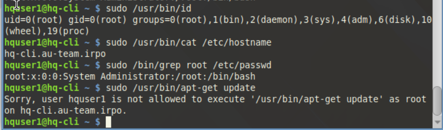
</p>

Команды `id`, `cat` и `grep` выполняются с повышенными привилегиями.

Команда `apt-get` должна быть запрещена:

```text
Sorry, user hquser1 is not allowed to execute ...
```

> **Примечание:**
> Пользователи группы `hq` могут аутентифицироваться на `HQ-CLI`, но повышать привилегии разрешено только для ограниченного набора команд: `cat`, `grep` и `id`.

### <p align="center"><b>2. Настройка RAID0 на HQ-SRV</b></p>

По заданию на `HQ-SRV` необходимо объединить два дополнительных диска объёмом `1 ГБ` в массив `RAID0`.

Массив должен быть доступен как устройство:

```text
/dev/md0
```

На массиве создаём раздел, форматируем его в `ext4` и настраиваем автоматическое монтирование в каталог:

```text
/raid
```

> **ВНИМАНИЕ!**
> **ПЕРЕД СОЗДАНИЕМ RAID ОБЯЗАТЕЛЬНО ПРОВЕРЬТЕ ИМЕНА ДВУХ ДОПОЛНИТЕЛЬНЫХ ДИСКОВ ОБЪЁМОМ 1 ГБ КОМАНДОЙ `lsblk`.**
> **ИМЕНА ДИСКОВ НА ВАШЕМ СТЕНДЕ МОГУТ ОТЛИЧАТЬСЯ.**
> В нашем случае это `/dev/sda` и `/dev/sdb`, а системный диск — `/dev/sdc`.
> **НЕ КОПИРУЙТЕ ИМЕНА ДИСКОВ ИЗ ПРИМЕРА БЕЗ ПРОВЕРКИ.**

Проверяем диски:

```bash
lsblk
```

<p align="center">
  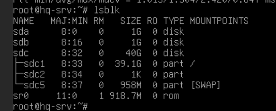
</p>

В нашем случае два дополнительных диска:

```text
/dev/sda
/dev/sdb
```

---

### <p align="center"><b>Установка необходимых пакетов</b></p>

Устанавливаем утилиты для создания RAID-массива и работы с разделами:

```bash
apt update
apt install -y mdadm parted
```

После установки переходим к созданию массива `RAID0`.

---

### <p align="center"><b>Создание RAID0</b></p>

Создаём массив `RAID0` из двух дополнительных дисков:

```bash
mdadm --create /dev/md0 \
  --level=0 \
  --raid-devices=2 \
  /dev/sda /dev/sdb
```

<p align="center">
  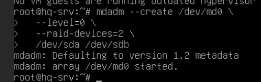
</p>

Проверяем параметры массива:

```bash
mdadm --detail /dev/md0
```

<p align="center">
  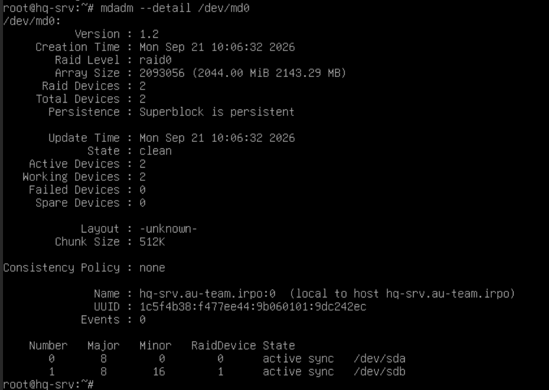
</p>

В выводе должно быть видно:

```text
Raid Level : raid0
Raid Devices : 2
State : clean
```

---

### <p align="center"><b>Создание раздела на RAID-массиве</b></p>

Создаём таблицу разделов и раздел на устройстве `/dev/md0`:

```bash
parted /dev/md0 --script mklabel gpt
parted /dev/md0 --script mkpart primary ext4 0% 100%
```

<p align="center">
  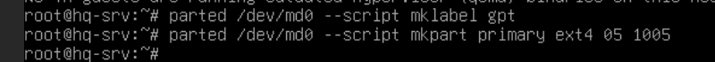
</p>

Проверяем:

```bash
lsblk
```

<p align="center">
  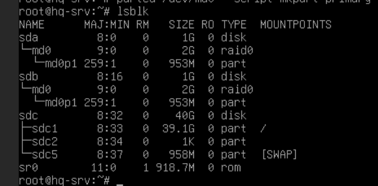
</p>

Должен появиться раздел:

```text
/dev/md0p1
```

> **Примечание:**
> Если утилита `parted` отсутствует, раздел можно создать через `fdisk /dev/md0`.

---

### <p align="center"><b>Форматирование раздела</b></p>

Форматируем раздел в файловую систему `ext4`:

```bash
mkfs.ext4 /dev/md0p1
```

<p align="center">
  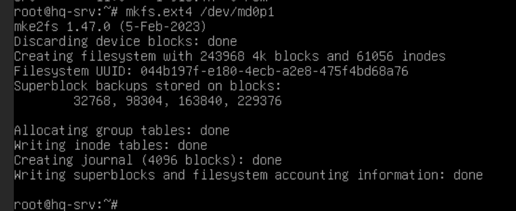
</p>

---

### <p align="center"><b>Монтирование RAID</b></p>

Создаём каталог:

```bash
mkdir -p /raid
```

Монтируем раздел:

```bash
mount /dev/md0p1 /raid
```

Проверяем:

```bash
df -h /raid
```

<p align="center">
  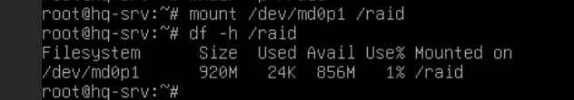
</p>

---

### <p align="center"><b>Сохранение конфигурации RAID</b></p>

Сохраняем конфигурацию массива:

```bash
mdadm --detail --scan > /etc/mdadm.conf
```

Проверяем:

```bash
cat /etc/mdadm.conf
```

---

### <p align="center"><b>Настройка автоматического монтирования</b></p>

Открываем файл:

```bash
nano /etc/fstab
```

Добавляем:

```text
/dev/md0p1    /raid    ext4    defaults    0    2
```

<p align="center">
  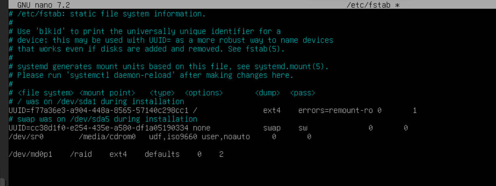
</p>

После изменения `/etc/fstab` обновляем конфигурацию systemd:

```bash
systemctl daemon-reload
```

Затем проверяем автоматическое монтирование:

```bash
umount /raid
mount -a
```

Если появляется сообщение о том, что `fstab` изменён, выполняем:

```bash
systemctl daemon-reload
mount -a
```

<p align="center">
  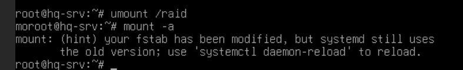
</p>

---

### <p align="center"><b>Финальная проверка</b></p>

Проверяем точку монтирования:

```bash
df -h /raid
```

Проверяем структуру дисков:

```bash
lsblk
```

<p align="center">
  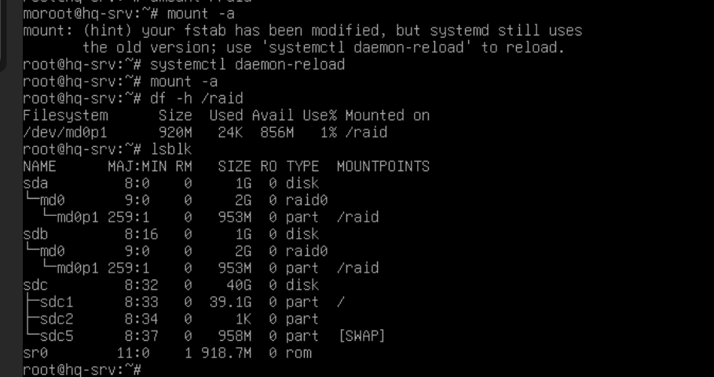
</p>

В результате:

- два диска по `1 ГБ` объединены в `RAID0`;
- создан массив `/dev/md0`;
- создан раздел `/dev/md0p1`;
- файловая система — `ext4`;
- раздел автоматически монтируется в `/raid`.

### <p align="center"><b>3. Настройка NFS на HQ-SRV</b></p>

По заданию необходимо настроить сетевую файловую систему NFS:

- общий каталог — `/raid/nfs`;
- доступ на чтение и запись разрешить только сети в сторону `HQ-CLI`;
- на `HQ-CLI` настроить автоматическое монтирование ресурса в `/mnt/nfs`.

Сеть `HQ-CLI`:

```text
192.168.20.0/28
```

---

### <p align="center"><b>Настройка NFS-сервера на HQ-SRV</b></p>

Устанавливаем NFS-сервер:

```bash
apt update
apt install -y nfs-kernel-server
```

Создаём каталог общего доступа:

```bash
mkdir -p /raid/nfs
chmod 777 /raid/nfs
```

Открываем файл настройки экспортируемых каталогов:

```bash
nano /etc/exports
```

Добавляем:

```text
/raid/nfs 192.168.20.0/28(rw,sync,no_subtree_check,no_root_squash)
```

<p align="center">
  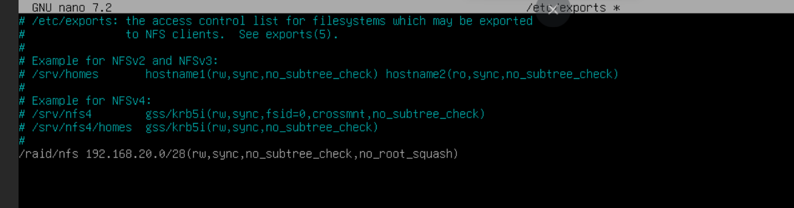
</p>

Где:

- `/raid/nfs` — общий каталог;
- `192.168.20.0/28` — сеть, в которой находится `HQ-CLI`;
- `rw` — разрешение чтения и записи;
- `sync` — синхронная запись данных;
- `no_subtree_check` — отключение проверки подкаталогов;
- `no_root_squash` — root-пользователь клиента не ограничивается в правах.

Применяем экспорт:

```bash
exportfs -arv
```

Запускаем NFS-сервер и добавляем его в автозагрузку:

```bash
systemctl enable --now nfs-server
```

Проверяем:

```bash
exportfs -v
```

<p align="center">
  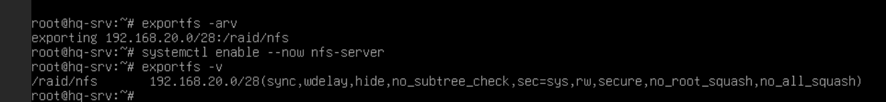
</p>

В выводе должен присутствовать ресурс:

```text
/raid/nfs 192.168.20.0/28
```

с разрешением `rw`.

---

### <p align="center"><b>Настройка NFS-клиента на HQ-CLI</b></p>

Устанавливаем клиентские пакеты:

```bash
apt-get update
apt-get install -y nfs-utils nfs-clients
```

Создаём каталог для монтирования:

```bash
mkdir -p /mnt/nfs
chmod 777 /mnt/nfs
```

Проверяем ручное монтирование ресурса:

```bash
mount -t nfs -o vers=4 192.168.100.2:/raid/nfs /mnt/nfs
```

<p align="center">
  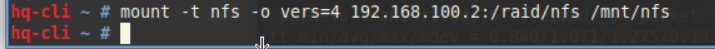
</p>

Если команда завершилась без ошибок, ресурс успешно подключён.

Проверяем:

```bash
df -h /mnt/nfs
```

---

### <p align="center"><b>Настройка автоматического монтирования</b></p>

Открываем файл:

```bash
nano /etc/fstab
```

Добавляем:

```text
192.168.100.2:/raid/nfs    /mnt/nfs    nfs    defaults,_netdev    0    0
```

<p align="center">
  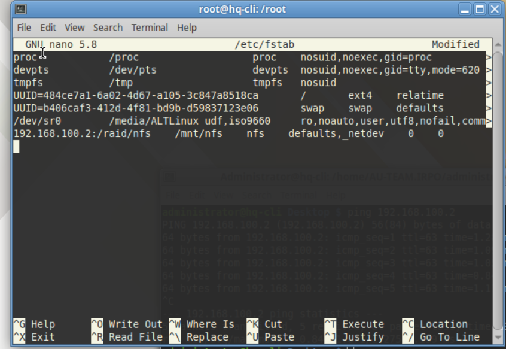
</p>

Для проверки автоматического монтирования отключаем ресурс:

```bash
umount /mnt/nfs
```

Обновляем конфигурацию systemd:

```bash
systemctl daemon-reload
```

Выполняем монтирование ресурсов из `/etc/fstab`:

```bash
mount -a
```

Проверяем:

```bash
df -h /mnt/nfs
ls -la /mnt/nfs
```

<p align="center">
  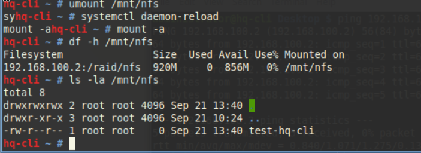
</p>

---

### <p align="center"><b>Проверка записи в NFS-ресурс</b></p>

На `HQ-CLI` создаём тестовый файл:

```bash
touch /mnt/nfs/test-hq-cli
```

Проверяем:

```bash
ls -la /mnt/nfs
```

<p align="center">
  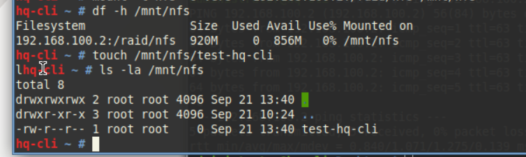
</p>

Файл `test-hq-cli` успешно создаётся в NFS-ресурсе.

Таким образом:

- каталог `/raid/nfs` опубликован на `HQ-SRV`;
- доступ разрешён только сети `192.168.20.0/28`;
- ресурс доступен на чтение и запись;
- на `HQ-CLI` ресурс автоматически монтируется в `/mnt/nfs`.

### <p align="center"><b>4. Настройка службы сетевого времени Chrony</b></p>

По заданию необходимо настроить службу сетевого времени на базе `chrony`.

В качестве сервера времени используется `ISP`.

Требования:

- на `ISP` настроить сервер Chrony;
- выбрать внешний NTP-источник;
- настроить локальный `stratum 5`;
- клиентами сервера времени сделать:
  - `HQ-SRV`;
  - `HQ-CLI`;
  - `BR-RTR`;
  - `BR-SRV`.

---

### <p align="center"><b>Настройка Chrony на ISP</b></p>

Устанавливаем пакет:

```bash
apt update
apt install -y chrony
```

Открываем конфигурационный файл:

```bash
nano /etc/chrony/chrony.conf
```

В качестве внешнего источника времени используем пул Debian:

```conf
pool 2.debian.pool.ntp.org iburst
```

Добавляем:

```conf
local stratum 5

allow 172.16.1.0/28
allow 172.16.2.0/28
```

Итоговый фрагмент конфигурации:

```conf
pool 2.debian.pool.ntp.org iburst

local stratum 5

allow 172.16.1.0/28
allow 172.16.2.0/28
```

<p align="center">
  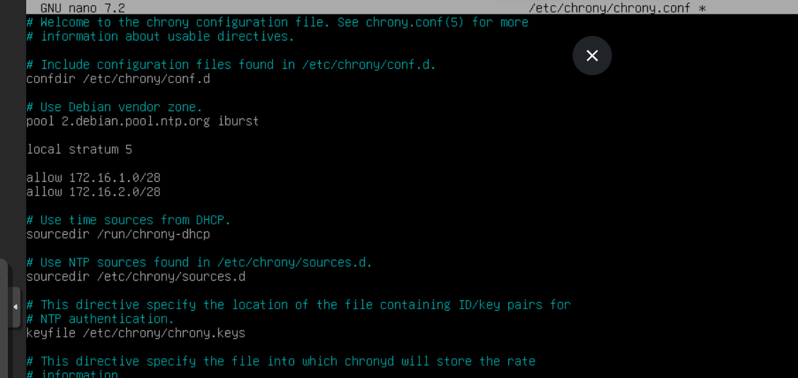
</p>

Где:

- `pool 2.debian.pool.ntp.org iburst` — внешний источник времени;
- `local stratum 5` — локальный уровень stratum сервера;
- `allow 172.16.1.0/28` — разрешает запросы со стороны HQ;
- `allow 172.16.2.0/28` — разрешает запросы со стороны BR.

Запускаем службу и добавляем её в автозагрузку:

```bash
systemctl enable --now chrony
systemctl restart chrony
```

Проверяем источники времени:

```bash
chronyc sources -v
```

Проверяем состояние синхронизации:

```bash
chronyc tracking
```

<p align="center">
  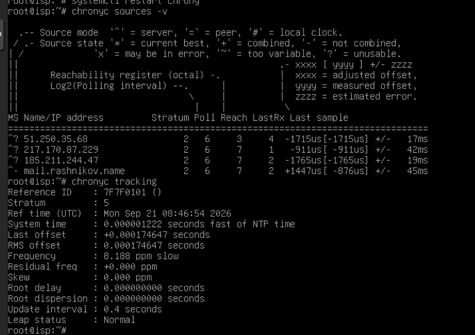
</p>

В выводе `chronyc tracking` должно отображаться:

```text
Stratum : 5
Leap status : Normal
```

> **Примечание:**
> Директива `local stratum 5` задаёт требуемый локальный stratum сервера.
> При синхронизации `ISP` с внешним NTP-источником фактические значения в выводе Chrony могут отличаться.

---

### <p align="center"><b>Настройка клиента HQ-SRV</b></p>

Устанавливаем Chrony:

```bash
apt update
apt install -y chrony
```

Открываем:

```bash
nano /etc/chrony/chrony.conf
```

Стандартный внешний пул комментируем и добавляем сервер `ISP`:

```conf
server 172.16.1.1 iburst
```

<p align="center">
  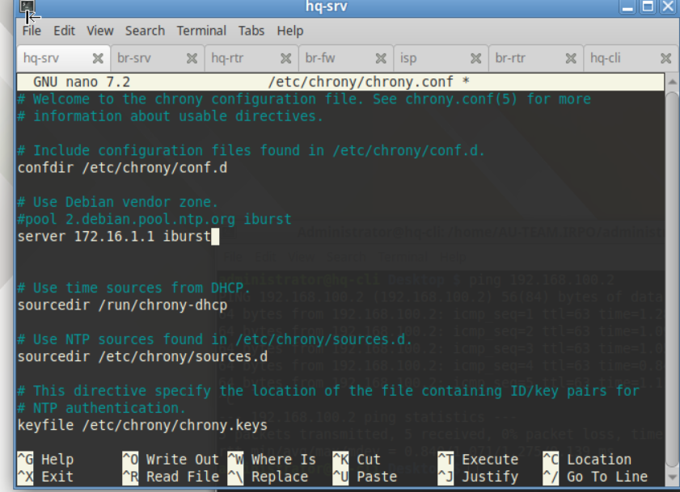
</p>

Применяем конфигурацию:

```bash
systemctl enable --now chrony
systemctl restart chrony
```

Проверяем:

```bash
chronyc sources -v
chronyc tracking
```

<p align="center">
  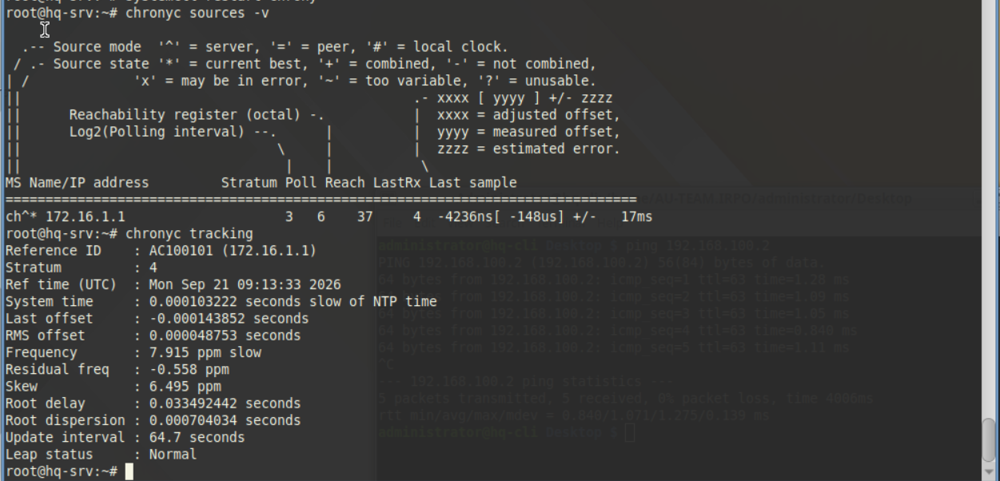
</p>

Источник:

```text
172.16.1.1
```

должен отображаться с признаком:

```text
^*
```

Это означает, что данный сервер выбран текущим источником времени.

---

### <p align="center"><b>Настройка клиента BR-SRV</b></p>

Устанавливаем:

```bash
apt update
apt install -y chrony
```

Открываем:

```bash
nano /etc/chrony/chrony.conf
```

Добавляем:

```conf
server 172.16.1.1 iburst
```

<p align="center">
  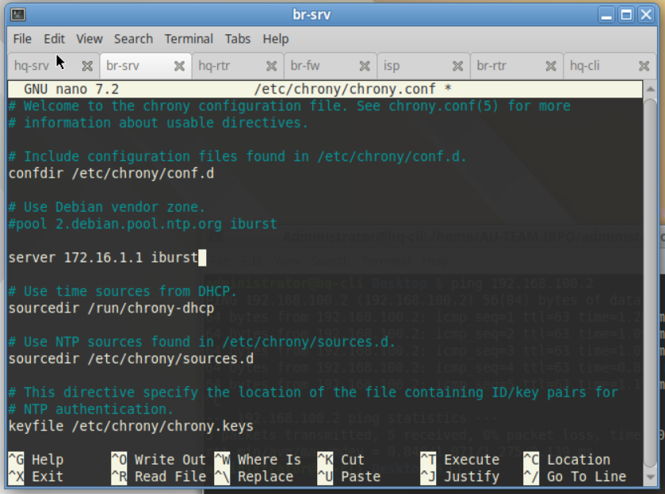
</p>

Перезапускаем службу:

```bash
systemctl enable --now chrony
systemctl restart chrony
```

Проверяем:

```bash
chronyc sources -v
chronyc tracking
```

<p align="center">
  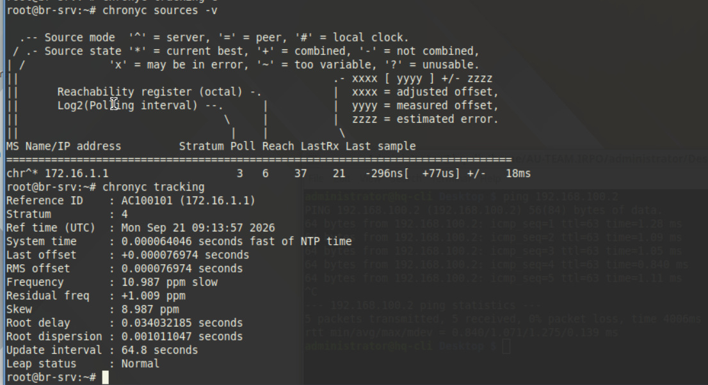
</p>

---

### <p align="center"><b>Настройка клиента BR-RTR</b></p>

Устанавливаем:

```bash
apt update
apt install -y chrony
```

Открываем:

```bash
nano /etc/chrony/chrony.conf
```

Указываем сервер времени:

```conf
server 172.16.1.1 iburst
```

<p align="center">
  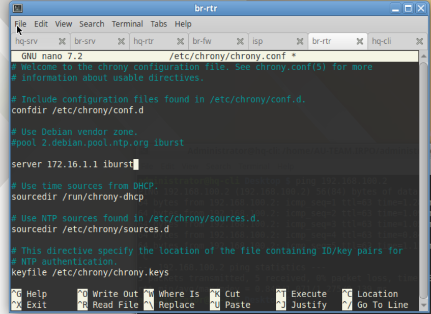
</p>

Запускаем и перезапускаем службу:

```bash
systemctl enable --now chrony
systemctl restart chrony
```

Проверяем:

```bash
chronyc sources -v
chronyc tracking
```

<p align="center">
  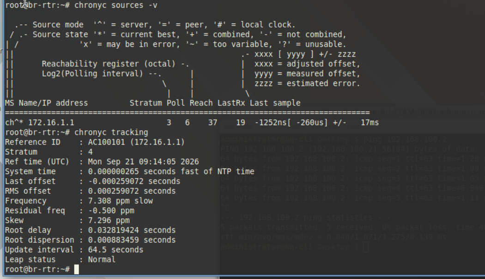
</p>

---

### <p align="center"><b>Настройка клиента HQ-CLI</b></p>

`HQ-CLI` работает под управлением ALT Workstation.

Устанавливаем Chrony:

```bash
apt-get update
apt-get install -y chrony
```

Открываем конфигурацию:

```bash
nano /etc/chrony.conf
```

Добавляем:

```conf
server 172.16.1.1 iburst
```

<p align="center">
  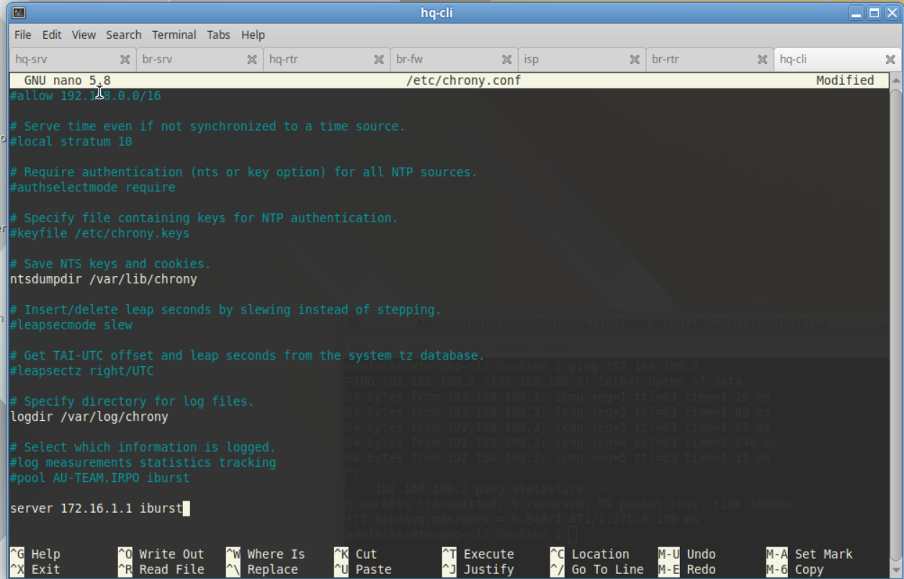
</p>

Перезапускаем службу:

```bash
systemctl enable --now chronyd
systemctl restart chronyd
```

Проверяем:

```bash
chronyc sources -v
chronyc tracking
```

<p align="center">
  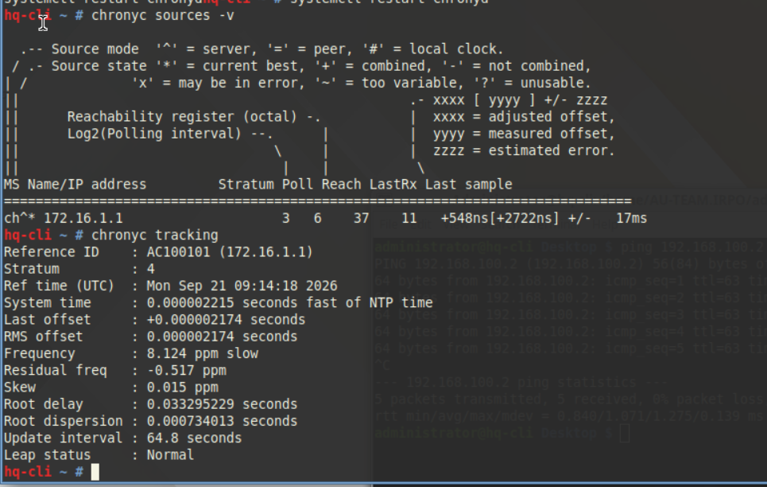
</p>

---

### <p align="center"><b>Финальная проверка</b></p>

На всех клиентах выполняем:

```bash
chronyc sources -v
```

В качестве выбранного источника должен отображаться:

```text
172.16.1.1
```

с состоянием:

```text
^*
```

Также проверяем:

```bash
chronyc tracking
```

В исправно работающей конфигурации должно отображаться:

```text
Leap status : Normal
```

В результате:

- `ISP` используется как сервер времени;
- на `ISP` настроен `local stratum 5`;
- `HQ-SRV`, `HQ-CLI`, `BR-RTR` и `BR-SRV` синхронизируют время с `ISP`;
- все клиенты успешно используют `172.16.1.1` как источник времени.

### <p align="center"><b>5. Настройка Ansible на BR-SRV</b></p>

По заданию необходимо настроить `Ansible` на сервере `BR-SRV`.

Требования:

- рабочий каталог — `/etc/ansible`;
- в inventory должны входить:
  - `HQ-SRV`;
  - `HQ-CLI`;
  - `HQ-RTR`;
  - `BR-RTR`;
- все устройства должны отвечать `pong` на команду:

```bash
ansible all -m ping
```

без предупреждений и ошибок.

---

### <p align="center"><b>Установка Ansible</b></p>

На `BR-SRV` устанавливаем Ansible:

```bash
apt update
apt install -y ansible
```

Создаём рабочий каталог:

```bash
mkdir -p /etc/ansible
```

Проверяем установку:

```bash
ansible --version
```

---

### <p align="center"><b>Создание SSH-ключа</b></p>

Для подключения Ansible к управляемым устройствам без постоянного ввода пароля создаём SSH-ключ:

```bash
ssh-keygen -t ed25519
```

На вопросы о пути сохранения ключа и парольной фразе нажимаем `Enter`.

<p align="center">
  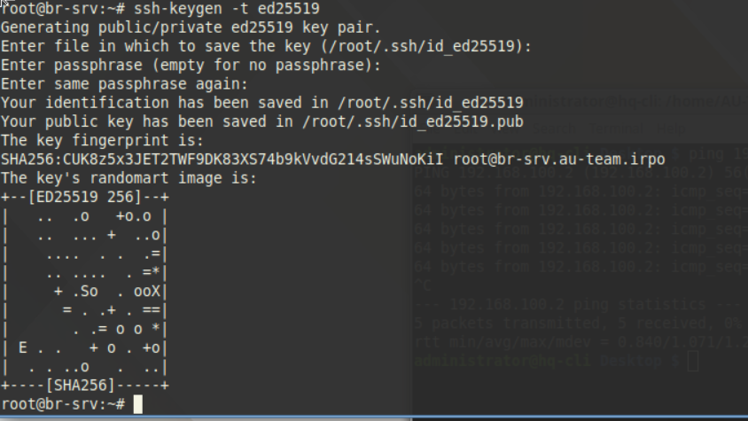
</p>

---

### <p align="center"><b>Настройка inventory</b></p>

Открываем:

```bash
nano /etc/ansible/hosts
```

Добавляем:

```ini
[servers]
hq-srv ansible_host=192.168.100.2 ansible_user=sshuser ansible_port=2027

[routers]
hq-rtr ansible_host=192.168.100.1 ansible_user=net_admin
br-rtr ansible_host=192.168.30.1 ansible_user=net_admin

[clients]
hq-cli ansible_host=192.168.20.2 ansible_user=administrator ansible_python_interpreter=/usr/bin/python3.9
```

<p align="center">
  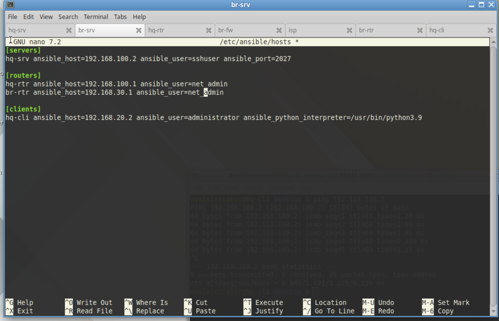
</p>

> **Примечание:**
> Для `HQ-CLI` явно указан интерпретатор Python `/usr/bin/python3.9`, чтобы Ansible не выводил предупреждение об автоматическом обнаружении Python.

---

### <p align="center"><b>Копирование SSH-ключа</b></p>

Копируем SSH-ключ на управляемые устройства.

Для `HQ-SRV`:

```bash
ssh-copy-id -p 2027 sshuser@192.168.100.2
```

Для `HQ-RTR`:

```bash
ssh-copy-id net_admin@192.168.100.1
```

Для `BR-RTR`:

```bash
ssh-copy-id net_admin@192.168.30.1
```

Для `HQ-CLI`:

```bash
ssh-copy-id administrator@192.168.20.2
```

После этого Ansible сможет подключаться к устройствам по SSH без запроса пароля.

---

### <p align="center"><b>Проверка inventory</b></p>

Переходим в рабочий каталог:

```bash
cd /etc/ansible
```

Проверяем список устройств:

```bash
ansible all --list-hosts
```

<p align="center">
  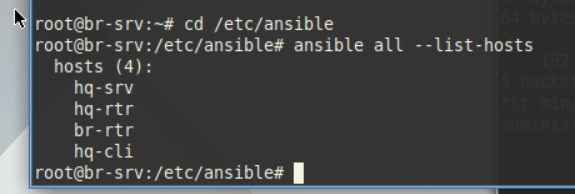
</p>

В выводе должны присутствовать четыре устройства:

```text
hq-srv
hq-rtr
br-rtr
hq-cli
```

---

### <p align="center"><b>Проверка Ansible Ping</b></p>

Выполняем:

```bash
ansible all -m ping
```

<p align="center">
  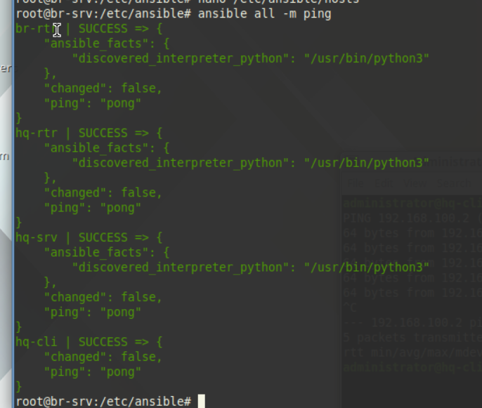
</p>

Все устройства должны вернуть:

```text
SUCCESS
"ping": "pong"
```

без строк `[WARNING]` и ошибок.

В результате `BR-SRV` настроен как управляющий узел Ansible, а все четыре устройства успешно доступны из inventory.

### <p align="center"><b>6. Развертывание приложения в Docker на BR-SRV</b></p>

По заданию на `BR-SRV` необходимо развернуть стек контейнеров:

- контейнер с базой данных `db`;
- контейнер с веб-приложением `testapp`;
- база данных — `testdb`;
- пользователь базы данных — `test`;
- пароль — `Passw0rd`;
- приложение должно быть доступно извне через порт `8080`.

Для развертывания используются образы:

```text
site_latest.tar
mariadb_latest.tar
```

расположенные в каталоге `docker` на образе `Additional.iso`.

---

### <p align="center"><b>Установка Docker</b></p>

На `BR-SRV` устанавливаем Docker и Docker Compose:

```bash
apt update
apt install -y docker.io docker-compose
```

Запускаем Docker и добавляем его в автозагрузку:

```bash
systemctl enable --now docker
```

Проверяем:

```bash
docker --version
docker-compose --version
```

---

### <p align="center"><b>Монтирование Additional.iso</b></p>

Создаём каталог:

```bash
mkdir -p /mnt/additional
```

Монтируем образ:

```bash
mount /dev/sr0 /mnt/additional
```

Проверяем содержимое:

```bash
find /mnt/additional -maxdepth 2 -type f
```

В каталоге `docker` должны присутствовать образы:

```text
/mnt/additional/docker/site_latest.tar
/mnt/additional/docker/mariadb_latest.tar
```

---

### <p align="center"><b>Импорт Docker-образов</b></p>

Загружаем образ веб-приложения:

```bash
docker load < /mnt/additional/docker/site_latest.tar
```

Загружаем образ MariaDB:

```bash
docker load < /mnt/additional/docker/mariadb_latest.tar
```

<p align="center">
  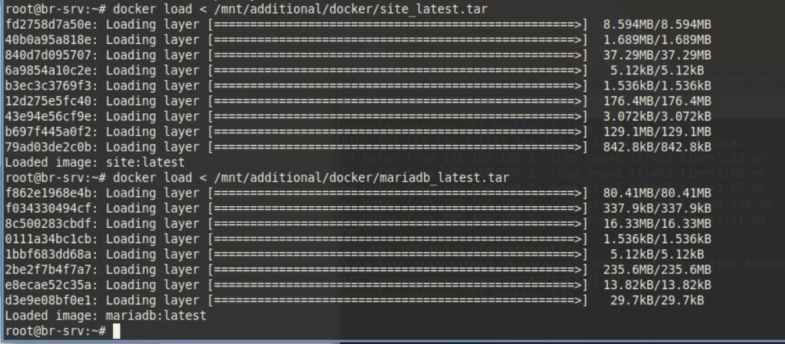
</p>

Проверяем загруженные образы:

```bash
docker images
```

После загрузки должны присутствовать образы:

```text
site:latest
mariadb:latest
```

---

### <p align="center"><b>Получение compose.yaml</b></p>

Устанавливаем утилиту `curl`:

```bash
apt update
apt install -y curl
```

Скачиваем готовый файл `compose.yaml` из репозитория:

```bash
curl -o /root/compose.yaml https://raw.githubusercontent.com/shiraorie/demo-2027/main/files/compose.yaml
```

Проверяем содержимое:

```bash
cat /root/compose.yaml
```

Файл содержит настройки контейнеров `db` и `testapp`, базу `testdb`, пользователя `test` и пароль `Passw0rd`.

<p align="center">
  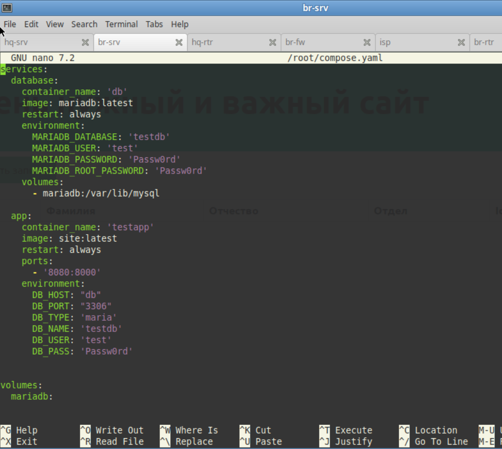
</p>

---

### <p align="center"><b>Исправление ошибки AppArmor</b></p>

> **Примечание:**
> Если при запуске контейнеров появляется ошибка:

```text
Could not check if docker-default AppArmor profile was loaded
```

монтируем `securityfs`:

```bash
mount -t securityfs securityfs /sys/kernel/security
```

После этого перезапускаем Docker:

```bash
systemctl restart docker
```

---

### <p align="center"><b>Запуск контейнеров</b></p>

Переходим в каталог с `compose.yaml`:

```bash
cd /root
```

Если контейнеры или база уже запускались ранее, удаляем старый стек вместе с volume:

```bash
docker-compose down -v
```

> **ВНИМАНИЕ!**
> Ключ `-v` удаляет данные старой базы данных. Используйте его при повторной настройке стенда.

Запускаем стек:

```bash
docker-compose up -d
```

Проверяем:

```bash
docker-compose ps
```

В результате оба контейнера должны иметь состояние `Up`:

```text
db        Up
testapp   Up
```

У контейнера `testapp` должен быть опубликован порт:

```text
0.0.0.0:8080->8000/tcp
```

---

### <p align="center"><b>Проверка базы данных</b></p>

Проверяем подключение к базе `testdb`:

```bash
docker exec db mariadb -utest -p'Passw0rd' testdb -e 'SELECT 1;'
```

При успешном подключении команда должна вернуть:

```text
1
1
```

---

### <p align="center"><b>Проверка веб-приложения</b></p>

На `HQ-CLI` открываем браузер и переходим по адресу:

```text
http://192.168.200.2:8080
```

<p align="center">
  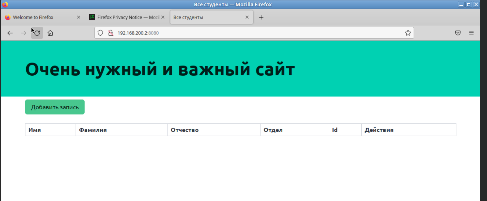
</p>

Если веб-страница открывается, контейнерное приложение работает корректно и доступно из сети через порт `8080`.

---

В результате:

- на `BR-SRV` установлен и запущен Docker;
- загружены образы `site:latest` и `mariadb:latest`;
- создан контейнер базы данных `db`;
- создан контейнер веб-приложения `testapp`;
- используется база данных `testdb`;
- пользователь базы данных — `test`;
- пароль — `Passw0rd`;
- приложение доступно по адресу `http://192.168.200.2:8080`.

### <p align="center"><b>7. Развертывание веб-приложения на HQ-SRV</b></p>

По заданию необходимо развернуть веб-приложение на сервере `HQ-SRV`.

Требования:

- веб-сервер — `Apache`;
- СУБД — `MariaDB`;
- база данных — `webdb`;
- пользователь базы данных — `web`;
- пароль — `P@ssw0rd`;
- импортировать данные из `dump.sql`;
- разместить `index.php` и `logo.png` в каталоге веб-сервера;
- исправить параметры подключения к базе данных;
- проверить работоспособность приложения.

---

### <p align="center"><b>Установка необходимых пакетов</b></p>

Устанавливаем Apache, MariaDB и PHP:

```bash
apt update
apt install -y apache2 mariadb-server php libapache2-mod-php php-mysql
```

Запускаем службы и добавляем их в автозагрузку:

```bash
systemctl enable --now apache2
systemctl enable --now mariadb
```

---

### <p align="center"><b>Монтирование Additional.iso</b></p>

Создаём каталог:

```bash
mkdir -p /mnt/additional
```

Монтируем образ:

```bash
mount /dev/sr0 /mnt/additional
```

Проверяем наличие файлов:

```bash
find /mnt/additional/web -maxdepth 1 -type f
```

В каталоге должны находиться:

```text
/mnt/additional/web/dump.sql
/mnt/additional/web/index.php
/mnt/additional/web/logo.png
```

---

### <p align="center"><b>Создание базы данных</b></p>

Открываем MariaDB:

```bash
mariadb
```

Создаём базу данных:

```sql
CREATE DATABASE webdb;
```

Создаём пользователя:

```sql
CREATE USER 'web'@'localhost' IDENTIFIED BY 'P@ssw0rd';
```

Выдаём права:

```sql
GRANT ALL PRIVILEGES ON webdb.* TO 'web'@'localhost';
FLUSH PRIVILEGES;
EXIT;
```

---

### <p align="center"><b>Импорт базы данных</b></p>

Импортируем `dump.sql`:

```bash
mariadb -u web -p'P@ssw0rd' webdb < /mnt/additional/web/dump.sql
```

Проверяем наличие таблиц:

```bash
mariadb -u web -p'P@ssw0rd' webdb -e 'SHOW TABLES;'
```

<p align="center">
  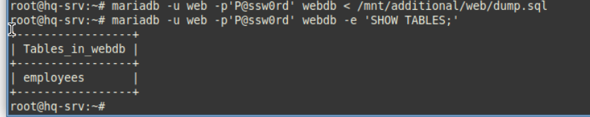
</p>

В базе должна присутствовать таблица:

```text
employees
```

---

### <p align="center"><b>Копирование файлов веб-приложения</b></p>

Удаляем стандартную страницу Apache:

```bash
rm -f /var/www/html/index.html
```

Копируем файлы приложения:

```bash
cp /mnt/additional/web/index.php /var/www/html/
cp /mnt/additional/web/logo.png /var/www/html/
```

Проверяем:

```bash
ls -la /var/www/html/
```

---

### <p align="center"><b>Настройка подключения к базе данных</b></p>

Открываем:

```bash
nano /var/www/html/index.php
```

> **ВНИМАНИЕ!**
> В исходном файле `index.php` значения `username`, `password` и `dbname` указаны неверно. Их необходимо изменить.

Указываем:

```php
<?php
$servername = "localhost";
$username = "web";
$password = "P@ssw0rd";
$dbname = "webdb";
```

В результате начало файла должно выглядеть следующим образом:

<p align="center">
  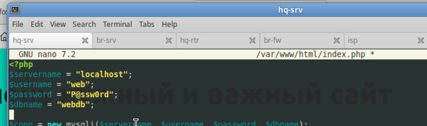
</p>

---

### <p align="center"><b>Запуск и проверка веб-приложения</b></p>

Перезапускаем Apache:

```bash
systemctl restart apache2
```

Проверяем состояние:

```bash
systemctl status apache2
```

На `HQ-CLI` открываем браузер и переходим по адресу:

```text
http://192.168.100.2
```

<p align="center">
  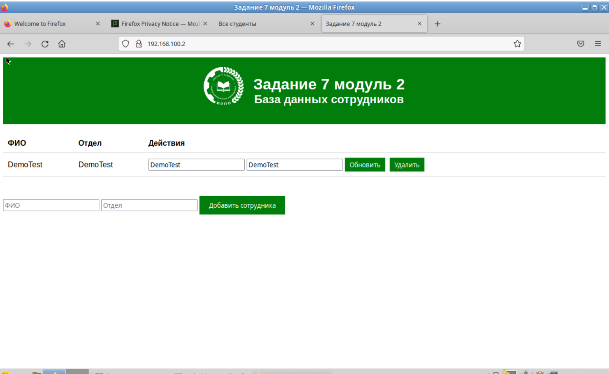
</p>

Если отображается веб-интерфейс с данными сотрудников, приложение работает корректно.

---

В результате:

- на `HQ-SRV` установлен Apache;
- установлена MariaDB;
- создана база `webdb`;
- создан пользователь `web`;
- импортирован `dump.sql`;
- размещены `index.php` и `logo.png`;
- исправлены параметры подключения к БД;
- веб-приложение доступно по адресу `http://192.168.100.2`.

### <p align="center"><b>8. Настройка статической трансляции портов</b></p>

По заданию необходимо настроить статическую трансляцию портов на маршрутизаторах `HQ-RTR` и `BR-RTR`.

Необходимо выполнить следующие пробросы:

| Маршрутизатор | Внешний порт | Внутренний узел | Внутренний порт |
|---|---:|---|---:|
| `HQ-RTR` | `8080` | `HQ-SRV` | `80` |
| `HQ-RTR` | `2027` | `HQ-SRV` | `2027` |
| `BR-RTR` | `8080` | `BR-SRV` | `8080` |
| `BR-RTR` | `2027` | `BR-SRV` | `2027` |

---

### <p align="center"><b>Настройка проброса портов на HQ-RTR</b></p>

Открываем конфигурацию `nftables`:

```bash
nano /etc/nftables.conf
```

В существующую таблицу `nat` добавляем цепочку `PREROUTING`:

```nft
table inet nat {
    chain PREROUTING {
        type nat hook prerouting priority dstnat;

        iifname "ens18" tcp dport 8080 dnat ip to 192.168.100.2:80
        iifname "ens18" tcp dport 2027 dnat ip to 192.168.100.2:2027
    }

    chain POSTROUTING {
        type nat hook postrouting priority srcnat;

        oifname "ens18" ip saddr { 192.168.100.0/27, 192.168.20.0/28, 192.168.99.0/29 } masquerade
    }
}
```

<p align="center">
  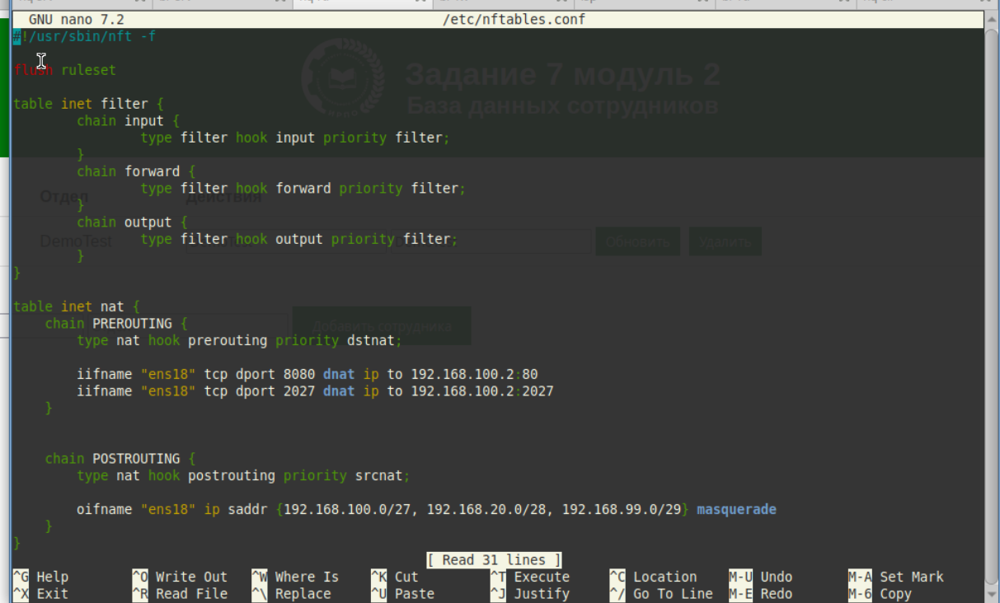
</p>

Проверяем синтаксис:

```bash
nft -c -f /etc/nftables.conf
```

Применяем конфигурацию:

```bash
nft -f /etc/nftables.conf
systemctl restart nftables
```

Проверяем правила:

```bash
nft list table inet nat
```

---

### <p align="center"><b>Настройка проброса портов на BR-RTR</b></p>

Открываем:

```bash
nano /etc/nftables.conf
```

В существующую таблицу `nat` добавляем:

```nft
table inet nat {
    chain PREROUTING {
        type nat hook prerouting priority dstnat;

        iifname "ens18" tcp dport 8080 dnat ip to 192.168.200.2:8080
        iifname "ens18" tcp dport 2027 dnat ip to 192.168.200.2:2027
    }

    chain POSTROUTING {
        type nat hook postrouting priority srcnat;

        oifname "ens18" ip saddr { 192.168.30.0/30, 192.168.200.0/28 } masquerade
    }
}
```

<p align="center">
  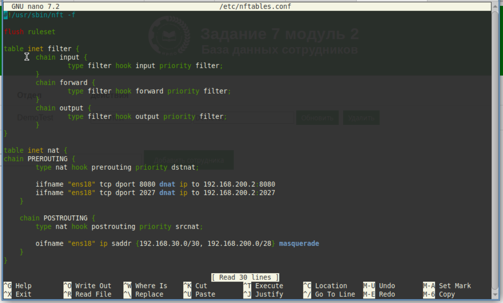
</p>

Проверяем синтаксис:

```bash
nft -c -f /etc/nftables.conf
```

Применяем:

```bash
nft -f /etc/nftables.conf
systemctl restart nftables
```

Проверяем:

```bash
nft list table inet nat
```

---

### <p align="center"><b>Проверка веб-приложений с ISP</b></p>

Для проверки статической трансляции выполняем запросы с внешней стороны — с устройства `ISP`.

Если утилита `curl` не установлена:

```bash
apt update
apt install -y curl
```

Проверяем веб-приложение на `HQ-SRV` через внешний адрес `HQ-RTR`:

```bash
curl http://172.16.1.2:8080
```

<p align="center">
  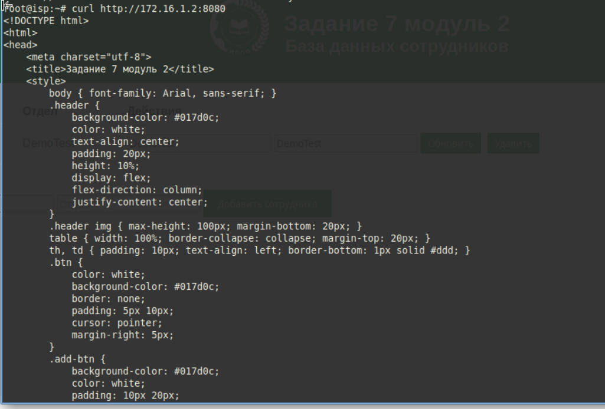
</p>

В ответ должен отображаться HTML-код веб-приложения, размещённого на `HQ-SRV`.

Проверяем приложение `testapp` на `BR-SRV` через внешний адрес `BR-RTR`:

```bash
curl http://172.16.2.2:8080
```

<p align="center">
  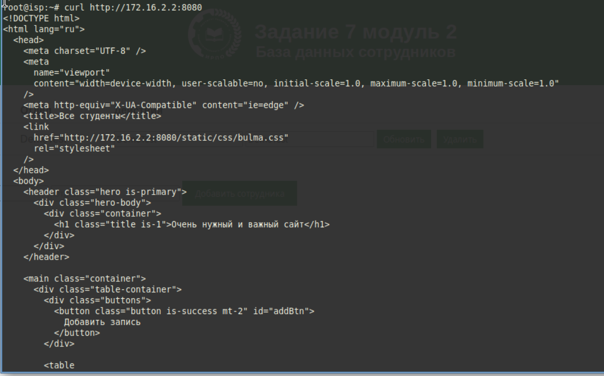
</p>

Если возвращается HTML-код приложения, проброс порта `8080` работает корректно.

---

### <p align="center"><b>Проверка SSH-пробросов</b></p>

С устройства `ISP` проверяем подключение к `HQ-SRV` через `HQ-RTR`:

```bash
ssh sshuser@172.16.1.2 -p 2027
```

Проверяем подключение к `BR-SRV` через `BR-RTR`:

```bash
ssh sshuser@172.16.2.2 -p 2027
```

<p align="center">
  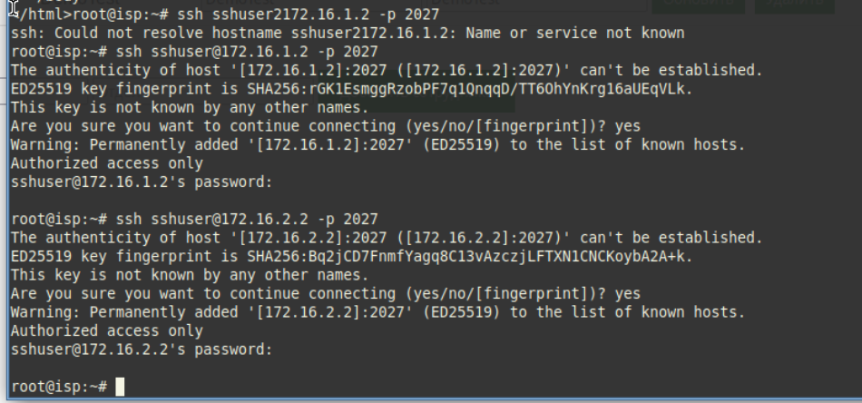
</p>

При корректной настройке отображается SSH-баннер:

```text
Authorized access only
```

и выполняется запрос пароля пользователя `sshuser`.

---

В результате настроены следующие статические трансляции:

```text
HQ-RTR:8080 -> HQ-SRV:80
HQ-RTR:2027 -> HQ-SRV:2027

BR-RTR:8080 -> BR-SRV:8080
BR-RTR:2027 -> BR-SRV:2027
```

Веб-приложения и SSH-сервисы успешно доступны со стороны внешней сети через адреса маршрутизаторов.

### <p align="center"><b>9. Установка Яндекс Браузера на HQ-CLI</b></p>

По заданию необходимо установить Яндекс Браузер на `HQ-CLI`.

Устанавливаем пакет:

```bash
apt-get update
apt-get install -y yandex-browser-stable
```

Проверяем установленную версию:

```bash
yandex-browser-stable --version
```

<p align="center">
  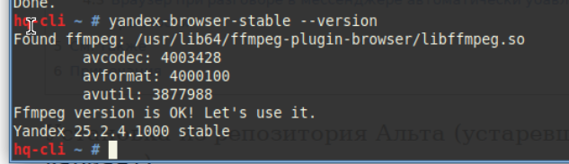
</p>

Для запуска браузера на данном стенде используем:

```bash
yandex-browser-stable --no-sandbox
```

<p align="center">
  
</p>

Если окно Яндекс Браузера успешно открывается, установка выполнена корректно.

В результате Яндекс Браузер установлен и запускается на `HQ-CLI`.

## <p align="center"><b>МОДУЛЬ 3</b></p>

## <p align="center"><b>Задание 3. Эксплуатация объектов сетевой инфраструктуры</b></p>

### <p align="center"><b>1. Импорт пользователей в домен au-team.irpo</b></p>

По заданию необходимо выполнить импорт пользователей из файла `users.csv` в домен `au-team.irpo` с сохранением паролей и поддерживаемых атрибутов.

На `BR-SRV` повторно монтируем образ `Additional.iso`:

```bash
mkdir -p /mnt/additional
mount /dev/sr0 /mnt/additional
```

Копируем файл пользователей в каталог `/opt`:

```bash
cp /mnt/additional/users.csv /opt/Users.csv
```

Устанавливаем `curl`, если он ещё не установлен:

```bash
apt update
apt install -y curl
```

Скачиваем подготовленный скрипт импорта из репозитория:

```bash
curl -o /root/import.sh https://raw.githubusercontent.com/shiraorie/demo-2027/main/files/import.sh
```

Выдаём скрипту права на выполнение:

```bash
chmod +x /root/import.sh
```

Запускаем импорт:

```bash
/root/import.sh
```

Скрипт сначала создаёт необходимые организационные подразделения, причём каждый уникальный OU создаётся только один раз. После этого пользователи импортируются из файла `Users.csv` в соответствующие подразделения домена.

<p align="center">
  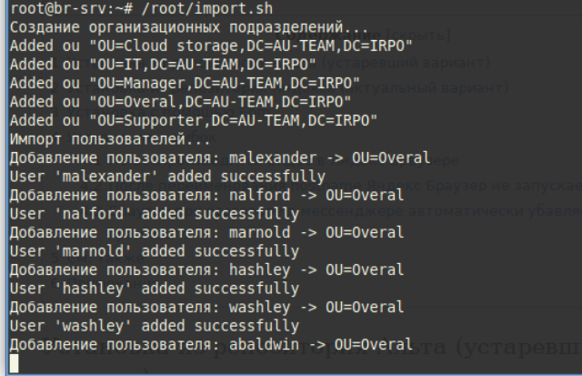
</p>

В результате пользователи из `users.csv` импортированы в домен `au-team.irpo` с паролями и поддерживаемыми Samba атрибутами.

### <p align="center"><b>2–3. Настройка обратного прокси-сервера и web-based аутентификации на ISP</b></p>

По заданию необходимо настроить на `ISP` обратный прокси-сервер для двух веб-приложений:

- `web.au-team.irpo` — веб-приложение на `HQ-SRV`;
- `docker.au-team.irpo` — приложение `testapp` на `BR-SRV`.

Для сайта `web.au-team.irpo` дополнительно необходимо настроить web-based аутентификацию с логином `WEB` и паролем `P@ssw0rd`.

---

### <p align="center"><b>Установка необходимых пакетов</b></p>

На `ISP` устанавливаем `nginx`, утилиту `htpasswd` и `curl`:

```bash
apt update
apt install -y nginx apache2-utils curl
```

---

### <p align="center"><b>Создание пользователя для web-based аутентификации</b></p>

Создаём файл с учётной записью пользователя `WEB`:

```bash
htpasswd -c /etc/nginx/.htpasswd WEB
```

Вводим пароль:

```text
P@ssw0rd
```

<p align="center">
  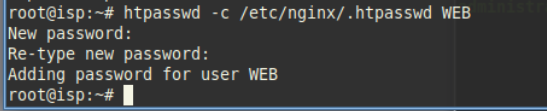
</p>

---

### <p align="center"><b>Настройка обратного прокси-сервера</b></p>

Скачиваем готовый конфигурационный файл `default` из репозитория:

```bash
curl -o /etc/nginx/sites-available/default https://raw.githubusercontent.com/shiraorie/demo-2027/main/files/default
```

Конфигурация содержит два виртуальных хоста.

Для `web.au-team.irpo` используется проксирование на внешний адрес `HQ-RTR`:

```nginx
server {
    listen 80;
    server_name web.au-team.irpo;

    auth_basic "Restricted";
    auth_basic_user_file /etc/nginx/.htpasswd;

    location / {
        proxy_pass http://172.16.1.2:8080;

        proxy_set_header Host $host;
        proxy_set_header X-Real-IP $remote_addr;
        proxy_set_header X-Forwarded-For $proxy_add_x_forwarded_for;
        proxy_set_header X-Forwarded-Proto $scheme;
    }
}
```

Для `docker.au-team.irpo` используется проксирование на внешний адрес `BR-RTR`:

```nginx
server {
    listen 80;
    server_name docker.au-team.irpo;

    location / {
        proxy_pass http://172.16.2.2:8080;

        proxy_set_header Host $host;
        proxy_set_header X-Real-IP $remote_addr;
        proxy_set_header X-Forwarded-For $proxy_add_x_forwarded_for;
        proxy_set_header X-Forwarded-Proto $scheme;
    }
}
```

<p align="center">
  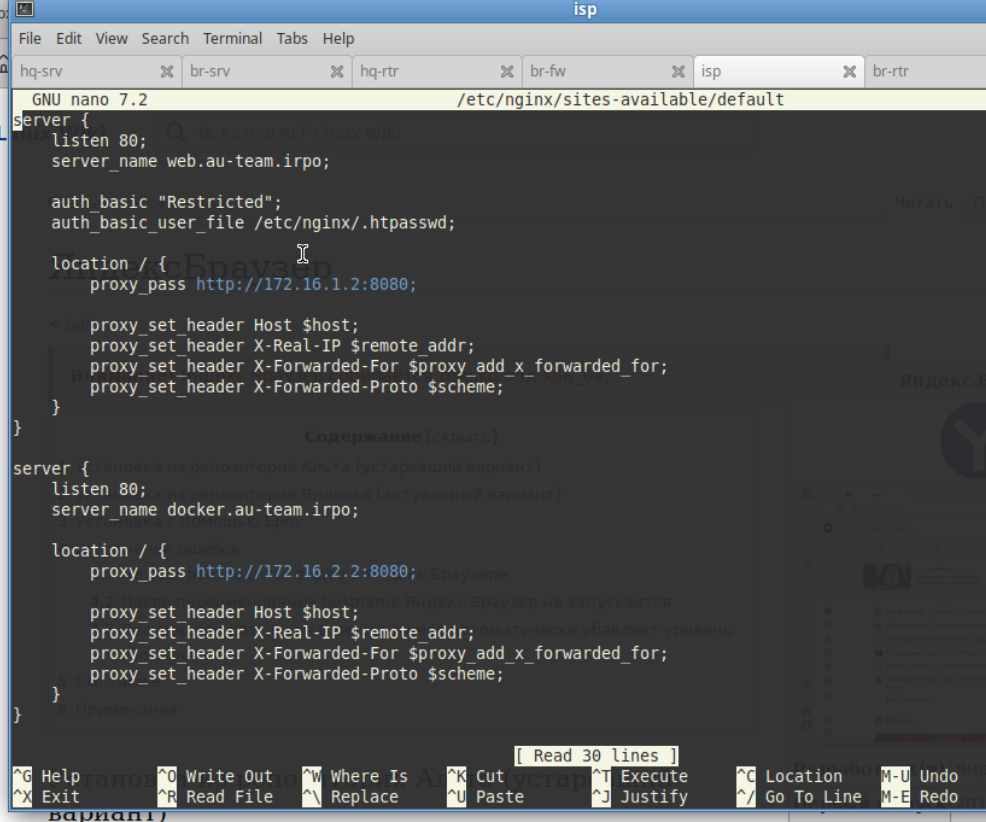
</p>

---

### <p align="center"><b>Проверка конфигурации nginx</b></p>

Проверяем конфигурацию:

```bash
nginx -t
```

Включаем сервис и перезапускаем его:

```bash
systemctl enable --now nginx
systemctl restart nginx
```

---

### <p align="center"><b>Проверка docker.au-team.irpo</b></p>

На `HQ-CLI` открываем браузер и переходим по адресу:

```text
http://docker.au-team.irpo
```

Должно открыться приложение `testapp`, работающее на `BR-SRV`.

<p align="center">
  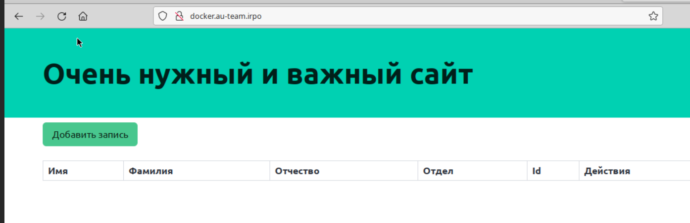
</p>

---

### <p align="center"><b>Проверка web.au-team.irpo</b></p>

На `HQ-CLI` переходим по адресу:

```text
http://web.au-team.irpo
```

При первом обращении браузер запрашивает учётные данные.

Используем:

```text
Логин: WEB
Пароль: P@ssw0rd
```

После успешной аутентификации открывается веб-приложение, размещённое на `HQ-SRV`.

<p align="center">
  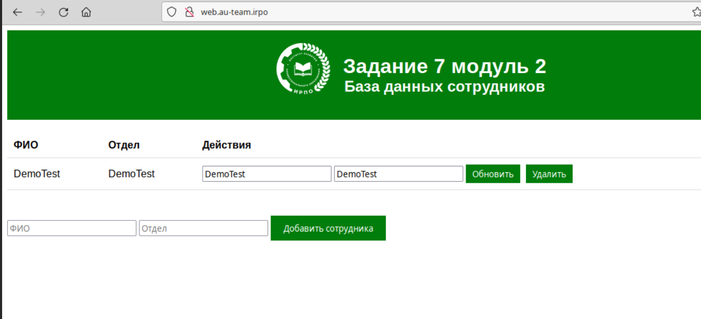
</p>

---

В результате:

- на `ISP` настроен обратный прокси-сервер `nginx`;
- `web.au-team.irpo` перенаправляется на веб-приложение `HQ-SRV`;
- `docker.au-team.irpo` перенаправляется на приложение `testapp` на `BR-SRV`;
- для `web.au-team.irpo` настроена web-based аутентификация;
- для входа используется пользователь `WEB` с паролем `P@ssw0rd`;
- после успешной аутентификации пользователь получает доступ к веб-приложению.

### <p align="center"><b>4. Настройка центра сертификации и перевод веб-сервисов на HTTPS</b></p>

По заданию необходимо:

- настроить центр сертификации на `HQ-SRV`;
- выдать сертификаты для `web.au-team.irpo` и `docker.au-team.irpo`;
- срок действия сертификатов должен составлять 30 дней;
- обеспечить доверие корневому сертификату на `HQ-CLI`;
- перевести ранее настроенный обратный прокси-сервер на протокол `HTTPS`;
- обеспечить открытие веб-сервисов без предупреждений браузера.

---

### <p align="center"><b>Подготовка центра сертификации на HQ-SRV</b></p>

Устанавливаем необходимые пакеты:

```bash
apt update
apt install -y openssl ca-certificates
```

Создаём структуру каталогов центра сертификации:

```bash
mkdir -p /etc/pki/CA/{private,certs,newcerts,crl}
touch /etc/pki/CA/index.txt
echo 1000 > /etc/pki/CA/serial
chmod 700 /etc/pki/CA/private
```

<p align="center">
  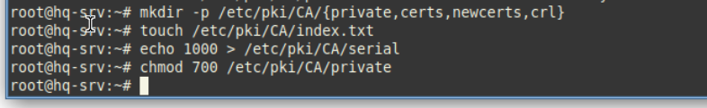
</p>

Создаём закрытый ключ центра сертификации:

```bash
openssl genrsa -out /etc/pki/CA/private/ca.key 4096
```

Создаём корневой сертификат:

```bash
openssl req -x509 -new \
  -key /etc/pki/CA/private/ca.key \
  -out /etc/pki/CA/certs/ca.crt \
  -days 3650 \
  -sha256 \
  -subj "/CN=AU-TEAM Root CA"
```

<p align="center">
  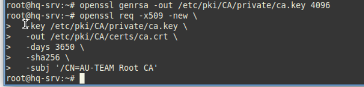
</p>

---

### <p align="center"><b>Создание ключей и запросов сертификатов</b></p>

Создаём закрытый ключ для `web.au-team.irpo`:

```bash
openssl genrsa -out /etc/pki/CA/private/web.au-team.irpo.key 2048
```

Создаём CSR:

```bash
openssl req -new \
  -key /etc/pki/CA/private/web.au-team.irpo.key \
  -out /etc/pki/CA/web.au-team.irpo.csr \
  -subj "/CN=web.au-team.irpo"
```

Создаём закрытый ключ для `docker.au-team.irpo`:

```bash
openssl genrsa -out /etc/pki/CA/private/docker.au-team.irpo.key 2048
```

Создаём CSR:

```bash
openssl req -new \
  -key /etc/pki/CA/private/docker.au-team.irpo.key \
  -out /etc/pki/CA/docker.au-team.irpo.csr \
  -subj "/CN=docker.au-team.irpo"
```

<p align="center">
  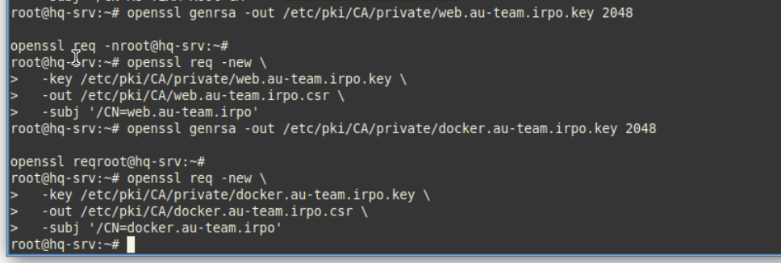
</p>

---

### <p align="center"><b>Выпуск сертификата для web.au-team.irpo</b></p>

Создаём файл расширений:

```bash
cat > /tmp/web.ext <<'EOF'
subjectAltName=DNS:web.au-team.irpo
basicConstraints=CA:FALSE
keyUsage=digitalSignature,keyEncipherment
extendedKeyUsage=serverAuth
EOF
```

Подписываем сертификат:

```bash
openssl x509 -req \
  -in /etc/pki/CA/web.au-team.irpo.csr \
  -CA /etc/pki/CA/certs/ca.crt \
  -CAkey /etc/pki/CA/private/ca.key \
  -CAcreateserial \
  -out /etc/pki/CA/certs/web.au-team.irpo.crt \
  -days 30 \
  -sha256 \
  -extfile /tmp/web.ext
```

<p align="center">
  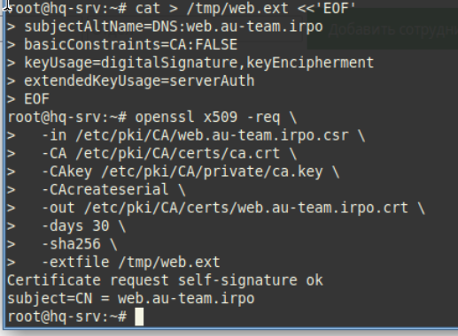
</p>

---

### <p align="center"><b>Выпуск сертификата для docker.au-team.irpo</b></p>

Создаём файл расширений:

```bash
cat > /tmp/docker.ext <<'EOF'
subjectAltName=DNS:docker.au-team.irpo
basicConstraints=CA:FALSE
keyUsage=digitalSignature,keyEncipherment
extendedKeyUsage=serverAuth
EOF
```

Подписываем сертификат:

```bash
openssl x509 -req \
  -in /etc/pki/CA/docker.au-team.irpo.csr \
  -CA /etc/pki/CA/certs/ca.crt \
  -CAkey /etc/pki/CA/private/ca.key \
  -out /etc/pki/CA/certs/docker.au-team.irpo.crt \
  -days 30 \
  -sha256 \
  -extfile /tmp/docker.ext
```

<p align="center">
  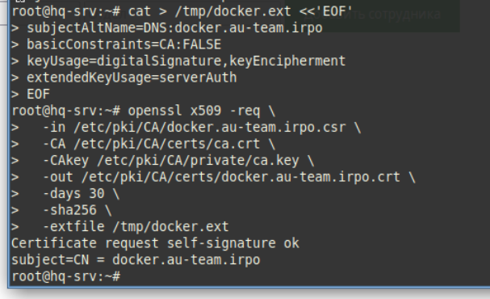
</p>

---

### <p align="center"><b>Проверка сертификатов</b></p>

Проверяем сертификат `web.au-team.irpo`:

```bash
openssl x509 -in /etc/pki/CA/certs/web.au-team.irpo.crt \
  -noout -subject -issuer -dates -ext subjectAltName
```

Проверяем сертификат `docker.au-team.irpo`:

```bash
openssl x509 -in /etc/pki/CA/certs/docker.au-team.irpo.crt \
  -noout -subject -issuer -dates -ext subjectAltName
```

<p align="center">
  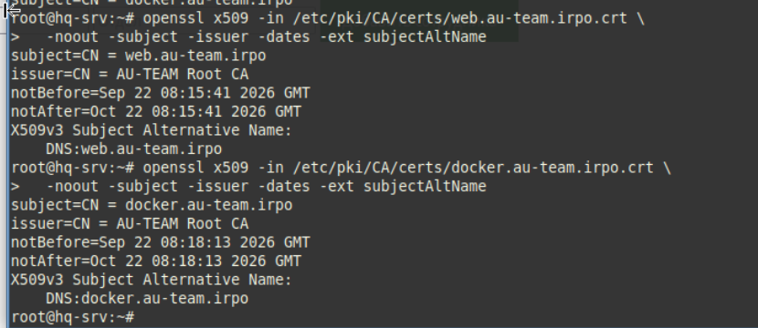
</p>

В выводе должны отображаться:

```text
issuer=CN = AU-TEAM Root CA
```

а также соответствующие DNS-имена в `Subject Alternative Name`.

Срок действия сертификатов составляет 30 дней.

---

### <p align="center"><b>Передача сертификатов на ISP</b></p>

На `ISP` создаём каталог:

```bash
mkdir -p /etc/nginx/ssl
```

С `HQ-SRV` передаём сертификаты и ключи:

```bash
scp /etc/pki/CA/certs/web.au-team.irpo.crt root@172.16.1.1:/etc/nginx/ssl/
scp /etc/pki/CA/private/web.au-team.irpo.key root@172.16.1.1:/etc/nginx/ssl/

scp /etc/pki/CA/certs/docker.au-team.irpo.crt root@172.16.1.1:/etc/nginx/ssl/
scp /etc/pki/CA/private/docker.au-team.irpo.key root@172.16.1.1:/etc/nginx/ssl/
```

<p align="center">
  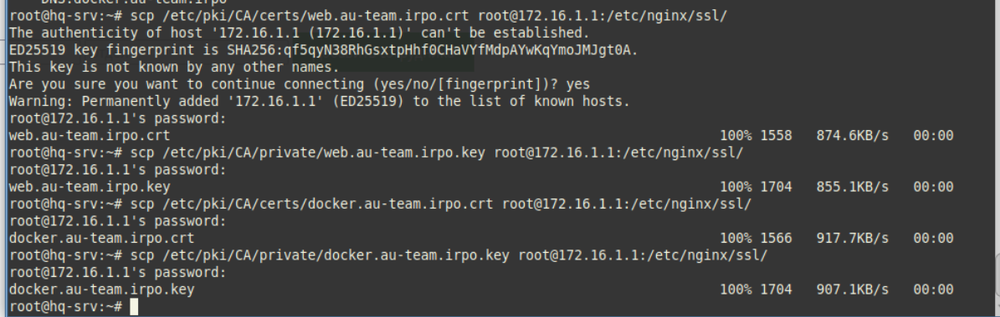
</p>

---

### <p align="center"><b>Перевод nginx на HTTPS</b></p>

Скачиваем готовую HTTPS-конфигурацию:

```bash
curl -o /etc/nginx/sites-available/default https://raw.githubusercontent.com/shiraorie/demo-2027/main/files/default-ssl
```

В конфигурации:

- `web.au-team.irpo` работает на `443 ssl`;
- `docker.au-team.irpo` работает на `443 ssl`;
- для каждого сайта используется отдельный сертификат;
- для `web.au-team.irpo` сохраняется web-based аутентификация;
- проксирование выполняется на ранее настроенные сервисы.

<p align="center">
  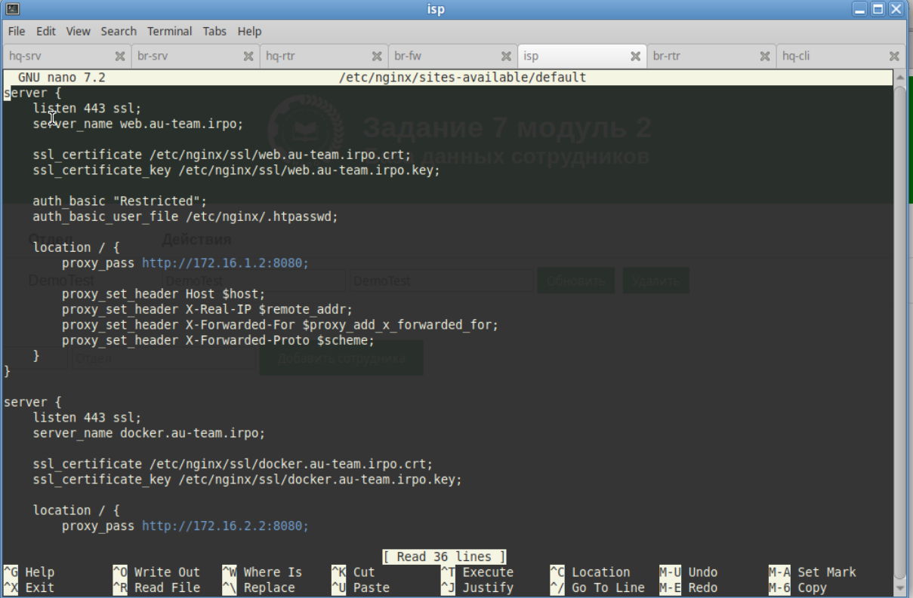
</p>

Проверяем конфигурацию:

```bash
nginx -t
```

Применяем:

```bash
systemctl restart nginx
```

---

### <p align="center"><b>Добавление корневого сертификата на HQ-CLI</b></p>

С `HQ-SRV` передаём корневой сертификат на `HQ-CLI`:

```bash
scp /etc/pki/CA/certs/ca.crt root@192.168.20.2:/tmp/ca.crt
```

<p align="center">
  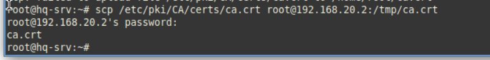
</p>

На `HQ-CLI` добавляем сертификат в доверенные:

```bash
mkdir -p /etc/pki/ca-trust/source/anchors
cp /tmp/ca.crt /etc/pki/ca-trust/source/anchors/au-team-ca.crt
update-ca-trust
```

После этого полностью перезапускаем браузер.

---

### <p align="center"><b>Проверка HTTPS</b></p>

На `HQ-CLI` открываем:

```text
https://web.au-team.irpo
```

После успешной web-based аутентификации приложение открывается по защищённому соединению без предупреждений браузера.

<p align="center">
  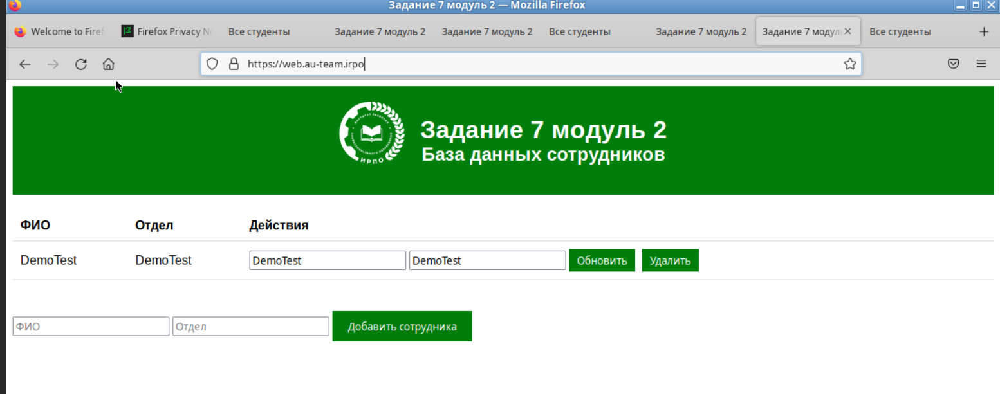
</p>

Проверяем второй сервис:

```text
https://docker.au-team.irpo
```

Приложение `testapp` также открывается по HTTPS без предупреждений сертификата.

<p align="center">
  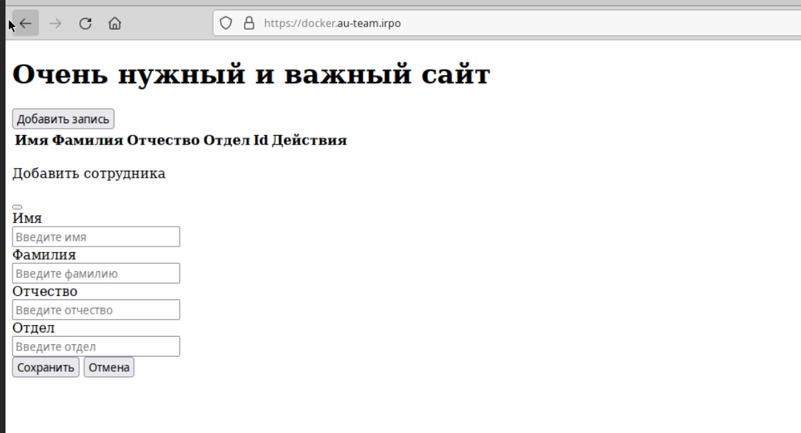
</p>

---

В результате:

- на `HQ-SRV` настроен собственный центр сертификации;
- создан корневой сертификат `AU-TEAM Root CA`;
- выпущены отдельные сертификаты для `web.au-team.irpo` и `docker.au-team.irpo`;
- срок действия серверных сертификатов составляет 30 дней;
- сертификаты содержат корректные `Subject Alternative Name`;
- сертификаты и ключи переданы на `ISP`;
- `nginx` переведён на HTTPS;
- web-based аутентификация для `web.au-team.irpo` сохранена;
- корневой сертификат добавлен в доверенные на `HQ-CLI`;
- оба веб-сервиса открываются по HTTPS без предупреждений браузера.

### <p align="center"><b>5. Настройка atop на HQ-SRV</b></p>

Устанавливаем `atop`:

```bash
apt update
apt install -y atop
```

Открываем конфигурационный файл:

```bash
nano /etc/default/atop
```

По умолчанию значение интервала составляет `600` секунд. По заданию необходимо установить интервал сбора данных 7 минут, поэтому изменяем:

```text
LOGINTERVAL=420
```

Остальные параметры оставляем без изменений:

```text
LOGOPTS=""
LOGINTERVAL=420
LOGGENERATIONS=28
LOGPATH=/var/log/atop
```

<p align="center">
  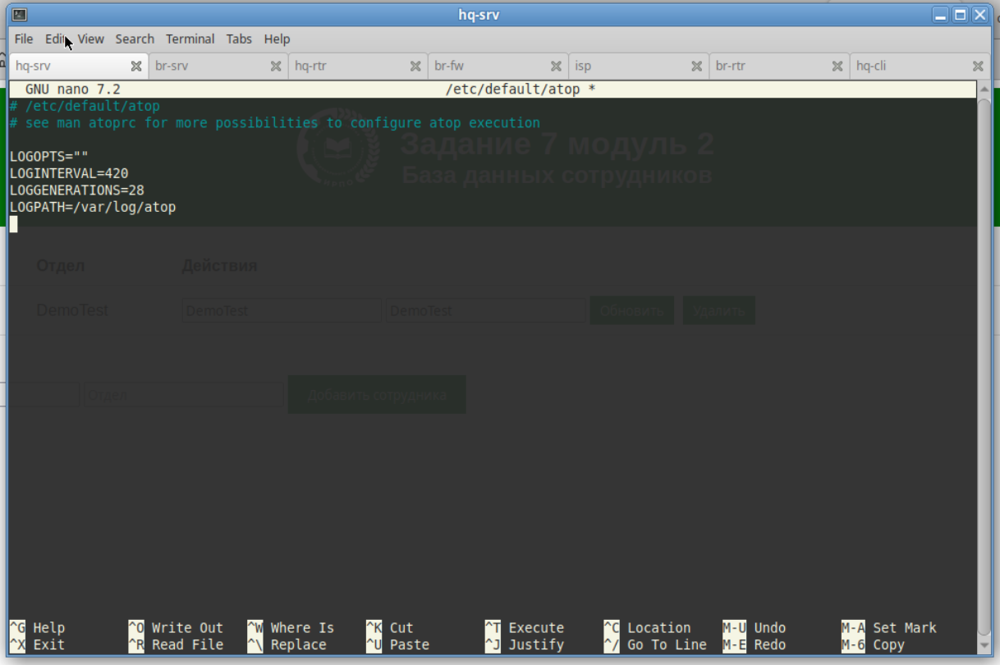
</p>

Применяем изменения:

```bash
systemctl enable --now atop
systemctl restart atop
```

Проверяем создание журнала:

```bash
ls -lh /var/log/atop/
```

<p align="center">
  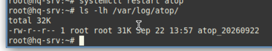
</p>

В результате `atop` ведёт непрерывный мониторинг состояния `HQ-SRV` с интервалом 420 секунд, то есть 7 минут.

### <p align="center"><b>6. Настройка принт-сервера CUPS на HQ-SRV</b></p>

На `HQ-SRV` устанавливаем CUPS и виртуальный PDF-принтер:

```bash
apt update
apt install -y cups cups-pdf
```

Включаем службу:

```bash
systemctl enable --now cups
```

Разрешаем удалённый доступ к CUPS и публикацию принтеров:

```bash
cupsctl --remote-any
cupsctl --share-printers
```

Публикуем виртуальный принтер `PDF`:

```bash
lpadmin -p PDF -o printer-is-shared=true
systemctl restart cups
```

<p align="center">
  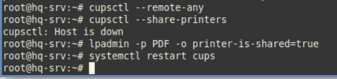
</p>

На `HQ-CLI` устанавливаем CUPS:

```bash
apt-get update
apt-get install -y cups
```

Создаём очередь для сетевого принтера, опубликованного на `HQ-SRV`:

```bash
lpadmin -p HQ-PDF \
  -E \
  -v ipp://192.168.100.2:631/printers/PDF \
  -m raw
```

Назначаем сетевой PDF-принтер принтером по умолчанию:

```bash
lpoptions -d HQ-PDF
```

Проверяем URI принтера:

```bash
lpstat -v
```

Проверяем принтер по умолчанию:

```bash
lpstat -d
```

<p align="center">
  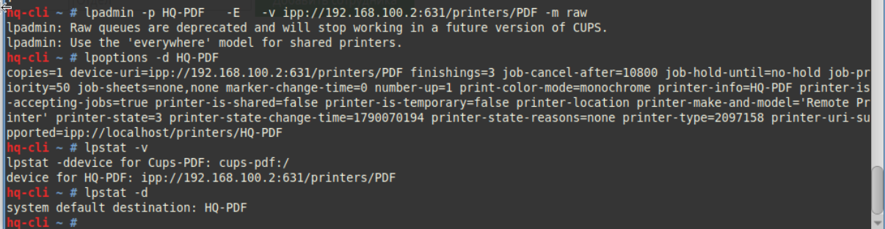
</p>

В результате на `HQ-SRV` опубликован виртуальный PDF-принтер, а на `HQ-CLI` подключён сетевой принтер `HQ-PDF` и назначен принтером по умолчанию.

### <p align="center"><b>7. Инвентаризация HQ-SRV и HQ-CLI через Ansible</b></p>

На `BR-SRV` создаём каталог для отчётов:

```bash
mkdir -p /etc/ansible/PC-INFO
```

Скачиваем подготовленный плейбук:

```bash
curl -o /etc/ansible/inventory.yml https://raw.githubusercontent.com/shiraorie/demo-2027/main/files/inventory.yml
```

Запускаем:

```bash
ansible-playbook /etc/ansible/inventory.yml
```

После выполнения проверяем созданные отчёты:

```bash
ls -la /etc/ansible/PC-INFO
```

```bash
cat /etc/ansible/PC-INFO/hq-srv.yml
cat /etc/ansible/PC-INFO/hq-cli.yml
```

<p align="center">
  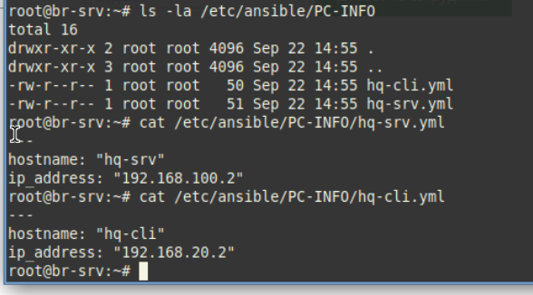
</p>

В результате для `HQ-SRV` и `HQ-CLI` созданы отчёты в формате `.yml`, содержащие имя компьютера и его IP-адрес.
